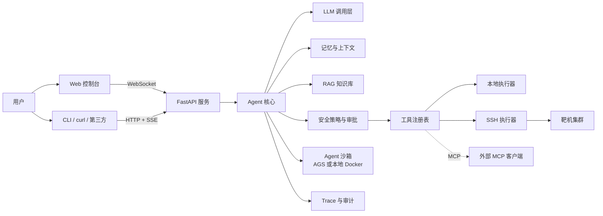

# server-agent

一个**本地可运行、支持远程调用**的服务器运维 Agent，同时也是一门「以练带学」的 Agent 课程。

- **Agent 做什么**：接收自然语言指令（如「web-01 的磁盘为什么满了」「nginx 502 了帮我看看」），自己决定调用哪些工具、在哪台主机上执行，给出诊断报告；在**授权范围内**执行修复操作（重启服务、清理文件等），高危操作必须经人工审批。
- **课程怎么学**：共 17 章 + 3 个附录。每章 = **知识讲解**（`docs/chapters/`）+ **代码落地**（本仓库源码）+ **模块文档**（`docs/modules/`）。每章结束打一个 git tag（`ch01` ... `ch17`），随时可以 `git checkout ch05` 回到当时的代码状态。
  注意：第 10–17 章是一次性发布的，`ch10` ... `ch17`（以及合并 tag `ch10-ch17`）**指向同一个提交**，checkout 其中任何一个看到的都是第 17 章完成时的代码；逐章回看请以讲义为准。

> 完整的逐章学习内容、代码交付物与验收标准见 **[docs/SYLLABUS.md](docs/SYLLABUS.md)**。

## 课程表

| 部分 | 章 | 标题 | 本章落地的能力 | 状态 |
|---|---|---|---|---|
| 一、地基：最小闭环 | 01 | Agent 是什么：从聊天机器人到能干活的智能体 | 项目骨架、配置、`/health`、CLI | [已发布](docs/chapters/01-what-is-agent.md) |
| | 02 | 和大模型说话：LLM 调用层 | Provider 抽象、流式输出、MockLLM | [已发布](docs/chapters/02-llm-layer.md) |
| | 03 | 给 Agent 装上手：工具调用 Function Calling | 工具注册表 + 6 个只读排障工具 | [已发布](docs/chapters/03-tool-calling.md) |
| | 04 | Agent 的心跳：ReAct 循环 | Agent Loop、事件模型、`ask` 命令 | [已发布](docs/chapters/04-react-loop.md) |
| 二、产品化 | 05 | 走出终端：HTTP API、SSE 与 WebSocket | 后端服务、事件流协议、鉴权 | [已发布](docs/chapters/05-api-streaming.md) |
| | 06 | 看得见的思考：前端交互界面 | Web 控制台、时间线、中断 | [已发布](docs/chapters/06-web-ui.md) |
| | 07 | 给 Agent 立规矩：Prompt 工程与结构化输出 | SRE 系统提示词、诊断报告 Schema | [已发布](docs/chapters/07-prompt-engineering.md) |
| 三、可信 | 08 | 记性与注意力：上下文管理与记忆 | 输出截断/压缩、会话持久化、主机档案 | [已发布](docs/chapters/08-context-memory.md) |
| | 09 | 刹车系统：安全、权限与人工审批 | 风险分级、审批流、审计、防注入 | [已发布](docs/chapters/09-safety-approval.md) |
| | 10 | 伸向远方：SSH 远程执行与多主机 | 执行器抽象、主机清单、Docker 靶场 | [已发布](docs/chapters/10-remote-executors.md) |
| | 11 | 给 Agent 一间隔离的工作室：Agent 沙箱（AGS） | 沙箱执行器、`run_python`、高危操作预演 | [已发布](docs/chapters/11-agent-sandbox.md) |
| 四、进阶 | 12 | 先想后做：规划、反思与 Runbook | Plan-and-Execute、Runbook 引擎 | [已发布](docs/chapters/12-planning-runbook.md) |
| | 13 | 让 Agent 读过你的文档：RAG 知识库 | 检索工具、引用溯源 | [已发布](docs/chapters/13-rag.md) |
| | 14 | 工具的 USB 接口：MCP 协议 | MCP Server / Client | [已发布](docs/chapters/14-mcp.md) |
| 五、工程化 | 15 | 先有尺子：评估与可观测性 | 评测集、Trace、回归报告 | [已发布](docs/chapters/15-eval-observability.md) |
| | 16 | 一个不够就组队：多 Agent 协作 | 诊断/执行/审查三角色 | [已发布](docs/chapters/16-multi-agent.md) |
| | 17 | 总演习：故障靶场实战与交付部署 | 端到端排障、Docker 部署 | [已发布](docs/chapters/17-capstone-deploy.md) |

## 最终架构（第 17 章完成时）



## 技术选型（摘要）

| 层 | 选择 | 理由 |
|---|---|---|
| 语言 | Python 3.12+ | Agent 生态最成熟，读起来最接近伪代码 |
| 后端 | FastAPI + Uvicorn | 原生 async，HTTP / SSE / WebSocket 一套搞定 |
| LLM | OpenAI 兼容 Chat Completions 接口 | 一套代码接 DeepSeek、通义千问（百炼）、混元、本地 vLLM / Ollama |
| Agent 框架 | **不用框架，手写** | 学习目的：每一行都要看得懂；附录 A 再做框架映射 |
| 前端 | 原生 HTML + JS（无构建） | 零依赖，注意力留给 Agent 本身 |
| 远程执行 | asyncssh | 纯 Python、异步、易于测试 |
| 代码沙箱 | 本地 Docker（默认）/ 腾讯云 AGS（可选） | Agent 生成的代码只在隔离环境里跑；AGS 兼容 E2B 协议，换域名和 Key 即可 |
| 存储 | SQLite | 本地零运维 |
| 测试 | pytest + MockLLM | 不花 token 也能跑通全部测试 |

详细取舍见 [docs/adr/0001-tech-stack.md](docs/adr/0001-tech-stack.md)。

## 仓库结构

```text
server-agent/
├── README.md
├── pyproject.toml                 # 第 01 章
├── docs/
│   ├── SYLLABUS.md                # 课程大纲（每章知识点、代码、验收的权威来源）
│   ├── HANDOFF.md                 # 新会话交接提示词
│   ├── adr/                       # 架构决策记录（0001 选型 / 0002 不给任意 shell / 0003 沙箱边界）
│   ├── chapters/NN-<slug>.md      # 每章知识讲解
│   └── modules/<module>.md        # 每个功能模块的说明文档
├── server_agent/
│   ├── config.py                  # 01
│   ├── cli.py                     # 01 → 04
│   ├── llm/                       # 02  Provider 抽象 / OpenAI 兼容 / Mock
│   ├── tools/                     # 03  注册表 + 排障工具（09 起加写操作工具）
│   ├── agent/                     # 04  循环与事件；12 规划器
│   ├── server/                    # 05  HTTP / SSE / WebSocket / 鉴权
│   ├── prompts/                   # 07  提示词模板与报告 Schema
│   ├── memory/                    # 08  上下文预算、会话与长期记忆
│   ├── policy/                    # 09  风险分级、审批、审计、脱敏
│   ├── executors/                 # 10  local / ssh
│   ├── sandbox/                   # 11  Agent 沙箱：docker_local / ags
│   ├── knowledge/                 # 13  RAG
│   ├── mcp/                       # 14  MCP Server / Client
│   ├── tracing/                   # 15  Trace
│   └── multi/                     # 16  多 Agent
├── web/                           # 06  前端
├── runbooks/                      # 12  排障手册（格式见 runbooks/README.md）
├── lab/                           # 10  Docker 靶场 + 故障注入脚本
├── evals/                         # 15  评测集与评测器（用例格式见 evals/README.md）
└── tests/
```

## 快速开始

```bash
git clone git@github.com:evaevable/server-agent.git && cd server-agent
python3 -m venv .venv && source .venv/bin/activate   # Python 3.12+
pip install -e ".[dev]"
cp .env.example .env        # 可选
pytest -q                   # 测试不需要任何 API Key
server-agent serve          # http://127.0.0.1:8000/health
server-agent chat --mock    # 无需 API Key 体验对话；填好 .env 里的 LLM_* 后去掉 --mock
server-agent tools list     # 查看全部 20 个工具（14 只读 / 2 低风险 / 4 高危需审批）
server-agent tools call disk_usage '{"path": "/"}'
server-agent ask "这台机器为什么卡"   # 让 Agent 自己多步排查（需先配置 .env）
server-agent ask --variant plain "这台机器为什么卡"   # 对照组：不带方法论的提示词
server-agent ask --host web-01 "磁盘满了吗"   # 带上该主机的历史记忆
server-agent history                          # 回看历史排查（SQLite，重启不丢）
server-agent tools call restart_service '{"name": "nginx"}'   # 高危操作：必须人工审批
server-agent audit                            # 审计日志：谁调了什么、批准还是拒绝
server-agent ask --plan "为什么慢"             # 先出计划再执行
server-agent ask --multi "磁盘满了并处理"       # 多 Agent：诊断→执行→审查
server-agent eval --cases evals/cases         # 跑评测集（离线、可重复）
server-agent mcp list --server "python -m server_agent.mcp.server"   # 暴露给 MCP 客户端
make lab-up && make fault-disk                # 起靶场并注入故障（需要 Docker）
SA_API_TOKEN=devtoken server-agent serve   # 启动服务：控制台 http://127.0.0.1:8000 ，接口见 docs/api.md
```

模块文档：[config / cli / server 骨架](docs/modules/config.md) · [llm 调用层](docs/modules/llm.md) · [tools 工具层](docs/modules/tools.md) · [agent 循环](docs/modules/agent-loop.md) · [server 服务层](docs/modules/server.md) · [web 前端](docs/modules/web.md) · [prompts 提示词层](docs/modules/prompts.md) · [memory 记忆层](docs/modules/memory.md) · [executors 执行器](docs/modules/executors.md) · [sandbox 沙箱](docs/modules/sandbox.md) · [planner 规划](docs/modules/planner.md) · [knowledge 知识库](docs/modules/knowledge.md) · [mcp](docs/modules/mcp.md) · [tracing/evals](docs/modules/tracing.md) · [multi 多 Agent](docs/modules/multi-agent.md) · [policy 策略层](docs/modules/policy.md) · [HTTP/WS 接口](docs/api.md) · [runbooks 手册格式](runbooks/README.md) · [evals 用例格式](evals/README.md)

架构决策：[ADR-0001 技术选型](docs/adr/0001-tech-stack.md) · [ADR-0002 不给 Agent 任意 shell](docs/adr/0002-no-arbitrary-shell.md) · [ADR-0003 沙箱边界](docs/adr/0003-sandbox-boundary.md)
