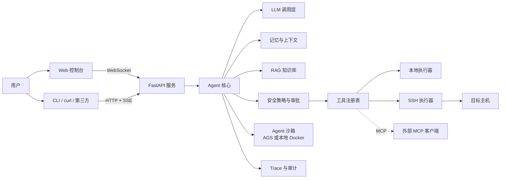

# 用一个 Server Agent 学会 Agent

一本从零手写 AI Agent 的技术书，配一个**真能用**的服务器排障 Agent。

- **Agent 做什么**：接收自然语言问题（「web-01 的磁盘为什么满了」「nginx 502 了」），自己决定调用哪些工具、在哪台主机上执行，给出带证据链的诊断报告；在授权范围内执行修复（重启服务、清理旧文件），高危操作必须人工审批。
- **书讲什么**：17 章 + 3 个附录，从一次 HTTP 调用讲到多 Agent 协作与交付部署。每章讲清一个 Agent 核心概念，再把它落地成这个项目里的一块代码，配测试、模块文档和验收命令。
- **不用框架**：Agent 循环、工具调用、审批、记忆、RAG、MCP 全部手写，每一行都能读懂；附录 A 再把它映射到 LangGraph、OpenAI Agents SDK 等框架。

## 阅读方式

| 方式 | 入口 | 适合 |
|---|---|---|
| 单文件全书 | [BOOK.md](BOOK.md) | 从头读到尾、全文搜索、打印 |
| 逐章阅读 | [章节目录](docs/chapters/SUMMARY.md) | 在 GitHub 上按章跳读 |
| 边读边跑 | 下面的「快速开始」 | 对照代码动手做每章的练习 |

## 目录

**第一部分 地基：Agent 最小闭环**

1. [Agent 是什么：从聊天机器人到能干活的智能体](docs/chapters/01-what-is-agent.md)
2. [和大模型说话：LLM 调用层](docs/chapters/02-llm-layer.md)
3. [给 Agent 装上手：工具调用 Function Calling](docs/chapters/03-tool-calling.md)
4. [Agent 的心跳：ReAct 循环](docs/chapters/04-react-loop.md)

**第二部分 产品化：让别人也能用**

5. [走出终端：HTTP API、SSE 与 WebSocket](docs/chapters/05-api-streaming.md)
6. [看得见的思考：前端交互界面](docs/chapters/06-web-ui.md)
7. [给 Agent 立规矩：Prompt 工程与结构化输出](docs/chapters/07-prompt-engineering.md)

**第三部分 可信：记得住、管得住、够得着、隔得开**

8. [记性与注意力：上下文管理与记忆](docs/chapters/08-context-memory.md)
9. [刹车系统：安全、权限与人工审批](docs/chapters/09-safety-approval.md)
10. [伸向远方：SSH 远程执行与多主机](docs/chapters/10-remote-executors.md)
11. [给 Agent 一间隔离的工作室：Agent 沙箱（AGS）](docs/chapters/11-agent-sandbox.md)

**第四部分 进阶：更聪明、更博学、更开放**

12. [先想后做：规划、反思与 Runbook](docs/chapters/12-planning-runbook.md)
13. [让 Agent 读过你的文档：RAG 知识库](docs/chapters/13-rag.md)
14. [工具的 USB 接口：MCP 协议](docs/chapters/14-mcp.md)

**第五部分 工程化：证明它靠谱，然后交付**

15. [先有尺子：评估与可观测性](docs/chapters/15-eval-observability.md)
16. [一个不够就组队：多 Agent 协作](docs/chapters/16-multi-agent.md)
17. [总演习：故障靶场实战与交付部署](docs/chapters/17-capstone-deploy.md)

**附录**：[A 框架对照](docs/appendix-a-frameworks.md) · [B 术语表](docs/appendix-b-glossary.md) · [C 排障速查](docs/appendix-c-cheatsheet.md) · [全书大纲与设计依据](docs/SYLLABUS.md)

## 系统架构



## 能力一览

| 方面 | 实现 |
|---|---|
| 工具 | 23 个：17 个只读（资源、日志、大文件、已删除未释放文件、systemd 状态、远程只读命令、知识库、Runbook）、2 个低风险（沙箱执行、写记忆）、4 个高危（重启服务、杀进程、清理目录、远程重启）|
| 安全 | 不给任意 shell；风险分级 + 参数白名单；高危操作人工审批、超时即拒绝；读文件工具拒绝凭证与私钥路径；审计 JSONL + 输出脱敏；策略挂在 CLI / HTTP / WebSocket / MCP 全部入口 |
| 运行时 | FastAPI + SSE（断线续传）+ WebSocket 审批；优雅退出（取消在跑任务、撤销挂起审批）；文本或 JSON 结构化日志 |
| 多主机 | asyncssh 执行器 + 主机清单（每台主机独立的授权范围）；远端不装任何依赖 |
| 进阶 | Plan-and-Execute + Runbook、BM25 知识库（带引用）、MCP Server/Client、诊断/执行/审查三角色多 Agent |
| 质量 | 330+ 条离线测试（MockLLM，不花 token）；YAML 评测集；Trace 耗时树 |

## 快速开始

```bash
git clone git@github.com:evaevable/server-agent.git && cd server-agent
make install                 # 创建 .venv 并安装（Python 3.12+）
make test                    # 全部离线测试，不需要任何 API Key
make eval                    # 离线评测集，输出 eval-report.md
cp .env.example .env         # 填入 LLM_BASE_URL / LLM_API_KEY / LLM_MODEL（任一 OpenAI 兼容、支持 tool calling 的模型）
```

常用命令：

```bash
server-agent tools list                                   # 全部工具与风险等级
server-agent tools call disk_usage '{"path": "/"}'        # 手动调用（同样经过策略层）
server-agent tools call find_large_files '{"path": "/var/log", "min_size_mb": 100}'
server-agent ask "这台机器为什么卡"                         # Agent 自主多步排查
server-agent ask --host web-01 "磁盘满了吗"                # 带上该主机的历史记忆
server-agent ask --plan "为什么慢"                         # 先出计划再执行
server-agent ask --multi "磁盘满了并处理"                   # 多 Agent：诊断 → 执行 → 审查
server-agent history / server-agent audit                 # 历史排查 / 审计日志
SA_API_TOKEN=devtoken server-agent serve                  # 控制台 http://127.0.0.1:8000 ，接口见 docs/api.md
make lab-up && make fault-disk                            # 起三台靶机并注入故障（需要 Docker）
make book                                                 # 改完章节后重新生成 BOOK.md 与目录
```

部署与上线检查见 [docs/deploy.md](docs/deploy.md) 与 [docs/security-checklist.md](docs/security-checklist.md)。

## 仓库结构

```text
server-agent/
├── BOOK.md                    # 全书单文件版（tools/build_book.py 生成）
├── docs/
│   ├── chapters/              # 正文 17 章 + SUMMARY.md 目录
│   ├── appendix-*.md          # 附录 A/B/C
│   ├── modules/               # 每个模块的职责、接口、数据流、取舍、限制
│   ├── adr/                   # 架构决策记录
│   ├── api.md  deploy.md  security-checklist.md  SYLLABUS.md
├── server_agent/
│   ├── llm/        agent/      tools/      prompts/    memory/
│   ├── policy/     executors/  sandbox/    knowledge/  mcp/
│   ├── tracing/    multi/      server/     cli.py      config.py  logging_setup.py
├── web/                       # 前端控制台（原生 HTML/JS，无构建）
├── runbooks/                  # 排障手册（格式见 runbooks/README.md）
├── knowledge/                 # 知识库示例文档
├── evals/                     # 评测集与评测器（见 evals/README.md）
├── lab/                       # Docker 靶场与故障注入脚本
├── tools/build_book.py        # 生成 BOOK.md 与目录
└── tests/
```

## 参考文档

模块：[config](docs/modules/config.md) · [llm](docs/modules/llm.md) · [tools](docs/modules/tools.md) · [agent 循环](docs/modules/agent-loop.md) · [server](docs/modules/server.md) · [web](docs/modules/web.md) · [prompts](docs/modules/prompts.md) · [memory](docs/modules/memory.md) · [policy](docs/modules/policy.md) · [executors](docs/modules/executors.md) · [sandbox](docs/modules/sandbox.md) · [planner](docs/modules/planner.md) · [knowledge](docs/modules/knowledge.md) · [mcp](docs/modules/mcp.md) · [tracing/evals](docs/modules/tracing.md) · [multi-agent](docs/modules/multi-agent.md) · [HTTP/WS 接口](docs/api.md)

架构决策：[ADR-0001 技术选型](docs/adr/0001-tech-stack.md) · [ADR-0002 不给 Agent 任意 shell](docs/adr/0002-no-arbitrary-shell.md) · [ADR-0003 沙箱边界](docs/adr/0003-sandbox-boundary.md)

版本点：`git checkout ch01` … `ch17` 可回到各章完成时的代码（第 10–17 章一次性发布，`ch10`…`ch17` 指向同一提交）。
