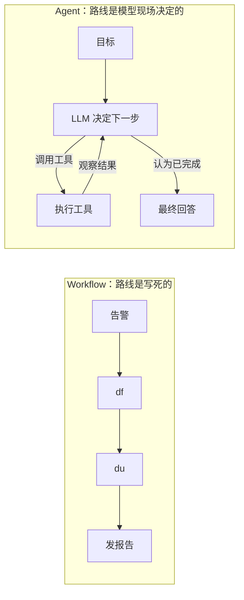
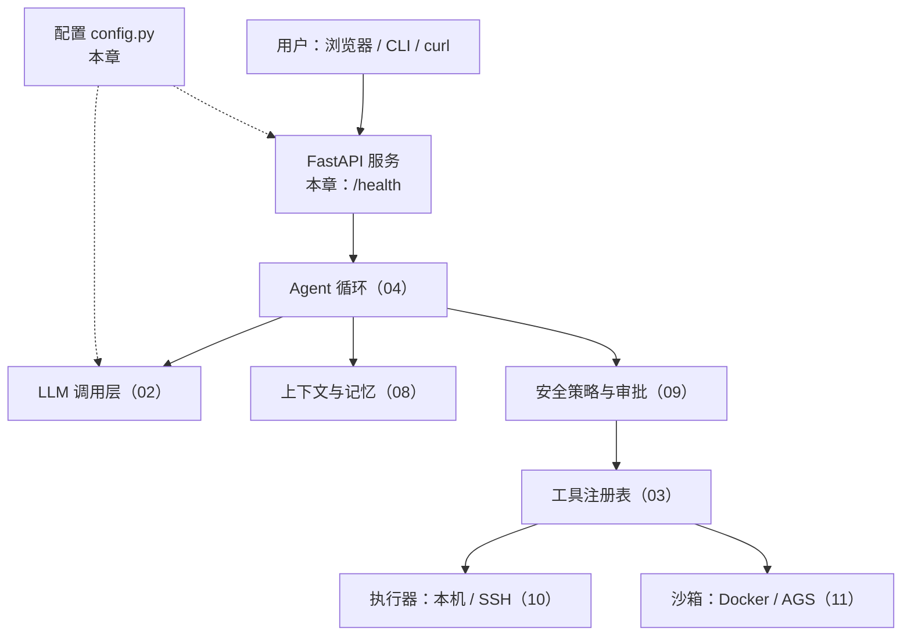
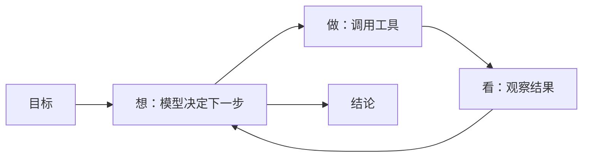

# 第 1 章 Agent 是什么：从聊天机器人到能干活的智能体

**前置知识**：会用终端、读得懂基础 Python

**本章代码**：项目骨架、配置加载、`/health` 接口、`server-agent` 命令行。

**学习目标**：读完本章，应能回答以下问题。

1. LLM、Chatbot、Workflow、Agent 到底差在哪？一句话的判别标准是什么？
2. 一个 Agent 由哪四样东西组成？在 server-agent 里分别对应哪个目录？
3. 什么时候**不该**用 Agent？
4. 为什么本书坚持手写，而不是直接上 LangGraph？

---

## 1.1 从一个真实场景说起

凌晨两点，告警群弹出一条消息：`web-01 磁盘使用率 97%`。值班的你会怎么做？

```bash
df -h                          # 1. 确认哪个分区满了
du -xh --max-depth=1 /var | sort -h | tail   # 2. 找出最大的目录
ls -lhS /var/log/nginx | head  # 3. 发现 access.log 有 40G
lsof /var/log/nginx/access.log # 4. 确认 nginx 还在往里写
# 5. 判断：logrotate 没生效 -> 决定轮转并压缩旧日志 -> 执行 -> 复查 df
```

把这五步拆开看，你其实在不停地做三件事：

| 你在做什么 | 抽象一下 |
|---|---|
| 看到 97%，决定先跑 `df` | **想**：根据目标和已知信息决定下一步 |
| 敲命令 | **做**：调用一个工具 |
| 读输出，发现是 `/var` | **看**：拿到观察结果，更新认知 |

然后回到「想」，直到问题解决。**这个「想 - 做 - 看」的循环，就是 Agent 的全部秘密。**本书要做的，就是让大模型来当这个值班工程师。

---

## 1.2 四个容易混的名词：谁在做决定？

市面上把什么都叫 Agent，先把概念钉死。判别标准只有一个：**下一步做什么，是谁决定的？**

| 形态 | 下一步由谁决定 | 能动手吗 | 在排障场景里的样子 |
|---|---|---|---|
| **LLM**（大语言模型） | 没有「下一步」，一问一答 | 不能 | 你贴 `df` 输出，它解释给你听 |
| **Chatbot** | 人 | 不能 | 多轮对话，但命令还是你自己敲 |
| **Workflow**（工作流） | 程序员提前写死 | 能 | 告警触发脚本：固定先 `df` 再 `du` 再发报告 |
| **Agent**（智能体） | **模型在运行时自己决定** | 能 | 它自己决定先 `df`，看到结果再决定查 `/var` |

Workflow 和 Agent 最容易混：两者都能调工具。区别在于**控制流在谁手里**。Workflow 的 `if/else` 写在代码里；Agent 的 `if/else` 在模型的「脑子」里，每次都可能不同。



### 一个高频误解：「接了大模型的程序就是 Agent」

不是。一个脚本调用 LLM 把日志总结成一段话，然后发到群里——这是 Workflow 里用了 LLM 的一个步骤。只要**没有让模型决定下一步调什么工具**，它就不是 Agent。反过来，Agent 也不一定复杂：一个循环 + 两个工具就够了，第 4 章你会亲手写出来。

---

## 1.3 Agent 的四要素

把1.1 节 里的值班工程师拆成零件：

| 要素 | 比喻 | 职责 | server-agent 里的位置 | 哪一章 |
|---|---|---|---|---|
| **模型**（Model） | 大脑 | 理解目标、决定下一步、写结论 | `server_agent/llm/` | 02 |
| **工具**（Tools） | 手 | 真正和世界交互：读磁盘、看进程、重启服务 | `server_agent/tools/` | 03 |
| **循环**（Loop） | 心跳 | 把「想-做-看」串起来，决定何时停 | `server_agent/agent/` | 04 |
| **记忆**（Memory） | 笔记本 | 记住本次过程、主机档案、历史故障 | `server_agent/memory/` | 08 |

围绕这四个核心，一个能上生产的 Agent 还需要一圈「外壳」：

| 外壳 | 解决什么 | 哪一章 |
|---|---|---|
| 接口与前端 | 别人怎么远程用它、怎么看它在干嘛 | 05、06 |
| 提示词 | 让它像个资深 SRE 而不是实习生 | 07 |
| 安全与审批 | 它想 `rm -rf` 的时候谁来拦 | 09 |
| 执行器与沙箱 | 在哪台机器上执行、它写的代码在哪跑 | 10、11 |
| 规划、知识、协议 | 更聪明、更博学、能和别的 Agent 互通 | 12、13、14 |
| 评估与观测 | 怎么证明它靠谱 | 15 |

### 一个高频误解：「模型越强，Agent 就越强」

模型是大脑，但一个大脑没有手（工具设计差）、没有刹车（安全缺失）、没有笔记本（上下文爆掉），照样干不好活。实践中 Agent 的效果**一半以上取决于工具设计和上下文管理**，这也是后面章节花大量篇幅讲它们的原因。

---

## 1.4 自主性光谱：什么时候不该用 Agent

「Agent」不是一个开关，而是一条光谱。越往右越灵活，也越不可控、越贵、越难测。

| 等级 | 形态 | 例子 | 可控性 | 成本 |
|---|---|---|---|---|
| L0 | 纯脚本 | cron 每天清理 7 天前日志 | 最高 | 最低 |
| L1 | 脚本 + LLM 单步 | 脚本抓日志，LLM 总结成中文 | 高 | 低 |
| L2 | 路由 | LLM 判断告警类型，分发给对应脚本 | 中高 | 低 |
| L3 | 工具调用 Agent | LLM 自主选工具、多步排查 | 中 | 中 |
| L4 | 自主规划 Agent | 先出计划、执行、反思、重规划 | 较低 | 高 |

**选型原则：能用左边解决的，就不要用右边。**

适合 Agent 的问题有三个特征：
1. **路径不确定**：同一个告警，根因可能是日志、可能是临时文件、可能是 Docker 镜像，事先写不出所有分支。
2. **需要多步推理**：前一步的结果决定后一步查什么。
3. **容错空间存在**：走错一步可以纠正，而不是立即造成事故（这正是第 9 章审批机制存在的理由）。

不适合的例子：「每天凌晨 3 点备份数据库」——路径固定、零容错，写个脚本就好，交给 Agent 反而是给自己埋雷。

---

## 1.5 为什么本书手写，而不是上框架

LangGraph、OpenAI Agents SDK、CrewAI 这些框架很好用，但对**学习**来说，它们把最该看见的东西藏起来了：

| 你真正需要理解的 | 框架里通常是 |
|---|---|
| 消息列表是怎么一轮轮增长的 | 一个隐藏的 state 对象 |
| 模型返回 tool_calls 后程序做了什么 | 一行 `graph.invoke()` |
| 工具报错时怎么办、什么时候停 | 默认参数 |
| 为什么上下文爆了 | 不知道 |

所以本书先**手写每一块**（整个 Agent 循环不到 200 行），全部学完再在附录 A 把每个模块映射到框架概念上。那时你再用框架，就知道它替你做了什么、坑在哪里。技术选型的完整理由见 [ADR-0001](../adr/0001-tech-stack.md)。

---

## 1.6 最终架构一览

学完 17 章，server-agent 长这样（本章只完成最左下角的「FastAPI 服务 + 配置 + CLI」）：



---

## 1.7 代码走读

```text
server-agent/
├── pyproject.toml            # 包定义、依赖、命令行入口 server-agent
├── .env.example              # 配置样例
├── server_agent/
│   ├── __init__.py           # __version__
│   ├── __main__.py           # 支持 python -m server_agent
│   ├── config.py             # 配置加载
│   ├── cli.py                # 命令行：version / config / serve
│   └── server/app.py         # FastAPI 应用工厂 + /health
└── tests/                    # 9 个测试
```

### 1. 配置：`server_agent/config.py`

```python
class Settings(BaseSettings):
    model_config = SettingsConfigDict(env_prefix="SA_", env_file=".env", extra="ignore")
    host: str = Field("127.0.0.1", ...)
    port: int = Field(8000, ge=1, le=65535, ...)
    log_level: str = Field("info", ...)
    api_token: str | None = Field(None, ...)
```

三个值得注意的设计：

| 设计 | 为什么 |
|---|---|
| 优先级：环境变量 > `.env` > 默认值 | 本地开发用 `.env`，部署时用环境变量覆盖，不改代码 |
| 默认 `host=127.0.0.1` | **安全默认值**。一个能操作服务器的 Agent，默认绝不能暴露到网络上；想远程访问必须显式改 |
| `public_dict()` 打码 | 配置经常被打印、被日志记录，密钥要从第一天就养成不裸奔的习惯 |

`get_settings()` 用 `lru_cache` 做成进程内单例；测试里用 `cache_clear()` 切换配置。第 2 章会在这里加上 `LLM_BASE_URL` 等模型配置。

### 2. 服务：`server_agent/server/app.py`

用**应用工厂** `create_app(settings)` 而不是模块级全局 `app`：测试可以注入任意配置，第 5 章挂载 API 时也更干净。`/health` 返回版本和运行时长，是之后部署、负载均衡探活的基础。

### 3. 命令行：`server_agent/cli.py`

标准库 `argparse`，三个子命令。`serve` 里有一处安全检查：监听非本机地址却没设 Token 时打印警告——第 5 章会把这个警告升级为强制鉴权。

---

## 1.8 动手练习

1. **装好并跑起来**（见下方验收清单）。
2. **改配置的三种方式**：分别用默认值、`.env` 文件、环境变量把端口改成 9000，用 `server-agent config` 观察生效值，验证优先级。
3. **给自己的判断力练练手**：下面四个需求，分别属于自主性光谱的哪一级？该不该用 Agent？
   - a. 每小时检查一次证书是否 7 天内过期，过期就发告警
   - b. 用户说「web-01 很卡」，找出原因
   - c. 把一段报错日志翻译成中文
   - d. 收到告警后判断是磁盘类还是 CPU 类，分别调用两个现成脚本
4. **思考题**：如果 `/health` 除了返回 `ok`，还要反映「LLM 是否可用」，你会怎么设计？会不会有问题？（提示：探活接口本身要不要调外部服务？第 5 章会讨论 liveness 与 readiness 的区别。）

参考答案：3a L0 脚本；3b L3 Agent；3c L1 单步；3d L2 路由。

---

## 1.9 验收清单

```bash
cd server-agent
python3 -m venv .venv && source .venv/bin/activate   # Python 3.12+
pip install -e ".[dev]"

server-agent version
# 预期：server-agent 0.1.0

pytest -q
# 预期：全部通过（0 failed）

server-agent serve &          # 默认 127.0.0.1:8000
curl -s localhost:8000/health
# 预期：{"status":"ok","version":"0.1.0","uptime_seconds":...}

SA_API_TOKEN=abc server-agent config
# 预期：api_token 显示为 "***"

kill %1
```

---

## 1.10 本章小结

**要点**
1. 判断是不是 Agent，只看一件事：**下一步做什么由模型在运行时决定**。
2. Agent = 模型（大脑）+ 工具（手）+ 循环（心跳）+ 记忆（笔记本），外面再包一圈接口、安全、执行器、评估。
3. 能用脚本解决的就别用 Agent；Agent 适合路径不确定、需要多步推理、有容错空间的问题——服务器排障正好是。



**自测题**（括号内为对应小节）

1. Workflow 和 Agent 都能调用工具，二者的根本区别是什么？（1.2 节）
2. 一个脚本把 `journalctl` 输出发给 LLM 总结后推送到群里，它是 Agent 吗？为什么？（1.2 节）
3. Agent 四要素分别是什么？在 server-agent 中各在哪个目录？（1.3 节）
4. 为什么说「模型越强 Agent 越强」是误解？（1.3 节）
5. 「每天凌晨备份数据库」为什么不适合交给 Agent？（1.4 节）
6. 适合用 Agent 的问题有哪三个特征？（1.4 节）
7. 本书为什么先手写而不用 LangGraph？（1.5 节）
8. 服务默认监听 `127.0.0.1` 而不是 `0.0.0.0`，出于什么考虑？（代码走读）
