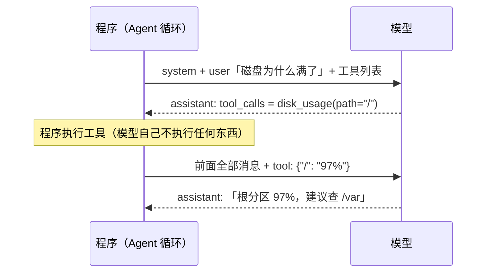
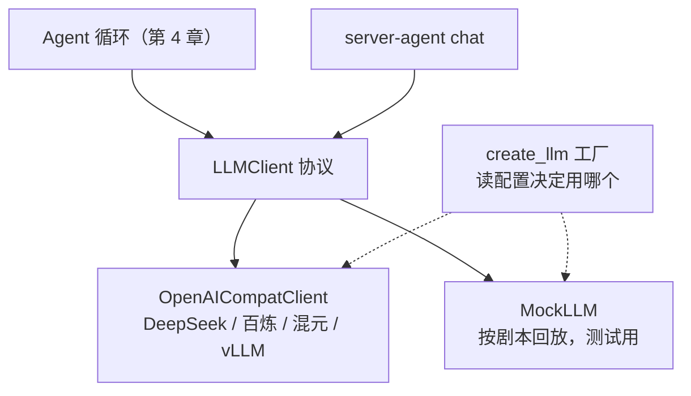
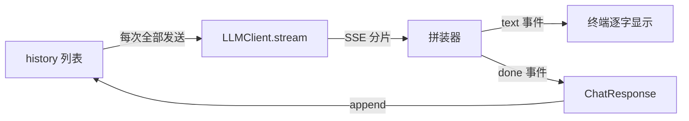

# 第 2 章 和大模型说话：LLM 调用层

**前置知识**：第 1 章（Agent 四要素里的「模型 = 大脑」）；知道 HTTP 请求和 JSON

**本章代码**：`server_agent/llm/`（数据结构、OpenAI 兼容客户端、MockLLM、工厂）+ `server-agent chat`。

**学习目标**：读完本章，应能回答以下问题。

1. 一次 Chat Completions 请求里到底发了什么？`system / user / assistant / tool` 四种角色各管什么？
2. 模型为什么「记得」上一轮对话？（剧透：它不记得）
3. 流式输出是怎么一片片传回来的？工具调用的参数被切碎了怎么拼？
4. 为什么要自己包一层 Provider 抽象，而不是直接到处调 SDK？
5. MockLLM 是什么，为什么它能让后面所有 Agent 测试不花一分钱？

---

## 2.1 剥开 SDK：一次调用就是一个 HTTP POST

不管你用哪家模型，只要它说自己「OpenAI 兼容」，一次调用就是这么一个请求：

```bash
curl https://api.deepseek.com/chat/completions \
  -H "Authorization: Bearer $LLM_API_KEY" \
  -H "Content-Type: application/json" \
  -d '{
    "model": "deepseek-v4-flash",
    "messages": [
      {"role": "system", "content": "你是资深 Linux 运维工程师"},
      {"role": "user",   "content": "磁盘满了先看什么？"}
    ],
    "temperature": 0.2
  }'
```

返回：

```json
{
  "model": "deepseek-v4-flash",
  "choices": [{
    "message": {"role": "assistant", "content": "先用 df -h 确认是哪个分区……"},
    "finish_reason": "stop"
  }],
  "usage": {"prompt_tokens": 28, "completion_tokens": 60, "total_tokens": 88}
}
```

就这些。厂商 SDK 做的事情，本质上是把这个 JSON 包成对象、加上重试。**本书用 httpx 直接发这个请求**，这样你随时能看到线上跑的是什么——排查「模型为什么这么回答」时，第一件事永远是看它**实际收到了什么**。

这个协议已经成了事实标准：DeepSeek、通义千问（百炼兼容模式）、混元、本地部署的 vLLM / Ollama 都提供同样的接口。所以换模型只需要改三个配置：`LLM_BASE_URL`、`LLM_API_KEY`、`LLM_MODEL`。

---

## 2.2 四种消息角色：一段对话的剧本

`messages` 是一个按时间顺序排列的列表，每条消息有一个 `role`：

| 角色 | 谁写的 | 作用 | 排障场景里的例子 |
|---|---|---|---|
| `system` | 开发者 | 立人设、定规矩，放在最前面 | 「你是资深 SRE，先只读后写入，结论要有证据」 |
| `user` | 用户 | 提问、下指令 | 「web-01 磁盘为什么满了」 |
| `assistant` | 模型 | 模型的回答，**或者它提议的工具调用** | 「我先查一下磁盘」+ `tool_calls: [disk_usage]` |
| `tool` | 程序 | 工具执行结果，用 `tool_call_id` 对应到某次调用 | `{"/": "97%"}` |

后两种角色是 Agent 的关键，完整的一轮工具往返长这样（第 03、04 章会真正跑起来）：



### 一个高频误解：「模型记得上一轮聊了什么」

不记得。**Chat Completions 是无状态的**：每次请求，模型只看得到这次 `messages` 里的内容。所谓「多轮对话」，是程序每次都把**全部历史**重新发一遍。

这带来三个直接后果，后面的章节都绕不开：

| 后果 | 影响 | 哪一章处理 |
|---|---|---|
| 历史越长，每次请求越贵、越慢 | 成本随轮数增长 | 08 上下文管理 |
| 历史由程序维护，程序可以改写它 | 可以压缩、截断，也可能被篡改 | 08、09 |
| 模型的「记忆」完全等于你发给它的东西 | 调试时看 messages 就够了 | 本章 MockLLM 的 `calls` |

本章 `server-agent chat` 的核心就一行：回答结束后 `history.append(resp.message)`。删掉这行，你会发现模型立刻「失忆」——动手练习第 2 题会让你亲手验证。

---

## 2.3 Token、上下文窗口与几个关键参数

**Token** 是模型处理文本的最小单位，大致上一个英文单词约 1-1.5 个 token，一个汉字约 1-2 个 token（不同模型的分词器不同）。计费、限额、上下文长度都按 token 算。

**上下文窗口** 是一次请求中「输入 + 输出」能容纳的 token 上限。它是 Agent 最宝贵的预算：一次 `journalctl` 输出可能就有几万 token。

| 参数 | 控制什么 | 本项目默认 | 为什么 |
|---|---|---|---|
| `temperature` | 随机性。0 最确定，越高越发散 | `0.2` | 排障要稳定、可复现，不需要创意 |
| `max_tokens` | 本次最多输出多少 token | 不设（由服务端默认） | 需要时在调用处传 `max_tokens=` |
| `tools` / `tool_choice` | 可用工具列表 / 是否强制调用 | 第 3 章启用 | — |
| `stream` | 是否流式返回 | CLI 用流式 | 用户体验，见2.4 节 |

每次响应里的 `usage` 告诉你花了多少：`prompt_tokens`（输入）、`completion_tokens`（输出）。`server-agent chat -v` 会把它打印出来——多聊几轮，你会看到 `prompt_tokens` 一轮比一轮大，这就是2.2 节 里「每次都重发全部历史」的直观证据。

**`finish_reason`** 说明模型为什么停下，Agent 循环要根据它决定下一步：

| 值 | 含义 | Agent 该做什么 |
|---|---|---|
| `stop` | 正常说完 | 当作最终回答 |
| `tool_calls` | 想调用工具 | 执行工具，把结果回喂（第 4 章） |
| `length` | 撞到 `max_tokens` 或上下文上限 | 输出被截断，需要处理 |
| `content_filter` | 被内容审核拦截 | 报错 |

### 关于思考模型

部分模型带「思考模式」：先输出一段推理过程，再给回答。以 DeepSeek V4 为例（2026-09 核实），它**默认开启思考**，推理内容放在单独的 `reasoning_content` 字段，不在 `content` 里。只读 `content` 的客户端会看到「长时间没反应，然后突然出答案」。

本项目的处理：推理内容单独收集到 `ChatResponse.reasoning`，CLI 用灰色显示；**它不会被放回历史**（`Message.to_dict()` 不含它），因为推理过程通常不需要、也不应该回传给模型。排障场景追求响应速度，`.env.example` 默认通过 `LLM_EXTRA_BODY` 关闭思考。

---

## 2.4 流式输出：SSE 分片与增量拼接

非流式调用要等模型把几百个字全部生成完才返回，用户盯着空白屏幕等十几秒。流式调用（`"stream": true`）则边生成边推送，协议是 **SSE**（Server-Sent Events，服务器推送事件）：

```text
data: {"choices":[{"delta":{"role":"assistant","content":""}}]}

data: {"choices":[{"delta":{"content":"先用"}}]}

data: {"choices":[{"delta":{"content":" df -h"}}]}

data: {"choices":[{"delta":{},"finish_reason":"stop"}]}

data: {"choices":[],"usage":{"prompt_tokens":28,"completion_tokens":60,"total_tokens":88}}

data: [DONE]
```

规则很简单：每个事件一行 `data: ...`，事件间空一行，最后以 `data: [DONE]` 结束（注意它**不是 JSON**，直接 `json.loads` 会崩）。以 `:` 开头的行是心跳注释，忽略即可。

需要当心的是**工具调用也会被切碎**。模型要调用 `disk_usage(path="/var")` 时，你可能收到：

```text
delta.tool_calls = [{"index": 0, "id": "call_9", "function": {"name": "disk_", "arguments": ""}}]
delta.tool_calls = [{"index": 0, "function": {"name": "usage", "arguments": "{\"pa"}}]
delta.tool_calls = [{"index": 0, "function": {"arguments": "th\": \"/var\"}"}}]
```

拼接要点：

| 要点 | 原因 |
|---|---|
| 按 `index` 归组，不按 `id` | `id` 只在第一片出现；并行调用时多个 index 的碎片会交错到达 |
| `arguments` 先拼完再 `json.loads` | 中间状态 `{"pa` 不是合法 JSON |
| 文本同理，不要对单个分片做关键词判断 | 分片边界没有语义，一个词可能被切成两半 |

`server_agent/llm/openai_compat.py` 里的 `_StreamAccumulator` 就是这个拼装器，测试 `test_stream_assembles_tool_call_fragments` 用的正是上面这种切碎的数据。

---

## 2.5 Provider 抽象：为什么要自己包一层

如果在业务代码里到处直接发 HTTP 请求，换模型、加重试、写测试都会很痛苦。所以先定义一个很薄的**协议**（Protocol），上层只依赖它：

```python
class LLMClient(Protocol):
    async def chat(self, messages, tools=None, **opts) -> ChatResponse: ...
    def stream(self, messages, tools=None, **opts) -> AsyncIterator[StreamEvent]: ...
```



这层抽象要解决的横切问题：

| 问题 | 本章的做法 |
|---|---|
| **换模型** | 改配置即可；厂商私有参数（如关闭思考）走 `LLM_EXTRA_BODY`，不写死在代码里 |
| **超时** | httpx 统一 `timeout`，默认 60 秒 |
| **重试** | 只重试「可能自愈」的错误：429 限流、5xx、网络错误、超时；**401/400 立即失败**（重试一百次 Key 也不会变对）|
| **退避** | 指数退避 + 随机抖动；服务端给了 `Retry-After` 就听它的 |
| **流式重试** | 只在收到第一个字节前重试；开始输出后再重试会让用户看到重复内容 |
| **成本** | 每次响应带 `usage`，`Usage` 支持相加，便于累计 |
| **错误分类** | 统一抛 `LLMError`，带 `status` 与 `retryable`，上层据此决策 |

### 一个高频误解：「重试越多越稳」

对 429 盲目快速重试，只会让限流更严重（所有客户端同时重试，形成「惊群」）。所以退避要**指数增长**并加**随机抖动**，把重试请求在时间上打散。而对 400（请求本身有问题）重试毫无意义。**先判断错误能不能靠等待解决，再决定要不要重试。**

---

## 2.6 MockLLM：让 Agent 测试确定、免费、可重复

Agent 测试最头疼的三件事：真模型**每次回答不一样**、**要花钱**、**要联网**。MockLLM 用「剧本」解决全部三个问题：

```python
from server_agent.llm.mock import MockLLM, tool_call

llm = MockLLM([
    tool_call("disk_usage", {"path": "/"}),   # 第 1 次调用：假装模型要查磁盘
    "根分区 97%，主要是 /var/log",             # 第 2 次调用：假装模型给出结论
])
```

| 能力 | 用途 |
|---|---|
| 剧本按顺序回放 | 精确控制「模型」每一步做什么，测试结果完全确定 |
| 剧本项可以是函数 | 根据收到的消息动态决定回答，模拟「看到工具结果后再决定」 |
| `llm.calls` 记录每次收到的消息快照 | 断言「Agent 到底给模型看了什么」——这比断言输出更有价值 |
| 剧本用完就报错 | 发现 Agent 调用模型的次数比预期多（比如死循环） |
| 剧本为空时 echo | 没有 API Key 也能体验 `server-agent chat --mock` |

这里有一个重要的思想：**测试验证的不是模型聪不聪明，而是 Agent 程序在模型做出某种选择时的行为是否正确**。模型聪不聪明，要靠第 15 章的评测集来衡量，那是另一回事。

真实客户端同样不联网测试：`httpx.MockTransport` 可以拦截请求、返回伪造的响应，于是请求体格式、响应解析、SSE 拼接、429 重试、401 不重试，全都能在 0.1 秒内离线验证。

---

## 2.7 代码走读

```text
server_agent/llm/
├── __init__.py         # 对外导出
├── base.py             # Message / ToolCall / ChatResponse / Usage / StreamEvent / LLMError / LLMClient 协议
├── openai_compat.py    # httpx 实现：请求体、重试、非流式解析、SSE 拼装
├── mock.py             # MockLLM 与 text() / tool_call() 剧本辅助函数
└── factory.py          # create_llm()：按配置返回真实客户端或 MockLLM
```

### 1. 数据结构：`base.py`

`Message` 是整个项目流通的「货币」，`to_dict()` 负责转成接口格式。两个细节：

- `ToolCall.arguments` 保留**原始字符串**，`parsed_arguments()` 才解析。模型可能给出非法 JSON，解析失败要作为错误信息回喂给模型（第 4 章「错误即观察」），而不是在解析层就崩掉。
- `ChatResponse.reasoning` 与 `message` 分开存放，保证推理过程不会误入历史。

### 2. 真实客户端：`openai_compat.py`

`_payload()` 组装请求体，合并顺序是：默认参数 → `extra_body`（厂商私有参数）→ 调用时传入的参数，后者优先。`chat()` 的重试循环把错误分成三类：网络与超时（重试）、可重试状态码（退避后重试）、其它（立即抛出）。

### 3. 配置：`config.py` 新增的 LLM 项

LLM 配置同时接受 `LLM_XXX` 与 `SA_LLM_XXX` 两种写法（`AliasChoices`），因为 `LLM_BASE_URL` 这类名字是社区通用习惯。`LLM_EXTRA_BODY` 是 JSON 字符串，pydantic 自动解析为 dict。`llm_api_key` 和 `api_token` 一样在 `public_dict()` 里打码。

### 4. 命令行：`server-agent chat`

```text
history = [system]
循环：
    history.append(user 输入)
    流式调用 → 边收边打印（思考内容灰色走 stderr，回答走 stdout）
    history.append(模型回答)     ← 模型「记得」上文的全部秘密
```

---

## 2.8 动手练习

1. **接上你的模型**：`cp .env.example .env`，填好 `LLM_API_KEY`（以及你用的厂商对应的 `LLM_BASE_URL` / `LLM_MODEL`），运行 `server-agent chat -v`，问两个相关联的问题（如「nginx 日志默认在哪」→「那怎么按小时切割它」）。观察第二轮的 `prompt_tokens` 比第一轮大多少。
2. **验证「模型没有记忆」**：把 `cli.py` 里的 `history.append(resp.message)` 注释掉，再问同样两个问题，看第二个回答还能不能接上。做完记得改回来。
3. **看透 SSE**：用 `curl -N`（`-N` 关闭缓冲）直接请求你的模型接口并加上 `"stream": true`，对照2.4 节 看原始分片。
4. **温度实验**：同一问题分别用 `LLM_TEMPERATURE=0` 和 `LLM_TEMPERATURE=1.2` 各问 3 次，比较回答的一致性，想想为什么排障 Agent 选低温度。
5. **读测试**：打开 `tests/test_openai_compat.py`，找到 429 重试和 401 不重试两个用例，试着把 `RETRYABLE_STATUS` 里的 429 删掉，看哪个测试失败。

---

## 2.9 验收清单

```bash
cd server-agent && source .venv/bin/activate
pip install -e ".[dev]"

pytest -q
# 预期：全部通过（0 failed）

server-agent chat --mock --once "你好"
# 预期：（mock）你说的是：你好

server-agent chat --once "hi"          # 未配置模型时
# 预期：[error] 缺少模型配置: LLM_BASE_URL, LLM_MODEL ...  退出码 2

cp .env.example .env && vi .env          # 填 LLM_API_KEY 等
server-agent config | grep llm_
# 预期：llm_api_key 显示为 "***"

server-agent chat -v --once "磁盘满了先看什么"
# 预期：回答逐字流式出现；stderr 打印 [tokens] 本轮 输入 N / 输出 M
```

---

## 2.10 本章小结

**要点**
1. 调用大模型就是一个 HTTP POST：发一个 `messages` 列表，收一条 `assistant` 消息；`tool` 角色和 `tool_calls` 是后面 Agent 的基础。
2. 模型没有记忆，多轮对话 = 程序每次重发全部历史，所以上下文是要精打细算的预算。
3. 用一个薄薄的 `LLMClient` 协议隔离厂商差异；真实客户端负责超时、重试、流式拼装，MockLLM 让 Agent 测试确定、免费、离线。



**自测题**（括号内为对应小节）

1. `system`、`user`、`assistant`、`tool` 四种角色分别由谁写？（2.2 节）
2. 为什么说 Chat Completions 是无状态的？这对成本有什么影响？（2.2 节）
3. `finish_reason` 为 `tool_calls` 和 `length` 时，Agent 分别应该怎么处理？（2.3 节）
4. 流式工具调用的碎片为什么要按 `index` 而不是 `id` 归组？（2.4 节）
5. 为什么遇到 401 不重试，遇到 429 要退避重试？退避为什么要加随机抖动？（2.5 节）
6. 流式调用为什么只在收到第一个字节之前重试？（2.5 节）
7. MockLLM 的 `calls` 记录有什么用？为什么说「测的不是模型聪不聪明」？（2.6 节）
8. 思考模型的推理内容为什么不放回历史？（2.3 节）
