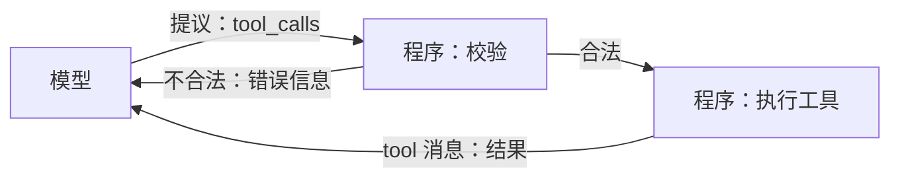
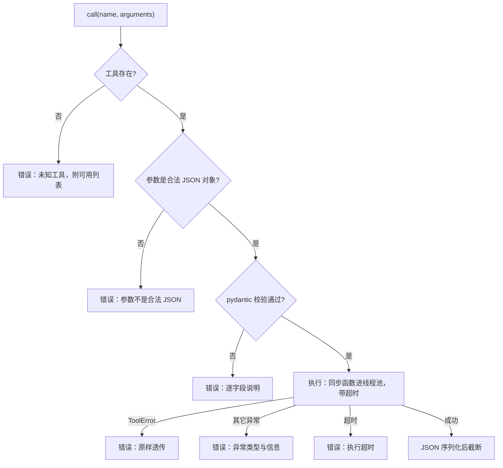
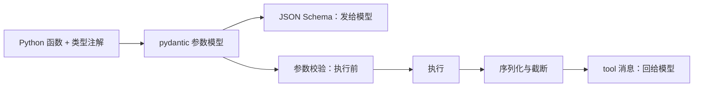

# 第 3 章 给 Agent 装上手：工具调用 Function Calling

**前置知识**：第 2 章（`assistant` 消息里的 `tool_calls`、`tool` 角色、`finish_reason=tool_calls`）

**本章代码**：`server_agent/tools/`（注册表 + 6 个只读排障工具）、`server-agent tools list / call`。

**学习目标**：读完本章，应能回答以下问题。

1. 模型「调用工具」时，到底是谁在执行？
2. 模型是靠什么知道一个工具怎么用的？为什么说工具描述比工具实现更重要？
3. 一个好的 Agent 工具长什么样？参数、返回值、错误各有什么讲究？
4. 工具返回了 5 万行日志怎么办？

---

## 3.1 模型只提议，程序才执行

第 1 章说 Agent = 大脑 + 手。但大模型本质上只会**输出文字**，它没有手。所谓 Function Calling（函数调用，也叫 Tool Calling），真相是一场「分工」：

| 步骤 | 谁做 | 做什么 |
|---|---|---|
| 1 | 程序 | 在请求里附上 `tools`：每个工具的名字、描述、参数格式 |
| 2 | 模型 | 读完用户问题和工具列表，**输出一段结构化文本**：「我想调用 `disk_usage`，参数 `{"path": "/"}`」 |
| 3 | 程序 | 检查这个提议（存在吗？参数合法吗？第 9 章还要问：允许吗？），然后**真正执行** |
| 4 | 程序 | 把结果作为 `tool` 消息追加到历史，再次请求模型 |
| 5 | 模型 | 看到结果，决定继续调工具还是给出结论 |



记住这张图里的一个事实：**模型永远碰不到你的服务器**。它能造成的所有影响，都要经过程序这一关。这是整个安全体系（第 9 章）的地基——关卡设在哪里、设得多严，完全由你决定。

### 一个高频误解：「模型支持 Function Calling，所以它会执行函数」

不会。模型只是被训练成「在合适的时候输出一段符合 Schema 的 JSON」。它甚至不知道这个函数存不存在——它可能编造一个不存在的工具名，或者给出不合法的参数。所以程序端的校验不是可选项，是必需品。本章的注册表对这两种情况都会返回可读的错误。

---

## 3.2 模型只看得到描述：JSON Schema

这是发给模型的 `disk_usage` 工具的完整样子（`server-agent tools list --schema` 可以看到全部）：

```json
{
  "type": "function",
  "function": {
    "name": "disk_usage",
    "description": "查看磁盘空间使用情况（相当于 df -h）：每个分区的总量、已用、可用与使用率，使用率 >= 90% 会带 warning。\n只统计分区级别，不统计某个目录占多大。",
    "parameters": {
      "type": "object",
      "properties": {
        "path": {"type": "string", "default": null,
                 "description": "要查看的路径，如 / 或 /var/log；不填则列出所有分区"}
      },
      "additionalProperties": false
    }
  }
}
```

`parameters` 部分是 **JSON Schema**——一种描述 JSON 数据结构的标准。它告诉模型：有哪些参数、什么类型、哪些必填、取值范围、每个参数干什么。

模型决定「用不用这个工具、怎么填参数」时，**能依据的只有这三样：`name`、`description`、`parameters`**。它看不到你的 Python 代码，看不到你的注释。这带来一个反直觉的结论：

> **改工具描述，就是在改 Agent 的行为。**

比如 `disk_usage` 描述里那句「只统计分区级别，不统计某个目录占多大」，是在防止模型误以为它能回答「/var/log 占了多少」——没有这句，模型很可能调用它然后得出错误结论。第 7 章写提示词时，你会发现工具描述其实就是提示词的一部分，而且是每轮都发送的那部分。

好描述的要素：

| 要素 | 例子 |
|---|---|
| 做什么（类比熟悉的命令） | 「相当于 df -h」 |
| 返回什么 | 「总量、已用、可用与使用率」 |
| 什么时候用 | 「排障开始时先调用它」 |
| **不能做什么** | 「不统计某个目录占多大」「二进制文件会被拒绝」 |
| 参数怎么填（给例子） | 「如 /var/log/nginx/error.log」 |

---

## 3.3 从 Python 函数自动生成 Schema

手写上面那段 JSON 又累又容易和代码不一致。这里让 Python 的类型注解同时承担三个角色：

```python
@tool
def tail_file(
    path: Annotated[str, Field(description="文件的绝对路径，如 /var/log/nginx/error.log")],
    lines: Annotated[int, Field(ge=1, le=1000, description="返回最后多少行")] = 50,
    grep: Annotated[str | None, Field(description="只保留包含该关键字的行（不区分大小写）")] = None,
) -> dict:
    """读取文本文件（通常是日志）的最后若干行（相当于 tail -n，可选 grep 过滤）。..."""
```

| 写在代码里的 | 变成 Schema 里的 | 调用时用来 |
|---|---|---|
| 函数名 | `name` | 路由 |
| docstring | `description` | — |
| 类型 `int` / `str` / `Literal["cpu","memory"]` | `type` / `enum` | 类型校验 |
| 没有默认值 | `required` | 必填校验 |
| `Field(ge=1, le=1000)` | `minimum` / `maximum` | 范围校验 |
| `Field(description=...)` | 参数的 `description` | — |

实现只有三步（`server_agent/tools/registry.py`）：

1. `build_params_model(func)`：用 `inspect.signature` + `get_type_hints` 读出参数，交给 pydantic 的 `create_model` 生成一个参数模型；
2. `model_json_schema()` 导出 JSON Schema；
3. `clean_schema()` 做两处精简：去掉 pydantic 自动加的 `title`；把 `str | None` 生成的 `anyOf: [{type: string}, {type: null}]` 压平成 `type: string`。少一层嵌套，模型更不容易填错，也省 token——**Schema 每一轮都要随请求发送**，6 个工具目前约 2500 字符。

**同一个参数模型既生成 Schema，又负责校验**，所以「告诉模型的」和「实际检查的」永远一致。

注册时还有三条硬规则，违反直接报错：

| 规则 | 理由 |
|---|---|
| 必须写 docstring | 没有描述的工具，模型只能靠名字瞎猜 |
| 每个参数必须有类型注解 | 否则生成不了 Schema |
| 不许 `*args` / `**kwargs` | 模型需要一份明确的参数清单 |

---

## 3.4 工具设计原则：给模型用的 API

工具的使用者不是人，是模型。模型的特点是：读得懂描述，但会犯粗心错误；上下文有限；不会主动问「这个参数什么意思」。据此有五条原则：

| 原则 | 反例 | 本项目的做法 |
|---|---|---|
| **单一职责** | 一个 `system_check(action)` 包打天下 | 6 个工具各管一件事 |
| **参数少而明确** | `path` 相对绝对都行、`lines` 不设上限 | 必须绝对路径；`lines` 限 1-1000；排序只能 `cpu` / `memory` |
| **返回结构化、自带判断** | 直接返回 `df` 原始文本 | 返回 JSON；使用率 >= 90% 自动加 `warning` 字段 |
| **有长度上限** | 返回整个日志文件 | 只扫描末尾 2MB；默认返回 50 行；结果超过上限就截断 |
| **错误可读、可行动** | 抛出 Python 异常栈 | 「必须使用绝对路径: t.log」——模型看了就知道怎么改 |

最后一条尤其重要。第 4 章的 Agent 循环会把错误**原样回喂给模型**，让它自己纠正。所以错误信息的读者是模型：要说清楚**错在哪、怎么改**。

### 常见陷阱：真实发生的两件事

**事件 1：多余参数被拒。** 调试时如果顺手给每个工具都传 `{"limit": 3}`，结果 `host_info` 返回：

```text
{"error": "参数校验失败：limit: Extra inputs are not permitted"}
```

这正是 `extra="forbid"` 的作用。模型也会犯同样的错（把 A 工具的参数用到 B 工具上），如果静默忽略，模型会以为参数生效了，得出错误结论。**拒绝并说明，比默默吞掉更安全。**

**事件 2：端口工具的输出被截断。** `listening_ports` 第一版没有参数，在一台普通开发机上返回了 43 个端口、4046 字符，超过 4000 字符上限被截断——模型看到的是半截 JSON，最后几个端口丢了。截断是兜底，但**靠截断解决问题是工具设计失败**。修正方法是给工具加上「缩小范围」的能力：

| 修改 | 效果 |
|---|---|
| 加 `port` 参数 | 「80 端口被谁占了」一次精确命中 |
| 加 `limit` 参数（默认 30） | 默认输出约 3000 字符，留出余量 |
| 超出时返回 `hint` | 「共 43 条，仅返回前 30 条；可用 port 参数精确查询」——告诉模型下一步怎么做 |

**教训：先设计「让输出变小」的参数，截断只作最后防线。**

---

## 3.5 工具结果：序列化、截断与异常

注册表的 `call()` 是工具的唯一入口，它对任何输入都返回一个 `ToolResult`，**绝不向上抛异常**：



| 字段 | 给谁 | 说明 |
|---|---|---|
| `content` | 模型 | 永远是有长度上限的字符串；失败时是 `{"error": "..."}` |
| `data` | 程序 | 原始返回值，给前端展示、测试断言 |
| `ok` / `error` | 程序 | 第 4 章据此生成事件 |
| `truncated` | 程序与模型 | 截断时 `content` 末尾会附上说明和建议 |
| `elapsed_ms` | 程序 | 第 15 章 Trace 的原始数据 |

两个工程细节：

- **`ToolError` 与普通异常分开**：`ToolError("文件不存在: /x")` 是工具作者特意写给模型看的，原样透传；其它异常（如 `ZeroDivisionError`）是 bug，给出类型和信息，方便定位。
- **同步工具放进线程池**：psutil 采样 CPU 要 `sleep` 0.5 秒，如果直接在事件循环里跑，第 5 章服务化后会卡住所有并发请求。`asyncio.to_thread` 把它挪到线程池，再用 `wait_for` 加超时（默认 30 秒）。

---

## 3.6 六个只读排障工具

| 工具 | 相当于 | 参数 | 回答什么问题 |
|---|---|---|---|
| `host_info` | `uname -a; uptime` | 无 | 这是台什么机器？开机多久了？ |
| `cpu_memory_usage` | `top` 头部、`free -h` | `interval` | 卡不卡？负载高不高？内存够不够？ |
| `disk_usage` | `df -h` | `path` | 哪个分区满了？ |
| `top_processes` | `ps aux --sort` | `sort_by`、`limit` | 谁在吃 CPU / 内存？ |
| `listening_ports` | `ss -lntup` | `port`、`limit` | 端口被谁占了？服务在监听吗？ |
| `tail_file` | `tail -n \| grep` | `path`、`lines`、`grep` | 日志里最近报了什么错？ |

为什么**全部只读**？本章的 Agent 还没有任何刹车（审批、权限、审计要到第 9 章），给它写操作工具等于把方向盘交给一个还没考驾照的人。所有工具都标记了 `risk="read"`，第 9 章会基于这个字段决定哪些操作需要人工批准。

几个实现上的小心思：

| 工具 | 细节 | 原因 |
|---|---|---|
| `top_processes` | CPU% 先打点、`sleep 0.5`、再采样 | psutil 的 CPU% 是两次采样之间的差值，第一次调用永远返回 0 |
| `listening_ports` | 权限不足时退化为逐进程查询，并标注 `partial` | macOS 非 root 无法列出全部连接；**不完整时要明确告诉模型**，否则它会把「没看到」当成「不存在」 |
| `tail_file` | 从文件末尾 seek，只读 2MB；丢弃第一行 | 10GB 日志也能秒回；第一行大概率被切成半截 |
| `tail_file` | 前 8KB 含 `\0` 就拒绝 | 读二进制文件只会给模型一堆乱码 |
| `disk_usage` | 过滤 tmpfs、overlay 等伪文件系统 | 减少噪音，让模型注意力留给真正的磁盘 |

---

## 3.7 代码走读

```text
server_agent/tools/
├── __init__.py      # 导出 registry / tool / ToolResult 等；导入 system 以触发注册
├── registry.py      # Tool、ToolResult、ToolError、ToolRegistry、@tool、clean_schema、truncate
└── system.py        # 6 个只读工具 + human() 字节格式化
server_agent/cli.py  # 新增 tools list [--schema] / tools call NAME [JSON]
tests/test_tool_registry.py   # Schema 生成、注册规则、参数校验、异常、超时、截断
tests/test_system_tools.py    # 6 个工具在本机真实运行；tail_file 的边界情况
```

`registry.py` 里最值得细读的是 `call()`：约 40 行，包含了本章3.5 节 的全部分支。另外注意全局注册表的写法：

```python
registry = ToolRegistry()   # 全局默认注册表
tool = registry.tool        # system.py 里的 @tool 就是它
```

测试中则用 `ToolRegistry()` 新建独立注册表，互不干扰。

---

## 3.8 动手练习

1. **看看模型眼中的工具**：`server-agent tools list --schema`，挑一个工具，试着只凭这段 JSON 回答「它能不能用来查 /var/log 目录占了多大」。
2. **扮演一次模型**：依次运行下面四条，体会模型犯错时会收到什么反馈：
   ```bash
   server-agent tools call tail_file '{"path": "app.log"}'
   server-agent tools call top_processes '{"limit": "many"}'
   server-agent tools call host_info '{"verbose": true}'
   server-agent tools call rm_everything
   ```
3. **写一个自己的工具**：在 `system.py` 里加一个 `file_stat(path)`，返回文件大小、修改时间、属主。要求：docstring 写清「不能做什么」；路径不存在时抛 `ToolError`。用 `tools list --schema` 检查生成结果，再补一个测试。
4. **截断实验**：`server-agent tools call listening_ports '{"limit": 100}'`，观察 stderr 最后一行是否提示截断；再用 `'{"port": 22}'` 对比输出大小。
5. **思考题**：`tail_file` 允许读任意绝对路径，包括 `/etc/shadow`（如果进程有权限）。这有什么风险？第 9 章会怎么解决？

---

## 3.9 验收清单

```bash
cd server-agent && source .venv/bin/activate
pip install -e ".[dev]"            # 新增依赖 psutil

pytest -q
# 预期：全部通过（0 failed）

server-agent tools list
# 预期：本章的 6 个工具都在，均为 [read]（后续章节会陆续加入更多工具）

server-agent tools list --schema | python3 -c "import sys,json; print(len(json.load(sys.stdin)))"
# 预期：一个整数，即当前注册的工具总数（checkout ch03 时为 6）

server-agent tools call disk_usage '{"path": "/"}'
# 预期：partitions 数组；stderr 末行 [ok] disk_usage ...ms

server-agent tools call tail_file '{"path": "relative.log"}'
# 预期：{"error": "必须使用绝对路径: relative.log"}，退出码 1
```

---

## 3.10 本章小结

**要点**
1. Function Calling 是分工：模型只**提议**（输出一段符合 Schema 的 JSON），程序负责校验和**执行**，模型永远碰不到服务器。
2. 模型只看得到 `name`、`description`、`parameters`，所以工具描述就是提示词；用类型注解同时生成 Schema 和校验参数，保证「说的」和「查的」一致。
3. 好工具 = 单一职责 + 参数少而明确 + 结构化且有上限的返回 + 模型能看懂并据此改正的错误；截断只是最后一道防线。



**自测题**（括号内为对应小节）

1. 模型返回 `tool_calls` 之后，是谁在执行工具？为什么说这是安全体系的地基？（3.1 节）
2. 模型决定怎么调用工具时，能依据哪三样信息？（3.2 节）
3. `disk_usage` 描述里为什么要写「不统计某个目录占多大」？（3.2 节）
4. 为什么同一个 pydantic 模型既生成 Schema 又负责校验？（3.3 节）
5. `extra="forbid"` 解决了什么问题？静默忽略多余参数有什么风险？（3.4 节）
6. `listening_ports` 输出被截断后，为什么说「靠截断解决问题是工具设计失败」？正确的修法是什么？（3.4 节）
7. `ToolError` 与普通异常在处理上有什么区别？（3.5 节）
8. 同步工具为什么要放进线程池执行？（3.5 节）
