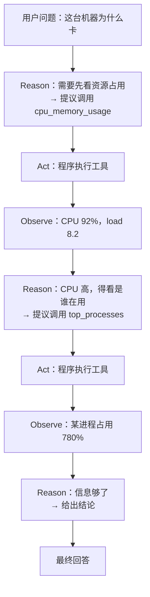
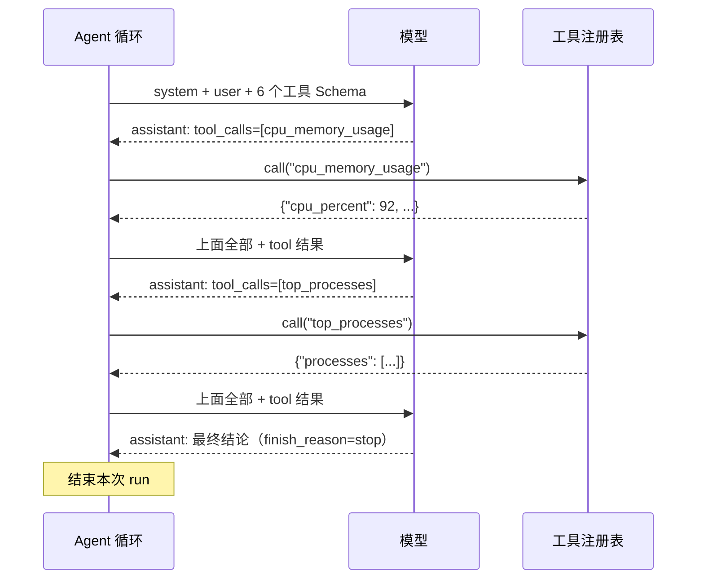
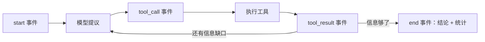

# 第 04 章 Agent 的心跳：ReAct 循环

> **本章导读**
>
> - 建议用时：知识 50 分钟 + 动手 40 分钟
> - 前置知识：第 02 章（流式、`finish_reason`）、第 03 章（工具注册表）
> - 读完能回答：
>   1. ReAct 循环的四个动作分别是什么？为什么它「够了」？
>   2. 一次多步排查里，消息列表是怎么一步步长出来的？
>   3. Agent 会失控吗？有哪三个刹车？
>   4. 为什么工具报错不能让程序崩，而要继续喂给模型？
>   5. 为什么这次要输出「事件流」而不是直接打印文字？
> - 本章代码：`server_agent/agent/`（事件模型 + ReAct 循环）、`server-agent ask`。对应 tag `ch04`。

---

## 【积木 4-1】ReAct：想、做、看，循环

第 01 章的「想-做-看」有了正式名字：**ReAct**（Reason + Act，2022 年提出）。核心非常朴素——**把推理和行动交替进行**，让模型每一步都基于上一步的真实结果，而不是一次性把整条路想完。



为什么不「一次性想完再执行」？因为**模型没有事实**。它不知道这台机器的 CPU 是多少、有几个进程。让它先猜一套命令再执行，等于让医生不看化验单就开药。ReAct 的价值就是：**每一步都建立在真实观察之上**。

对比第 01 章的光谱，ReAct 就是 L3「工具调用 Agent」的最小实现。第 12 章的 Plan-and-Execute（先出计划再执行）是它的进化版，但**先把 ReAct 写对，再谈规划**——绝大部分排障场景 ReAct 已经够用。

---

## 【积木 4-2】消息列表是怎么长出来的

这是本章最该看懂的一张图。假设用户问「这台机器为什么卡」：

| 轮次 | 追加到 `messages` 的内容 | 谁写的 |
|---|---|---|
| 0 | `system`：你是资深 SRE…… | 程序（初始化） |
| 0 | `user`：这台机器为什么卡 | 程序 |
| 1 | `assistant`：`tool_calls=[cpu_memory_usage]` | 模型 |
| 1 | `tool`：`{"cpu_percent": 92, "load_per_1m": 8.2}` | 程序（工具结果） |
| 2 | `assistant`：`tool_calls=[top_processes]` | 模型 |
| 2 | `tool`：`{"processes": [{"name": "python", "cpu": 780}]}` | 程序 |
| 3 | `assistant`：结论：某进程占满 8 核，建议…… | 模型 → 结束 |



注意两件事：

1. **每一次模型调用，整个历史都要重发一遍**（第 02 章讲过：模型没有记忆）。所以第 8 章要处理「历史越来越长、越来越贵」的问题。
2. **`tool` 消息必须用 `tool_call_id` 对应到具体调用**。一轮里并行调了 3 个工具，模型靠 id 才知道哪条结果是谁的。

程序的循环逻辑只有几十行，伪代码：

```python
while step < max_steps:
    resp = 模型(历史 + 工具清单)
    历史.append(resp.message)
    if resp 要调工具:
        执行工具 → 历史.append(tool 消息) → continue
    else:
        结束，返回 resp 的文本
```

---

## 【积木 4-3】三个刹车：Agent 为什么不会失控

一个只会 `while True` 的循环是危险的：模型可能反复调用同一个工具、可能永远不给结论、可能一次调用卡住 10 分钟。本章装了三个刹车：

| 刹车 | 默认 | 触发时 | 为什么需要 |
|---|---|---|---|
| **最大步数** `max_steps` | 12 步 | 第 12 步时追加一句「已达最大步数，请基于已有信息给结论」，然后强制收尾 | 防止无限循环与费用失控 |
| **总超时** `timeout` | 300 秒 | 抛超时错误，`stopped=timeout` | 防止卡在某次调用上 |
| **重复调用检测** | 自动 | 参数完全相同的调用**不执行**，回一句提醒 | 死循环最常见的样子就是反复查同一个东西 |

关于「最大步数」，有个细节值得学：**最后一步不是硬砍，而是先给模型一个交代的机会**——在最后一步的请求里追加一句「已达到最大步数，请基于已有信息给出结论」。硬砍会得到一个空白回答；这样至少能拿到一份「基于已知信息的结论」，用户知道发生了什么。

重复调用检测的实现要点是**参数归一化**：`{"path": "/"}` 和 `{ "path" : "/" }` 是同一个调用，所以先把 JSON 解析出来再按键排序序列化，用这个规范形式做 key。如果只比较原始字符串，模型换个空格就能绕过检测。

其他几个边界情况：

| 情况 | 处理 |
|---|---|
| `finish_reason=length` | 输出被截断，作最终回答并在末尾标注 |
| 模型既不回答也不调工具（空回复） | 追加一句提醒「请给出结论或调用工具」，继续循环 |
| 模型调用不存在的工具 | 注册表返回「未知工具 + 可用列表」，模型自己改 |
| 模型给出非法 JSON 参数 | 回一句「参数不是合法 JSON，请修正后重新调用」 |
| 模型调用 API 失败 | 发 `error` 事件并结束，`stopped=error`，**不抛出**给调用方 |

---

## 【积木 4-4】错误即观察：让模型自己纠错

第 03 章说「`registry.call()` 永不抛异常」，现在能看清它的价值了。看这一段真实运行（本章测试里的场景）：

```text
第 1 步：[调用] disk_usage {"path": "/missing"}
        [失败] disk_usage，路径不存在: /missing
第 2 步：模型读到这条错误 → 输出「该路径不存在，我改查根目录」
```

如果工具抛异常、程序崩了，用户看到的是堆栈；现在模型看到的是「路径不存在」，它会自己换一个路径——**这是 Agent 和脚本的本质区别之一**。

同理，模型填错参数（多余字段、类型错误、超范围）也走同一条路：错误信息回喂，模型自己改。所以第 03 章反复强调「错误信息的读者是模型」——它要写清楚**错在哪、怎么改**。

不过要注意分寸：**重试不是无条件的**。如果同一个错误出现三次，通常会一直失败下去。第 12 章的「反思」和第 09 章的审计会进一步收紧这一点；本章靠重复调用检测和最大步数兜底。

---

## 【积木 4-5】事件流：把「过程」变成一等公民

前面三章，程序都是「算出结果、打印结果」。本章换一种输出方式：**回调 / 生成器逐步产出事件**。

```python
async for event in agent.run("这台机器为什么卡"):
    # event.type ∈ start | step | reasoning | text | tool_call | tool_result | error | end
    render(event)
```

为什么要这么改？三个理由：

| 理由 | 说明 |
|---|---|
| **用户要看得见** | 一个跑 30 秒的 Agent，用户必须知道它现在在干什么（第 06 章的前端时间线直接消费这些事件） |
| **远程调用要能流式** | 第 05 章要把过程推给 HTTP 客户端，事件就是天然的协议 |
| **可观测** | 一次 run 的事件流就是一份完整轨迹（第 15 章 Trace 的基础） |

事件设计遵循两条原则：**扁平**（`data` 里都是可直接渲染的简单值，前端不用再解析嵌套结构）和 **有序**（每个事件带自增 `seq`，第 05 章断线续传靠它判断有没有漏事件）。

| 事件 | 关键字段 | 终端表现 |
|---|---|---|
| `start` | `input` `tools` `max_steps` `model` | — |
| `step` | `step` | `── 第 N 步 ──` |
| `reasoning` | `text`（思考模型才有） | 灰色小字（`-v` 才显示） |
| `text` | `text`（增量） | 逐字输出 |
| `tool_call` | `id` `name` `arguments` | `[调用] disk_usage {...}` |
| `tool_result` | `ok` `content` `chars` `elapsed_ms` `truncated` `skipped` | `[ok] disk_usage 13ms，102 字符` |
| `error` | `message` | `[错误] ...` |
| `end` | `text` `steps` `tool_calls` `usage` `stopped` | 最终答案 + 统计行 |

一个工程细节：**最终答案走 stdout，过程走 stderr**。这样 `server-agent ask -q "..." > answer.md` 能直接拿到干净的结论，而过程日志仍然可见。`--json` 则输出完整事件数组，供脚本和前端消费。

### 实战复盘：本章开发时踩的两个坑

**坑 1：事件「生成了」但没「发出去」。** 第一版里，`_step()` 和 `_run_tools()` 这两个辅助方法也用 `emit()` 产事件，而 `emit()` 里写的是 `yield`——但它们是**普通函数**，不是生成器。结果：文本、思考、工具结果事件被创建出来后**直接丢弃**，测试里看到的序列是 `start → step → tool_call → end`，中间全不见。修复方式是把 `emit()` 改成「只往缓冲区写」，由主循环统一 `flush()` 出去——**异步生成器里，只有生成器自己能 yield**。

**坑 2：序号（seq）从缓冲区长度算。** 紧接着我把 seq 写成 `len(buf) + 1`。因为缓冲区每轮都会被清空，seq 在第二轮又变回 1，事件顺序信息就废了。**序号必须来自一个只增不减的计数器**，和缓冲区大小无关。测试 `assert events[-1]["seq"] == len(events)` 就是专门用来防这个回归的。

**教训：事件流这类「正确性靠顺序」的东西，一定要用测试把顺序钉死**，而不是靠肉眼看终端输出。

---

## 【代码走读】本章落地了什么

```text
server_agent/agent/
├── __init__.py    # 导出 Agent / Event / AgentResult
├── events.py      # Event（type, run_id, seq, data）、AgentResult
└── loop.py        # Agent 主循环：_step / _run_tools / run / run_sync
server_agent/cli.py    # 新增 ask 子命令与终端渲染
server_agent/config.py # 新增 SA_AGENT_MAX_STEPS / SA_AGENT_TIMEOUT / SA_AGENT_MAX_TOKENS
tests/test_agent_loop.py  # 13 个用例：多步、错误恢复、重复调用、上限、超时、空回复、坏参数…
```

三个设计选择值得说明：

| 选择 | 原因 |
|---|---|
| `Agent(llm, tools, ...)` 依赖注入 | 测试里传 `MockLLM` 和自制注册表，不碰网络、不碰真实机器 |
| `clock` 可注入 | 超时测试不需要真的 `sleep(300)`；用假时钟每次前进 1 秒即可 |
| `run()` 是 async generator，`run_sync()` 是语法糖 | 前者给第 05 章的流式服务用，后者给「只想要结果」的场景（如测试与评测） |

`ask` 命令的渲染函数 `_render()` 单独放在 CLI 里，**不放进 Agent**：Agent 只负责产出事件，怎么显示是调用方的事——终端一种显示方式，浏览器（第 06 章）另一种。

---

## 【动手练习】

1. **接真模型跑一次排查**：`server-agent ask "这台机器现在资源占用怎么样？"`，观察它先调什么、再调什么。再用 `-v` 看每一步的工具结果片段。
2. **看事件流**：`server-agent ask --json "查一下磁盘" | python3 -m json.tool`，对照积木 4-5 的表格逐个核对字段。
3. **踩一下刹车**：`server-agent ask --max-steps 3 "把系统所有能查的都查一遍"`，观察第 3 步时模型收到了什么提示（`--json` 里能看到最后一条 user 消息）。
4. **改一个刹车参数**：把 `SA_AGENT_MAX_TOKENS=64`，问一个需要长回答的问题，看 `stopped=length` 时答案末尾的标注。
5. **思考题**：重复调用检测目前只拦「完全相同的参数」。如果模型反复用**略微不同的参数**查同一个东西（如 `/var`、`/var/`、`/var/log`），这套机制拦不住。你会怎么改进？（提示：能不能按「工具名 + 主要参数」统计次数？第 15 章的 Trace 能提供数据支持。）

---

## 【验收清单】

```bash
cd server-agent && source .venv/bin/activate
pip install -e ".[dev]"

pytest -q
# 预期：74 passed

server-agent ask --mock "磁盘满了吗"
# 预期：输出 mock 回答；stderr 有 [final] 1 步，0 次工具调用

server-agent ask --mock --json "测试" | python3 -c "import sys,json;print([e['type'] for e in json.load(sys.stdin)])"
# 预期：['start', 'step', 'text', ..., 'end']

# 接真模型（.env 已配置）
server-agent ask "这台机器为什么卡"
# 预期：自主调用两个以上工具（cpu_memory_usage → top_processes ...）后给出带数据的结论
```

---

## 【本章小结】

**三句话：**
1. ReAct = 想（模型提议）+ 做（程序执行）+ 看（结果回喂）循环，价值在于每一步都建立在**真实观察**上。
2. 循环必须有刹车：最大步数（且最后一步给模型收尾机会）、总超时、重复调用检测。
3. 工具报错不崩程序，而是作为观察回喂——**错误信息的读者是模型**，要写清楚错在哪、怎么改。



**自测题：**

1. ReAct 的两个动作是什么？为什么不「一次性想完再执行」？（积木 4-1）
2. 一次三步排查后，`messages` 里依次有哪些消息？`tool` 消息为什么必须带 `tool_call_id`？（积木 4-2）
3. 三个刹车分别是什么？最大步数触发时为什么要追加一句提示，而不是硬砍？（积木 4-3）
4. 重复调用检测为什么要先做参数归一化？（积木 4-3）
5. 为什么 `registry.call()` 永不抛异常？（积木 4-4）
6. 事件流的两个设计原则是什么？`seq` 字段有什么用？（积木 4-5）
7. 最终答案走 stdout、过程走 stderr，这样设计的好处是什么？（积木 4-5）
8. 本章踩的坑 1 说明了异步生成器的什么特性？（实战复盘）

---

## 【下一章预告】

第 05 章「走出终端：HTTP API、SSE 与 WebSocket」：让 Agent 变成**服务**。本章的事件流会被原样推给远程客户端——我们会设计事件协议（含断线续传）、实现 `POST /api/runs` 提交任务、`GET /api/runs/{id}/events` 用 SSE 流式接收过程、`/ws` 提供双向通道（为第 09 章的人工审批铺路），并加上 Bearer Token 鉴权，以及任务取消与并发控制。学完这章，别人就能通过 HTTP 远程调用你的 Agent。

*学完本章，回到对话里说一句「继续」，我就开讲第 05 章。*
