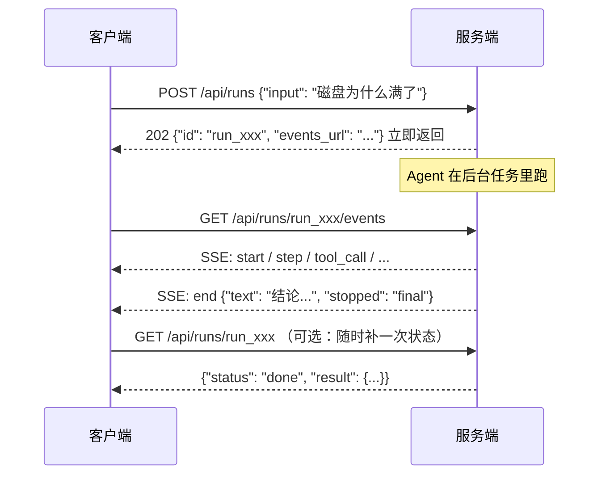
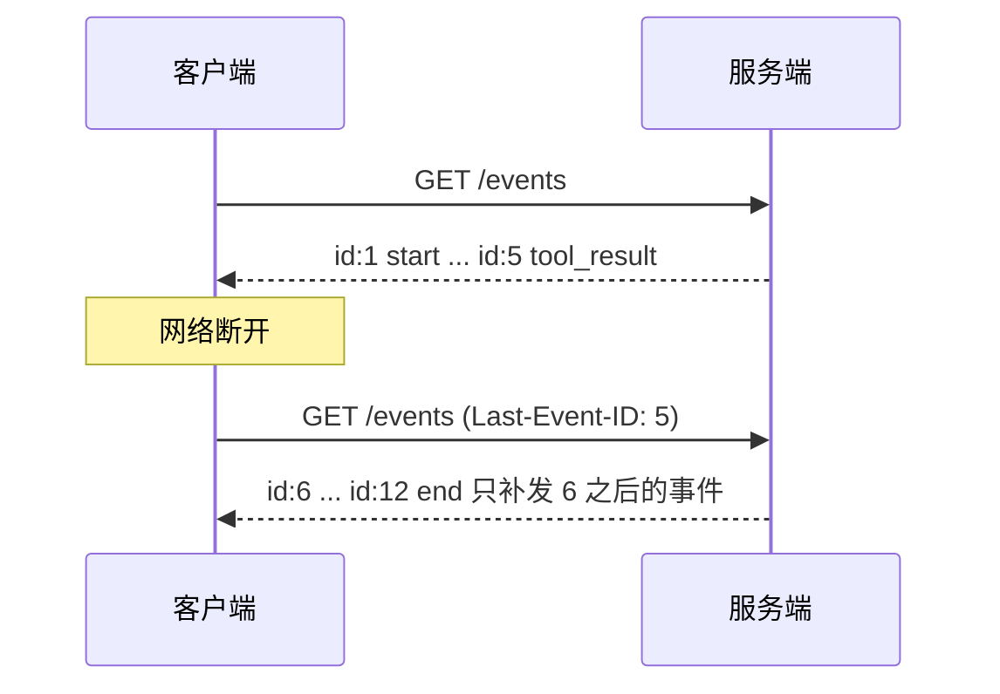
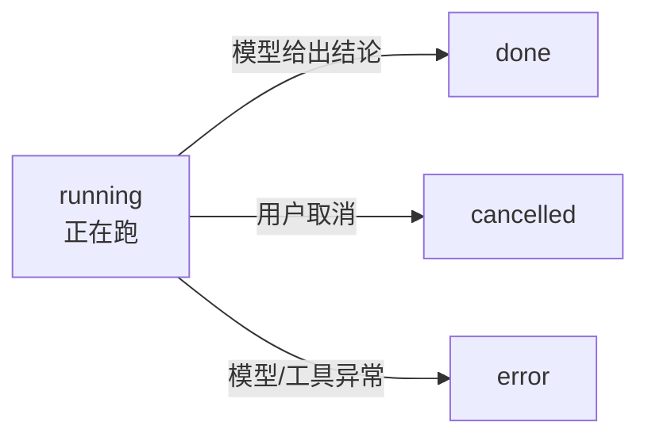
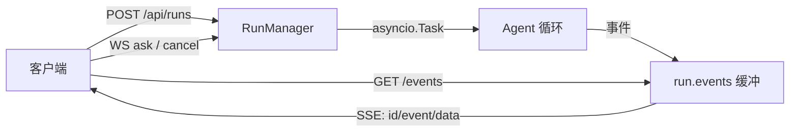

# 第 05 章 走出终端：HTTP API、SSE 与 WebSocket

> **本章导读**
>
> - 建议用时：知识 50 分钟 + 动手 40 分钟
> - 前置知识：第 04 章（事件流）；知道 HTTP 请求/响应、`curl` 基本用法
> - 读完能回答：
>   1. 为什么 Agent 服务不能做成「一个 POST 等到跑完」？
>   2. SSE 和 WebSocket 怎么选？
>   3. 事件流断线了怎么办？`Last-Event-ID` 是怎么工作的？
>   4. 一个能操作服务器的 Agent，暴露到网络上最少要做哪几件事？
>   5. 为什么 Agent 任务要能取消？取消是怎么实现的？
> - 本章代码：`server_agent/agent/runs.py`（Run 管理器）、`server_agent/server/`（API、WS、鉴权）、`docs/api.md`。对应 tag `ch05`。

---

## 【积木 5-1】Agent 服务为什么和普通 API 不一样

普通的业务接口：请求进来 → 查数据库 → 返回，几十毫秒。Agent 完全不同：

| 特征 | 普通 API | Agent 任务 |
|---|---|---|
| 耗时 | 毫秒级 | 10 秒 - 几分钟（多步推理 + 多次模型调用） |
| 中间过程 | 无 | 有，而且**用户很想看**（在想什么、在调什么工具） |
| 失败模式 | 抛异常返回错误码 | 可能中途超时、被取消、模型限流 |
| 请求方等待 | 值得 | 不值得，浏览器/网关早超时了 |

所以「一个 POST 一直挂着等结果」是行不通的。我们把一次排查拆成两件事：



**提交（POST）与订阅（GET /events）分离**带来三个好处：

| 好处 | 说明 |
|---|---|
| 短请求 | 提交请求立刻返回，不受网关超时限制 |
| 可重连 | 网络抖一下，重新订阅即可，Agent 还在跑 |
| 可复用 | 同一份事件流，终端看、浏览器看、写进日志，都行 |

---

## 【积木 5-2】SSE 与 WebSocket：单向推送 vs 双向对话

两种「服务端主动说话」的技术：

| 维度 | SSE（Server-Sent Events） | WebSocket |
|---|---|---|
| 方向 | 单向：服务端 → 客户端 | 双向 |
| 协议 | 就是普通 HTTP，`Content-Type: text/event-stream` | 独立协议，握手后升级 |
| 浏览器 API | `EventSource`，自带断线重连 + `Last-Event-ID` | `WebSocket`，重连要自己写 |
| 代理/网关友好度 | 好（就是 HTTP） | 一般（长连接，需要专门配置） |
| 适用 | 看进度、看输出 | 需要客户端回话的场景 |

Agent 的两种需求恰好各占一半：

- **看进度**——SSE 足够，而且浏览器 `EventSource` 自动重连、自动带 `Last-Event-ID`，白送一个断线续传。
- **服务端要问客户端**——只有 WebSocket 能干。第 09 章的人工审批就是这样：Agent 想执行高危操作，必须停下来问「批准吗」，等客户端回答「批准/拒绝」才能继续。SSE 单向，没法回话。

所以本项目**两个都实现**，各管一摊：

| 通道 | 用途 |
|---|---|
| `GET /api/runs/{id}/events`（SSE） | 主通道：任务提交后的过程推送 |
| `WS /ws` | 交互通道：一次连接内可以连续提问、取消、以及第 09 章的审批回话 |

### 一个高频误解：「SSE 就是 WebSocket 的简化版」

不是。它们是两个不同的东西：SSE 是**基于 HTTP 的单向流**，WebSocket 是**独立的双向协议**。SSE 在「服务端持续推数据」这件事上更简单、更稳（自带重连、能穿过大多数代理），但它**永远没法让客户端回话**——这就是为什么审批场景必须上 WebSocket。

---

## 【积木 5-3】事件协议：为什么要有 id 和 seq

第 04 章的事件已经带了 `seq`，本章把它落实到线协议上：

```text
id: 7
event: tool_call
data: {"id": "call_1", "name": "disk_usage", "arguments": "{\"path\": \"/\"}"}

```

三条规则：

| 规则 | 原因 |
|---|---|
| `id:` 用 `seq` | SSE 规范：客户端重连时把它作为 `Last-Event-ID` 请求头发回，服务端据此补发后续事件 |
| `event:` 写事件类型 | 客户端可以按类型分别处理（`addEventListener("tool_call", ...)`） |
| `data:` 是 JSON | 结构化，便于前端渲染与脚本处理 |

**断线续传的完整链路**（本章已实测）：



实现的关键是**服务端要留一份事件缓冲**。Run 管理器把每个 run 的事件存在内存列表里，新订阅者先收到 `seq > after_seq` 的历史事件，再收实时事件。这里有个容易踩的坑：**补发和实时推送可能重复**，所以订阅逻辑用一个 `sent` 集合去重——本章的实现就是这样，测试 `test_subscribe_late_while_running_gets_backlog_then_live` 专门验证「既完整又不重复」。

---

## 【积木 5-4】Run：一次任务的生命周期

「一次提问」在服务端的实体叫 **Run**，它有自己的状态机：



| 关注点 | 本章做法 | 局限与后续 |
|---|---|---|
| 存储 | 内存（`dict[str, Run]`） | 进程重启即丢 → 第 08 章换 SQLite |
| 容量 | 最多留 50 个 run，单个最多 2000 条事件，超出淘汰最旧的 | 长跑任务仍需更精细的落盘策略 |
| 并发 | 每个 run 一个 `asyncio.Task`，各自独立的 Agent 实例 | 没有全局并发上限 → 生产需加信号量 |
| 取消 | `task.cancel()`，`_drive` 捕获 `CancelledError` 把状态置为 `cancelled` | 工具线程无法被强杀（Python 限制） |

**为什么每个 run 要新建一个 Agent 实例？** 第 04 章留的伏笔：`Agent` 上有 `usage`、`last_result` 这类实例状态。两个任务共用一个实例，统计就会串。**用「一个任务一个实例」换取状态隔离，比在实例里到处加锁简单得多。**

**取消为什么重要？** 用户点了「停止」、或者 Agent 明显跑偏了、或者一次模型调用卡了 5 分钟——没有取消能力，这些只能干等。取消的实现路径：`cancel()` → `task.cancel()` → 循环中的 `await` 点抛出 `CancelledError` → `_drive` 捕获、状态置 `cancelled`、给订阅者发结束哨兵。

### 实战复盘：本章踩的三个坑（都是「同步 / 异步」边界问题）

**坑 1：同步路由里创建异步任务 → `no running event loop`。**
`RunManager.start()` 里用 `asyncio.create_task()` 启动后台任务，而我把 `POST /api/runs` 写成了普通 `def` 路由。FastAPI 的同步路由跑在**线程池**里，那里没有事件循环，于是直接报错。
修法：`start()` 改成 `async def`，路由也改 `async def`。**规律：任何要创建任务、操作事件循环的代码，必须在事件循环里跑。**

**坑 2：鉴权依赖读的是全局配置，而不是这个 app 的配置。**
`require_token` 原本调用 `get_settings()`（进程级单例）。测试里用 `create_app(Settings(api_token="s3cret"))` 建了带 Token 的 app，依赖却读到「没设 Token」的全局配置，于是 401 测试全挂——**这同时暴露了真实风险：如果有多个 app 实例（或运行中改配置），鉴权会跟着错。**
修法：鉴权函数接收 `Request`，从 `request.app.state.settings` 读配置。**规律：依赖注入进 app 的配置，就从 app 拿，别偷偷摸全局单例。**

**坑 3：`/api/tools` 列出的是「全进程工具」，不是「本实例工具」。**
同理，它原本 `from server_agent.tools import registry` 直接引用全局注册表。测试里 app 用的是自定义工具集，接口却返回 6 个真实工具。
修法：把注册表挂到 `app.state.registry`，接口从那里读。**这也让第 09、10 章能做「按实例裁剪工具集」——比如只读实例根本不该看到写操作工具。**

**三个坑的共同点：凡是「隐式全局」，在测试里都会变成「说不清的依赖」。** 显式传参、挂在 app 上，虽然多写几行，但换来了可预测性。

---

## 【积木 5-5】远程调用的最低安全线

一个能读日志、能看进程、未来还能重启服务的 Agent，暴露在网络上必须满足三个基本条件：

| 措施 | 本章做法 | 为什么 |
|---|---|---|
| **默认只监听本机** | `SA_HOST` 默认 `127.0.0.1` | 本机之外的人默认连不上；要暴露必须显式改配置 |
| **Token 鉴权** | `SA_API_TOKEN`；HTTP 用 `Authorization: Bearer`，WebSocket 用 `?token=`（浏览器无法自定义 WS 请求头） | 有 Token 才算「有权限调用」 |
| **常数时间比较** | `hmac.compare_digest` | 普通字符串比较会在第一个不同字符处提前返回，攻击者可据此逐字符猜出 Token（时序侧信道） |

外加两条工程习惯：

- **未设 Token 却监听非本机地址 → 启动时告警**（第 01 章就写好了，本章真正用上）。这是「防呆」而不是「防攻击」：它拦住的是「我改了下 host 就忘了配 Token」这种日常失误。
- **`/health` 不鉴权**，而且**只报告自身状态**（版本、运行时长、是否开启鉴权），不检查下游依赖。原因：探活接口要能被负载均衡高频调用；如果它去调模型，模型限流时会误判整个服务挂了。这也是 K8s 里 liveness 与 readiness 分开的原因。

第 09 章会在这一层之上再加：审计日志（谁在什么时候调了什么）、按 Token 区分权限、审批流。

### 自己动手验证一下鉴权

```bash
SA_API_TOKEN=devtoken server-agent serve &

curl -s -o /dev/null -w "%{http_code}\n" localhost:8000/api/runs
# 401

curl -s -X POST localhost:8000/api/runs \
  -H "Authorization: Bearer devtoken" -H "Content-Type: application/json" \
  -d '{"input": "磁盘为什么满了"}'
# {"id":"run_xxx","status":"running","events_url":"/api/runs/run_xxx/events"}
```

---

## 【代码走读】本章落地了什么

```text
server_agent/
├── agent/runs.py        # Run、RunManager、make_sse（事件 -> SSE 文本）
└── server/
    ├── app.py           # 应用工厂：挂路由、CORS、app.state（settings/registry/runs/agent_factory）
    ├── api.py           # /api/runs、/api/runs/{id}、/api/runs/{id}/events、/cancel、/api/tools
    ├── ws.py            # /ws 双向通道：ask / cancel / ping，事件转发
    └── auth.py          # Bearer Token 校验（从 app.state.settings 读配置）
tests/test_runs.py       # 8 个：生命周期、缓冲、补发去重、取消、异常、淘汰
tests/test_api.py        # 10 个：202/SSE/续传/校验/鉴权/404
tests/test_ws.py         # 3 个：ask 事件流、坏消息、鉴权
docs/api.md              # 接口文档：curl 与 Python 示例、错误码
```

几个值得细读的实现点：

| 位置 | 做法 | 原因 |
|---|---|---|
| `create_app(settings, agent_factory, tools_registry)` | 三个都可在测试注入 | 全程离线测试，不碰网络、不碰真实机器 |
| `RunManager.subscribe()` | `sent` 集合去重 + 结束哨兵 | 解决「补发历史」与「实时推送」的交叠 |
| `X-Accel-Buffering: no` | 响应头显式关闭代理缓冲 | 否则经 nginx 时事件会被攒着一起发，流式变批处理 |
| `WSSession.send_lock` | 用锁串行化写连接 | 多个 run 并发往同一连接发消息会交错 |
| `_evict()` | 只淘汰**已结束**的旧 run | 正在跑的任务不能因为内存策略被杀掉 |

---

## 【动手练习】

1. **隔离环境跑通全流程**（验收清单里有完整命令）：提交任务 → `curl -N` 看事件流 → 查任务详情。
2. **验证断线续传**：先不带 `Last-Event-ID` 拿一遍事件流，记下最后一个 `id`；再带上它请求一次，确认只收到后续事件。
3. **验证鉴权**：分别在不设 Token、设了 Token 但没有、Token 错误、Token 正确四种情况下调用 `/api/runs`，记录状态码。
4. **WebSocket 试一下**：用下面这段脚本连上去提问，观察服务端推回的事件。
   ```python
   import asyncio, json, websockets  # pip install websockets

   async def main():
       async with websockets.connect("ws://127.0.0.1:8000/ws") as ws:
           print(await ws.recv())                      # ready
           await ws.send(json.dumps({"type": "ask", "input": "磁盘为什么满了"}))
           for _ in range(30):
               print(await ws.recv())

   asyncio.run(main())
   ```
5. **思考题**：现在同时提交 20 个任务会怎样？（提示：没有全局并发上限，会同时打 20 个模型请求，可能触发限流。）第 15 章评测并发场景时会遇到这个问题，你会用信号量还是任务队列？

---

## 【验收清单】

```bash
cd server-agent && source .venv/bin/activate
pip install -e ".[dev]"
pytest -q
# 预期：95 passed

# 终端 A：启动带 Token 的服务（需要 .env 里配好模型）
SA_API_TOKEN=devtoken server-agent serve

# 终端 B：
curl -s localhost:8000/health
# 预期：{"status":"ok","version":"0.1.0","uptime_seconds":...,"auth":true}

curl -s -o /dev/null -w "%{http_code}\n" localhost:8000/api/runs
# 预期：401

RUN=$(curl -s -X POST localhost:8000/api/runs \
  -H "Authorization: Bearer devtoken" -H "Content-Type: application/json" \
  -d '{"input":"这台机器磁盘和端口怎么样"}' | python3 -c "import sys,json;print(json.load(sys.stdin)['id'])")

curl -sN localhost:8000/api/runs/$RUN/events -H "Authorization: Bearer devtoken" | head -20
# 预期：逐条输出 id/event/data，最后是 event: end

curl -sN localhost:8000/api/runs/$RUN/events -H "Authorization: Bearer devtoken" \
  -H "Last-Event-ID: 5" | grep '^id:'
# 预期：只从 6 开始

curl -s localhost:8000/api/runs/$RUN -H "Authorization: Bearer devtoken"
# 预期：status=done，result.text 是结论
```

---

## 【本章小结】

**三句话：**
1. Agent 是长任务，所以「提交」与「接收进度」必须分开：`POST /api/runs` 立刻给 `run_id`，再订阅事件流。
2. SSE 负责单向推送（自带断线续传），WebSocket 负责双向对话（第 09 章审批要用）。
3. 暴露到网络的最低安全线：只监听本机、Token 鉴权（常数时间比较）、探活接口只报自身状态。



**自测题：**

1. 为什么 Agent 服务不能做成「一个 POST 等到跑完」？（积木 5-1）
2. SSE 和 WebSocket 各适合什么场景？为什么审批必须用 WebSocket？（积木 5-2）
3. SSE 的 `id:` 字段有什么用？重连时它变成什么？（积木 5-3）
4. 断线续传时，为什么补发和实时推送可能重复？怎么解决？（积木 5-3）
5. 一个 run 可能处于哪四种状态？分别由什么触发？（积木 5-4）
6. 为什么每个 run 要新建设一个 Agent 实例？（积木 5-4）
7. Token 比较为什么要用 `hmac.compare_digest`？（积木 5-5）
8. 本章三个坑的共同点是什么？「隐式全局」为什么有害？（实战复盘）

---

## 【下一章预告】

第 06 章「看得见的思考：前端交互界面」：把本章的事件流渲染成一个真正好用的界面。我们会用零依赖的原生 HTML/JS 写一个控制台：会话列表、输入框、**时间线**（思考、工具调用卡片、可折叠的结果）、最终结论卡片、停止按钮，以及断线自动重连。你会看到「Agent UX」的核心问题——**让用户随时知道它在想什么、做到哪一步了、还要多久**——是怎么通过事件流解决的。

*学完本章，回到对话里说一句「继续」，我就开讲第 06 章。*
