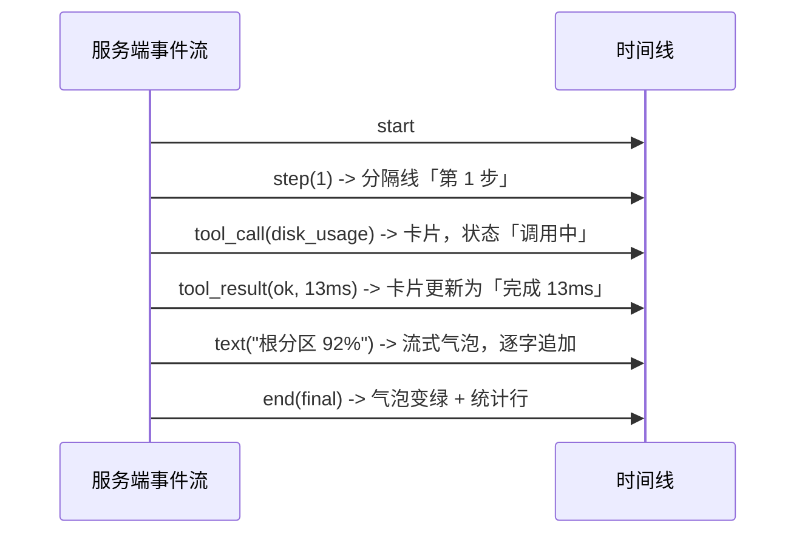
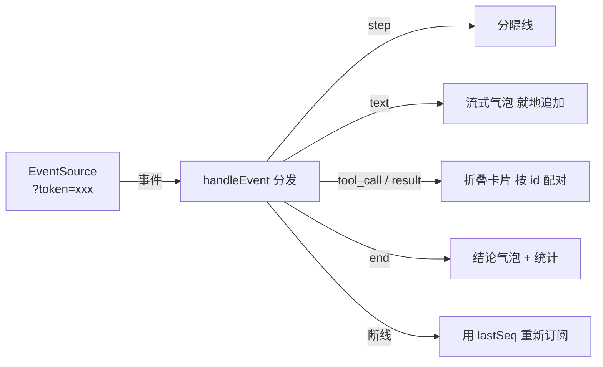

# 第 06 章 看得见的思考：前端交互界面

> **本章导读**
>
> - 建议用时：知识 40 分钟 + 动手 40 分钟
> - 前置知识：第 05 章（SSE 事件流、鉴权）
> - 读完能回答：
>   1. 「Agent UX」和普通网页 UX 的核心差别是什么？
>   2. 一条事件流怎么变成一条时间线？流式文本为什么要"就地追加"？
>   3. 浏览器连 SSE 有什么限制？Token 怎么带？
>   4. 断线重连在前端是怎么实现的？
>   5. 为什么这里不上 React？
> - 本章代码：`web/index.html`、`web/app.js`、`web/style.css`、静态托管与 `SA_WEB_DIR`。对应 tag `ch06`。

---

## 【积木 6-1】Agent UX 的核心：让用户敢走开

普通网页的用户体验关心「页面好不好看、点得顺不顺」。Agent 界面多了一个**更硬**的要求：

> 用户必须随时知道三件事：**它在想什么、做到哪一步了、还要多久（或者是不是卡住了）。**

为什么？因为 Agent 一次排查要几十秒到几分钟。如果界面只是一个转圈，用户的心态是：

| 界面表现 | 用户的心理 | 后果 |
|---|---|---|
| 转圈 30 秒 | 「是不是死了？」 | 刷新页面（任务其实还在跑） |
| 转圈 2 分钟 | 「算了不用了」 | 关掉，Agent 白跑一场 |
| 只显示最终答案 | 「这个结论哪来的？可信吗？」 | 不信任结论 |
| **逐步显示：查了磁盘 → 查了进程 → 结论** | 「哦它在干活，这个结论有依据」 | 信任，甚至学会了自己排障 |

所以本章的界面不是「把结果美化一下」，而是**把第 05 章的事件流翻译成「进度感 + 证据链」**。这也解释了为什么第 04 章要费劲设计事件流——**没有过程事件，前端就无从展示过程**。

### 一个高频误解：「Agent 前端就是聊天界面」

表面像聊天，本质不同。聊天界面的信息单元是「一问一答」；Agent 界面的信息单元是**一轮执行里的若干步骤**，每个步骤还带结构化数据（工具名、参数、耗时、成功与否）。所以本项目的界面是 **时间线（timeline）**，不是聊天气泡：一条消息下面可以挂出一串工具卡片。

---

## 【积木 6-2】事件 → 时间线：四类渲染

前端把事件分四类处理（`web/app.js` 的 `handleEvent`）：

| 事件 | 渲染成什么 | 交互 |
|---|---|---|
| `step` | 一条分隔线「第 N 步」 | — |
| `text` | 流式气泡（增量追加） | — |
| `tool_call` + `tool_result` | 一张**可折叠卡片**：工具名 + 状态标签 + 耗时 + 参数 + 结果 | 点开看参数与结果原文 |
| `end` | 结论气泡（绿色）+ 统计行 | — |



三个实现细节值得注意：

| 细节 | 做法 | 原因 |
|---|---|---|
| **流式文本就地追加** | `state.textNode.textContent += text` | 如果每片文本都新建一个 DOM 节点，一次回答会碎成几十个气泡；追加到同一个节点才像「正在打字」 |
| **工具卡片按 id 配对** | `state.cards[call.id]` 先建后改 | `tool_call` 与 `tool_result` 是两条独立事件，靠 id 找到同一张卡片更新状态 |
| **参数/结果可折叠** | 用原生 `<details>` | 一条日志可能几千字符，全展开会淹没结论。想看细节的点开，不想看的永远看不到 |

还有一个小而重要的决定：**思考内容（`reasoning` 事件）默认不显示**。思考模型的推理过程又长又啰嗦，摊在主界面上会把有效信息挤走。想看的可以改成默认展开——但默认值应该是「安静」。

---

## 【积木 6-3】浏览器连 SSE 的两个坑：Token 与重连

**坑 1：`EventSource` 不能设置请求头。**
第 05 章的 SSE 接口用 `Authorization: Bearer` 鉴权，很标准——但浏览器的 `EventSource` API **没有提供设置请求头的方式**。这是真实存在的限制（WebSocket 也一样）。

三种解法：

| 方案 | 优点 | 缺点 |
|---|---|---|
| 查询参数 `?token=xxx`（本章采用） | 一行代码，`EventSource` 天然支持 | Token 会进浏览器历史、代理日志 |
| Cookie 会话 | 不暴露在 URL | 需要会话机制、CSRF 防护 |
| 同源代理（前端与 API 同域，用 Cookie/内网信任） | 最干净 | 需要额外部署层 |

本章选了第一种，并在接口文档里**明确写出这个权衡**：本项目定位是本地工具，接受 Token 出现在 URL 里；如果部署到公网，应该换成 Cookie 或同源代理。**做安全决策时，写清楚「为什么这样权衡」比假装没有问题更重要。**

**坑 2：重连不是「重新订阅」那么简单。**
`EventSource` 自带重连：连接断了会自动重连，并且**自动带上 `Last-Event-ID` 请求头**（服务端发的 `id:` 会被浏览器记住）。所以续传基本是白送的。但两种情况要自己兜：

| 情况 | 处理 |
|---|---|
| 浏览器放弃重连（`readyState === CLOSED`） | 用记录下来的 `lastSeq` 手动重建 `EventSource`，带上 `?last_event_id=` |
| 用户手动点开历史任务 | 用 `after_seq=0` 订阅，服务端补发全部历史事件，界面瞬间"回放"完整个过程 |

`lastSeq` 从哪来？`addEventListener` 回调里的 `e.lastId`——浏览器把服务端发的 `id:` 字段交还给你。

---

## 【积木 6-4】为什么不上 React

这是个刻意的选择，理由和"手写 Agent 循环不用框架"完全一样：

| 维度 | 原生 HTML/JS | React/Vue |
|---|---|---|
| 构建步骤 | 无。改完刷新即可 | 需要 Vite/打包器 |
| 依赖 | 0 | 一堆 npm 包 |
| 学习成本 | 会 DOM 就会改 | 要先理解状态管理、Hooks |
| 本课程重点 | Agent 的事件与状态流转 | 前端工程化 |

界面的状态其实很少：`currentRun`、`lastSeq`、`textNode`、`cards`、`busy`——五个变量。用 `state` 对象集中管理就够了。

不过要**明确边界**：本项目的前端是「够用的调试台」，不是产品级界面。真的要做产品（多人协作、任务队列、富文本结论），该上框架还是得上——第 17 章会讨论部署形态与后续演进。

---

## 【积木 6-5】静态托管：挂载顺序是个坑

FastAPI 挂静态文件就一行：

```python
app.mount("/", StaticFiles(directory=web_dir, html=True), name="web")
```

但有两条规矩：

| 规矩 | 原因 |
|---|---|
| **放在 `include_router` 之后** | 路由按注册顺序匹配。挂载 `/` 会吃掉所有前缀；先注册 `/api`、`/ws`，它们才优先命中 |
| **目录不存在时不要挂** | 否则应用启动后所有路径都 404（包括 `/health`），排查起来很费劲。本章做法：目录不存在就跳过挂载，`/` 返回 404 但 API 正常 |

本章还加了一个配置项 `SA_WEB_DIR`，默认指向仓库里的 `web/`。默认值用 `mode="before"` 的 validator 在配置层算出来——**配置的默认值集中在一处，比散在各个模块里好找**。

验证挂载顺序对不对，一条命令就够：

```bash
curl -s -o /dev/null -w "%{http_code}\n" localhost:8000/api/runs -H "Authorization: Bearer devtoken"
# 挂载顺序错了这里会返回 404 或 HTML，而不是 200
```

---

## 【代码走读】本章落地了什么

```text
web/
├── index.html   # 结构：顶栏（健康状态 + Token + 工具抽屉）、侧栏（历史任务）、主区（时间线 + 输入）
├── style.css    # 浅色主题，变量集中在 :root
└── app.js       # 状态、渲染、SSE 订阅、交互（约 260 行）
server_agent/server/app.py   # 末尾挂载 StaticFiles
server_agent/config.py       # 新增 SA_WEB_DIR（默认指向 web/）
tests/test_web.py            # 5 个测试
docs/modules/web.md          # 模块文档
```

`app.js` 的分层（值得照着读一遍）：

| 区块 | 函数 | 职责 |
|---|---|---|
| 基础 | `api()` / `withToken()` / `el()` | 带 Token 的请求、拼查询参数、创建 DOM |
| 渲染 | `appendText()` / `toolCard()` / `finishToolCard()` | 事件 → DOM |
| 分发 | `handleEvent()` | 按事件类型路由到渲染函数 |
| 订阅 | `subscribe()` / `unsubscribe()` | EventSource 生命周期与重连 |
| 交互 | `ask()` / `stop()` / `openRun()` / `loadRuns()` / `loadTools()` | 用户动作 |

一个易忽略的细节：`handleEvent` 里每次操作后都调用 `scrollToBottom()`——**长任务里"自动滚到底"是刚需**，否则用户看到的是静止的旧内容，以为卡住了。

---

## 【动手练习】

1. **把界面跑起来**（见验收清单），连问两个问题，观察时间线：第几步、调了什么工具、结论什么时候出现。
2. **点开一张工具卡片**，看参数与结果原文，注意「回喂模型 N 字符」这个统计——它让你直观看到第 08 章要处理的问题：光一次端口查询就可能吃掉几千字符的上下文预算。
3. **验证断线续传**：发起一个任务，中途在浏览器 DevTools 的 Network 面板里把该请求「Block」住，等几秒再取消 Block，观察事件是否续上、有没有重复。
4. **验证取消**：发一个复杂问题，立刻点「停止」，看服务端返回什么状态、时间线怎么收尾。
5. **改造一个细节**：把 `reasoning` 事件也渲染出来（默认折叠在一张灰色卡片里），体会「信息密度」与「透明度」的取舍。
6. **思考题**：现在 Token 存在 `localStorage`，XSS 场景下会被偷。如果这个界面要部署到公网，你会怎么改？（提示：HTTP-only Cookie + 会话、单独的前端域 + CORS 白名单。）

---

## 【验收清单】

```bash
cd server-agent && source .venv/bin/activate
pip install -e ".[dev]"
pytest -q
# 预期：100 passed

# 需要 .env 里配好模型；带 Token 启动（体验鉴权链路）
SA_API_TOKEN=devtoken server-agent serve

# 浏览器打开 http://127.0.0.1:8000
#   顶栏 Token 填入 devtoken（会存在浏览器本地，只保存在你自己的机器上）
#   输入「这台机器现在资源占用怎么样？」→ 观察时间线逐条出现

# 命令行侧验证（可选）
curl -s -o /dev/null -w "%{http_code}\n" localhost:8000/            # 200
curl -s -o /dev/null -w "%{http_code}\n" localhost:8000/app.js      # 200
curl -s -o /dev/null -w "%{http_code}\n" -H "Authorization: Bearer devtoken" \
  localhost:8000/api/runs                                           # 200
```

---

## 【本章小结】

**三句话：**
1. Agent UX 的硬要求是「让用户随时知道它在想什么、做到哪一步」——所以界面是**时间线**，把第 04 章设计的事件流翻译成进度感与证据链。
2. 流式文本要就地追加、工具调用与结果要按 id 配对成卡片、细节默认折叠；这些都是为了让「正在发生的事」比「已经拿到的大段数据」更显眼。
3. 浏览器 `EventSource` 不能设请求头 → Token 走查询参数（并明确写下这个权衡）；断线续传靠服务端的 `id:` + 浏览器自动携带的 `Last-Event-ID`。



**自测题：**

1. Agent 界面为什么要展示中间过程？举一个「只显示最终答案」会出问题的场景。（积木 6-1）
2. 流式文本为什么要追加到同一个 DOM 节点？（积木 6-2）
3. `tool_call` 和 `tool_result` 是两条事件，前端怎么把它们关联起来？（积木 6-2）
4. 浏览器订阅 SSE 时 Token 为什么不能走请求头？三种解法各有什么代价？（积木 6-3）
5. `EventSource` 自动重连时会带什么请求头？服务端哪段代码配合它？（积木 6-3）
6. 点开历史任务时用 `after_seq=0` 订阅，会发生什么？（积木 6-3）
7. 静态挂载为什么必须放在路由注册之后？目录不存在时挂载会怎样？（积木 6-4）
8. 本章为什么不上 React？什么情况下应该上？（积木 6-4）

---

## 【下一章预告】

第 07 章「给 Agent 立规矩：Prompt 工程与结构化输出」：前六章我们把 Agent 的「身体」（循环、工具、服务、界面）搭好了，但它现在的行为方式还是"模型自由发挥"。下一章我们要把**资深 SRE 的排障方法论写进系统提示词**——USE 方法、先宏观后微观、先只读后写入、结论必须给证据链；并让最终输出满足一个固定的报告结构（现象、证据、根因、置信度、建议动作），前端渲染成报告卡片。你会看到同一个问题在两版提示词下的实际差异——这也是第 15 章评估体系要量化的第一件事。

*学完本章，回到对话里说一句「继续」，我就开讲第 07 章。*
