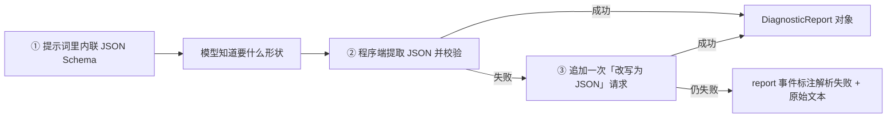
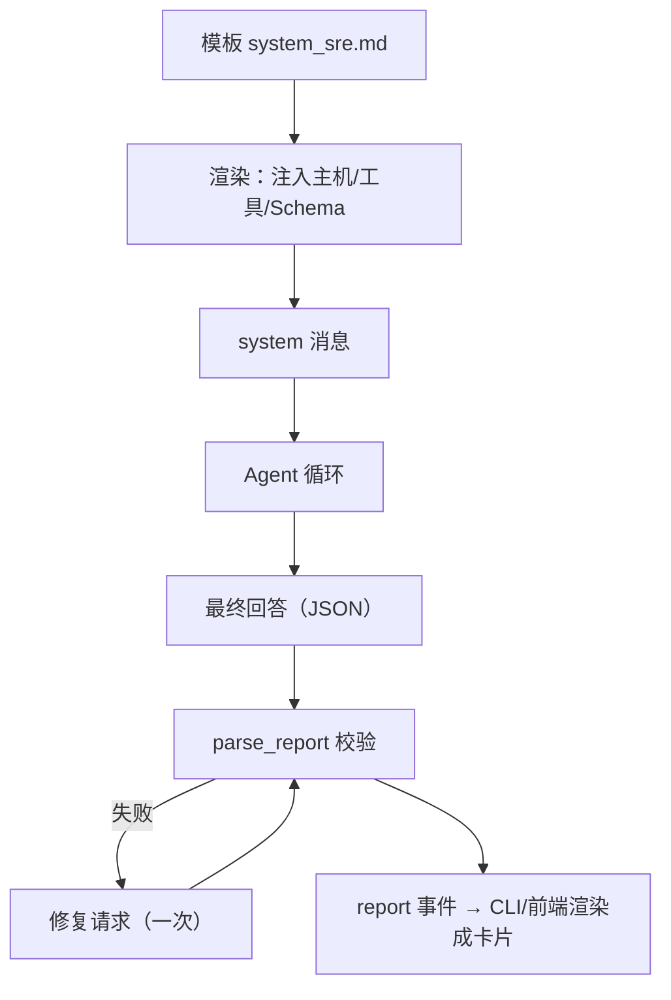

# 第 7 章 给 Agent 立规矩：Prompt 工程与结构化输出

**前置知识**：第 4 章（循环与停止条件）、第 6 章（事件渲染）

**本章代码**：`server_agent/prompts/`（模板、变体、报告 schema、解析与修复）、CLI/前端的报告渲染。

**学习目标**：读完本章，应能回答以下问题。

1. 系统提示词应该由哪几部分组成？为什么「方法论」比「礼貌用语」重要得多？
2. USE 方法是什么？为什么它适合写进排障 Agent 的提示词？
3. 「让模型输出 JSON」有哪三重保障？只靠提示词为什么会翻车？
4. 结构化输出和流式展示冲突了吗？怎么解决？
5. 提示词也要版本化？A/B 对比怎么做？

---

## 7.1 系统提示词的解剖

第 2 章讲过四种消息角色，其中 `system` 是唯一由**开发者**写的。它的作用是**在任何用户输入进来之前，先把行为方式定死**。一份能用的系统提示词有五段：

| 段落 | 回答的问题 | 本章写作 |
|---|---|---|
| **角色** | 你是谁？ | 资深 Linux 运维工程师（SRE） |
| **目标** | 你要达成什么？ | 定位问题根因，给出可执行的建议 |
| **方法论** | 你按什么步骤做？ | 先宏观后微观、USE 方法、证据链 |
| **约束** | 什么不能做？ | 只读优先、不重复调用、不确定就说不确定 |
| **输出格式** | 结论长什么样？ | 固定结构的 JSON 报告 |

大多数失败的提示词都缺第 3 段和第 5 段：只写了「你是专家」（角色），却没写「专家是怎么干的」（方法论），也没写「结论要什么形状」（格式）。结果模型只能靠自己的默认习惯发挥——**而默认习惯和你团队的排障规范很可能不一样**。

### 环境信息也要注入

提示词里还该带一点**运行时事实**，本章注入三项：

| 注入项 | 来源 | 作用 |
|---|---|---|
| 主机名、操作系统 | `socket.gethostname()` / `platform` | 让模型知道自己在哪台机器上，而不是"某台服务器" |
| 可用工具清单 | 工具注册表 | 与 API 的 `tools` 参数互相印证（模型更容易理解工具用途） |
| 报告 JSON Schema | pydantic 模型导出 | 让模型知道最终要交什么形状 |

环境信息 + 模板 = **渲染后的提示词**。本章用 `string.Template`（`$var` 占位）而不是 Jinja2 或 `str.format`——原因很实在：报告 schema 里全是 `{` `}`，用 `str.format` 会互相打架，而 `Template` 的 `$` 语法零依赖、不会冲突。

---

## 7.2 USE 方法：把专家经验写成清单

「先看什么、再看什么」是排障的核心经验，也是最难交接的部分。有一张现成的清单可以直接写进提示词：**USE 方法**（Brendan Gregg 提出），对每个资源依次问三个问题：

| 维度 | 问什么 | 本章对应的工具 |
|---|---|---|
| **U**tilization 使用率 | 这个资源用了多少？ | `cpu_memory_usage`、`disk_usage` |
| **S**aturation 饱和度 | 有没有任务在排队等它？ | load 与核数对比（`cpu_memory_usage`） |
| **E**rrors 错误 | 有没有出错？ | `tail_file` 看日志 |

写成提示词就是：

```text
按 USE 方法排查：对每个资源依次看 使用率 / 饱和度 / 错误
- CPU：使用率与 load；load 持续高于核数说明有任务排队
- 内存：可用内存与 swap 使用
- 磁盘：分区使用率；使用率 >= 90% 优先排查
```

为什么这张清单值得写进提示词？

1. **它把「排查顺序」变成可复述的规则**，模型不用自己摸索（不同模型的默认习惯差异很大）；
2. **它可验证**：第 15 章评估时可以检查「它有没有按 USE 顺序调工具」；
3. **它把隐性知识显性化**：你自己写下这段的过程，就是把团队经验固化的过程。

另一条同样重要的规则是「**信息不足时不硬猜**」：

```text
证据不足时 root_cause 留空、confidence 给 low，并列出还缺什么信息（data_gaps）
```

这条比「你要准确」有用得多——「要准确」是一句无法执行的愿望，「留空 + 说明缺什么」是一个明确动作。

---

## 7.3 结构化输出：三重保障

需要的不是一段散文，而是一个固定结构（本章的报告）：

```json
{
  "summary": "现象：一句话说清发生了什么",
  "severity": "info | warning | critical",
  "findings": [{"claim": "观察", "evidence": "支撑数据（必须是具体数值或日志原文）"}],
  "root_cause": "根因，证据不足时为 null",
  "confidence": "high | medium | low",
  "actions": [{"description": "动作", "risk": "read | low | high", "command": "可执行命令"}],
  "data_gaps": ["还缺什么信息"]
}
```

为什么值得结构化？三个理由：

| 收益 | 说明 |
|---|---|
| 可渲染 | 前端能画成卡片（现象/根因/置信度/建议），而不是一坨文字 |
| 可评估 | 第 15 章能自动判定「根因命中没有」，不用人读自然语言 |
| 可执行 | `actions[].risk` 直接喂给第 9 章的审批：high 就必须人工确认 |

**只写「请输出 JSON」是必然会翻车的**——模型会用 ```json 包起来、前面加一句"这是我的结论"、或者干脆少给字段。所以要三重保障：



三个实现要点：

| 要点 | 做法 |
|---|---|
| **提取要宽容** | 依次尝试：整段解析 → 代码块里解析 → 扫描「平衡花括号」片段（要处理字符串里的 `{` `}` 与转义） |
| **校验要严格** | 校验是 pydantic 干的：`severity` 只能是三个值之一，`confidence` 同理；字段缺失直接报错 |
| **修复只做一次** | 追加一次 chat 请求把散文改写成 JSON；**只做一次**，否则会拖着用户烧 token |

修复请求本身也有讲究：把「上一条回答」放进请求里，并明确说「只输出 JSON，不要 markdown」。这次请求**不需要带工具**（`tools=None`），因为任务是格式转换，不是排查。

### 一个高频误解：「结构化输出 = 用 JSON mode」

有些模型服务提供 JSON mode（强制输出合法 JSON）。它确实有用，但只解决**语法**问题，不解决**语义**问题：合法 JSON 也可能缺 `findings`、把 `confidence` 写成 `"较有信心"`、或者把猜测塞进 `root_cause`。**schema 校验 + 修复轮次**才管得住形状，**提示词里的方法论**才管得住内容。两者都要。

---

## 7.4 结构化输出和流式展示的冲突

本章开发时真实撞到的一个问题：

**模型按提示词只输出 JSON**，于是终端里滚出来一行 800 字符的原始 JSON（第 7 章第一次实跑截图就是这样的），前端时间线里也塞进一大坨 `{"summary": ...}`。用户想要的是「结论」，不是「数据交换格式」。

这是结构化输出的固有矛盾：

| 视角 | 想要什么 |
|---|---|
| 程序 | 机器可读的 JSON |
| 人 | 一眼看懂的报告 |

两种解法：

| 解法 | 优点 | 缺点 |
|---|---|---|
| **展示层识别并抑制**（本章采用） | 不增加模型负担；一次请求搞定 | 流式过程中只有一个「正在生成结构化报告…」提示，看不到中间文本 |
| **两段式输出**：先写给人看的总结，再附上 JSON | 流式过程更好看 | 输出更长、更贵；还要处理"前面这段到底算不算结论" |

本章的做法：CLI 与前端都检测「这一整块回答是不是以 `{` 开头」，是则**不再逐字渲染**，改由报告事件渲染成可读卡片。终端 stdout 输出的也是渲染后的报告（现象/根因/建议），原始 JSON 只在 `--json` 模式下出现。

**小结一句：从模型拿什么格式，和你给人看什么格式，是两个可以分开的决策。**

---

## 7.5 提示词也要版本化

提示词是**代码**——它改一行，Agent 的行为就变。所以它需要和代码一样的待遇：

| 做法 | 本章实现 |
|---|---|
| 存在仓库里，可 diff | `server_agent/prompts/system_sre.md` |
| 有变体，可对比 | `system_plain.md`：故意不写方法论，作为反面教材 |
| 能被开关切换 | `SA_PROMPT_VARIANT=sre\|plain`、`--variant` |
| 运行时可观测 | `start` 事件带 `prompt_variant`，历史任务能查到「这次跑的是哪版」 |

A/B 对比的办法很简单——同一台机器、同一个问题、两个变体各跑一次：

```bash
server-agent ask --variant sre   "这台机器为什么卡"      # 有方法论
server-agent ask --variant plain "这台机器为什么卡"      # 没有方法论
```

第 15 章会把这件事**变成自动化的量化对比**：用评测集跑两个变体，输出「根因命中率、平均步数、平均 token」的对照表。现在先把「能切换、能记录」的基础打好。

---

## 7.6 代码走读

```text
server_agent/prompts/
├── __init__.py        # 模板加载与渲染、变体管理、repair_prompt
├── system_sre.md      # 带方法论的提示词模板（$hostname/$os/$tools/$report_schema）
├── system_plain.md    # 对照组：只给角色与格式，不给方法论
└── report.py          # DiagnosticReport / Evidence / Action、extract_json、parse_report
server_agent/agent/loop.py   # 用模板渲染系统提示词；结束时产出 report 事件与 AgentResult.report
server_agent/agent/events.py # 新增 report 事件类型
server_agent/cli.py          # 报告渲染；抑制原始 JSON 流
web/app.js                   # 报告卡片；同样抑制原始 JSON 流
tests/test_prompts.py        # 19 个用例
```

三个值得注意的实现细节：

| 细节 | 原因 |
|---|---|
| `Agent(system_prompt=None)` 时自动渲染模板 | 默认就该是「有方法论」的那个；传字符串则覆盖（测试与实验用） |
| 报告解析放在 `end` 事件之前 | 前端拿到 `report` 就能立刻渲染卡片，`end` 只负责收尾与统计 |
| 修复请求失败时**不抛异常**，只把 `report_error` 记下来 | 报告解析失败不是致命错误：结论原文照样给用户看，但要让调试者知道为什么没解析出来 |

### 常见陷阱：两个坑

**坑 1：`Template.substitute` 少传一个占位符就爆。** 如果把 `repair_prompt()` 写成「返回一个 Template 对象，调用方再补 `previous`」，结果调用方只补了 schema，`substitute` 直接 `KeyError: 'previous'`——**而且这个错误让 10 个已有测试一起挂掉**，因为修复逻辑在收尾路径上，每个 run 都会走到。
教训：**凡是「多步替换」的字符串，就一次性把参数给全**（现在 `repair_prompt(previous)` 一步到位）；另外**收尾路径上的异常要格外小心**，它会把所有历史测试一起带崩。

**坑 2：`$` 不只有占位符一种**。测试里若写「渲染后不应再有 `$`」，结果 JSON Schema 里的 `$defs` 让它失败——**断言写得太粗，等于给自己埋雷**。改成枚举检查四个具体占位符。

两条教训指向同一件事：**提示词层是"字符串处理 + 收尾路径"的组合，是最容易出低级错误的地方，测试要盯紧这两处。**

---

## 7.7 动手练习

1. **看渲染后的提示词**：
   ```bash
   python3 -c "
   from server_agent.prompts import render_system_prompt
   print(render_system_prompt('sre', tools=['disk_usage','tail_file']))"
   ```
   数一数：角色、方法论、约束、格式各占多少行？
2. **做一次 A/B**（需配好模型）：同一个问题分别用 `--variant sre` 和 `--variant plain` 各跑一次，对比：调了哪些工具、能不能给出证据、结论格式是否符合 schema。
3. **观察修复轮次**：把 `SA_REPORT_REPAIR=false`，然后问一个会得到散文回答的问题，看 `report` 事件的 `parsed` 与 `error` 字段。
4. **改一条方法论**：在 `system_sre.md` 里加一条你自己的经验（例如「磁盘满时优先看 `/var/log` 与 Docker 数据目录」），重跑一次，看行为有没有变化。
5. **思考题**：现在报告是「侦察结束才产出」的。如果希望 Agent **每查完一步就先给一条结论摘要**（边查边汇报），提示词和事件结构要怎么改？代价是什么？

---

## 7.8 验收清单

```bash
cd server-agent && source .venv/bin/activate
pip install -e ".[dev]"
pytest -q
# 预期：全部通过（0 failed）

server-agent ask --variant sre "这台机器磁盘为什么快满了"
# 预期：
#   stderr 显示步骤与工具调用；结构化报告阶段显示「正在生成结构化报告…」
#   随后输出 [报告] 严重程度 / 置信度、根因、建议动作
#   stdout 输出可读报告（现象 / 置信度 / 观察与依据 / 根因 / 建议动作 / 还缺信息）

server-agent ask --json "这台机器磁盘为什么快满了" | python3 -c "
import json,sys
events = json.load(sys.stdin)
report = [e for e in events if e['type'] == 'report'][0]['data']
print('parsed =', report['parsed'])
print('severity =', report['report']['severity'], '| confidence =', report['report']['confidence'])
print('事件序列 =', [e['type'] for e in events])"
# 预期：parsed = True；事件序列包含 ... text... report end

SA_PROMPT_VARIANT=bogus server-agent ask "x"
# 预期：启动即报「未知的提示词变体」，不会静默降级
```

---

## 7.9 本章小结

**要点**
1. 系统提示词 = 角色 + 目标 + **方法论** + 约束 + **输出格式**；缺了后两段，模型就只能靠默认习惯发挥。本章用 USE 方法把排障顺序写成可复述、可验证的规则。
2. 结构化输出要三重保障：提示词里内联 schema、程序端严格校验、失败时一次修复请求；只写「请输出 JSON」必翻车，而 JSON mode 只解决语法、不解决语义。
3. 提示词是代码：存仓库、可 diff、有变体、运行时记录版本——这样第 15 章才能量化「方法论到底值多少」。



**自测题**（括号内为对应小节）

1. 系统提示词的五个段落分别是什么？最常被漏掉的是哪两段？（7.1 节）
2. 为什么要往提示词里注入主机名和工具清单？（7.1 节）
3. USE 方法问的三个问题是什么？为什么它适合写进排障提示词？（7.2 节）
4. 「信息不足时不硬猜」这条规则，比「你要准确」好在哪？（7.2 节）
5. 结构化输出的三重保障分别是什么？（7.3 节）
6. 为什么 JSON mode 不能替代 schema 校验？（7.3 节）
7. 结构化输出和流式展示的矛盾是什么？本章怎么解决？（7.4 节）
8. 提示词为什么要版本化？`start` 事件里记录 `prompt_variant` 有什么用？（7.5 节）
