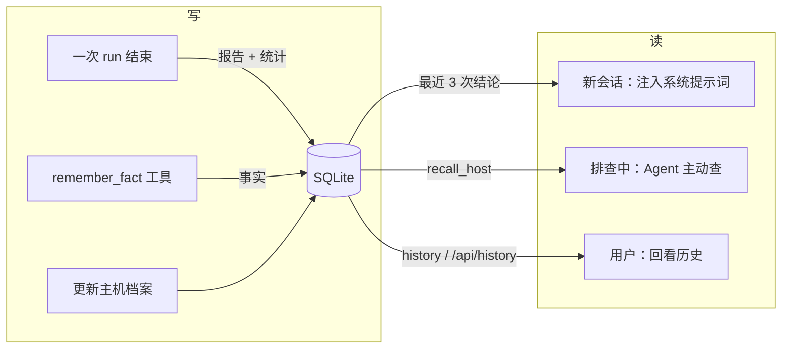
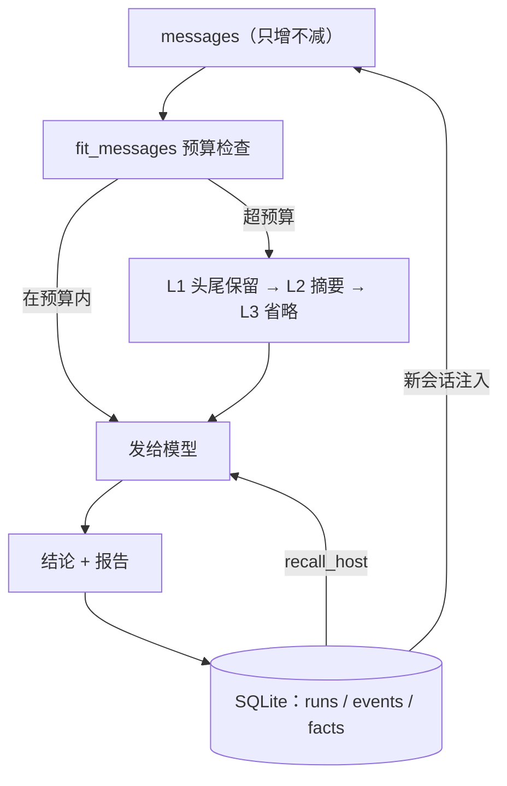

# 第 8 章 记性与注意力：上下文管理与记忆

**前置知识**：第 2 章（上下文窗口、无状态）、第 4 章（消息列表如何增长）、第 7 章（结构化报告）

**本章代码**：`server_agent/memory/`（上下文预算、SQLite 存储、记忆工具）、`history` 命令、`/api/history` 接口。

**学习目标**：读完本章，应能回答以下问题。

1. 上下文窗口被谁吃掉了？为什么必须「主动」管它？
2. 工具结果压缩有哪三级？为什么按这个顺序？
3. 短期记忆和长期记忆分别存在哪、怎么用？
4. 为什么把历史记忆塞进系统提示词，而不是伪造几条对话？
5. 「记住」有什么风险？

---

## 8.1 上下文是预算，不是抽屉

第 2 章说过：模型没有记忆，每一轮都要把全部历史重发一遍。于是每一轮请求的输入都在长：

| 内容 | 一次排查里的规模（真实量级） |
|---|---|
| 系统提示词 | 约 3.5k 字符（第 7 章渲染后） |
| 工具结果的 JSON Schema | 8 个工具约 3k 字符 |
| 每一步的 assistant 回复 | 几百字符 |
| **每一步的工具结果** | **`listening_ports` 一次约 3k 字符、`tail_file` 最多 8k 字符** |
| 第 7 章的报告 JSON | 约 1k 字符 |

一次 8 步的排查，工具结果就能吃掉 2 万字符以上。而模型的上下文窗口是**硬上限**：超了要么被服务端拒绝（报错），要么被静默截断（更糟，模型看到残缺信息还照常下结论）。

所以正确处理只有一种：**在发请求之前，主动把它压进预算**。

本章的预算模型很直白：

```python
available = max_tokens - reserve_output     # 例如 32000 - 2000 = 30000
```

`max_tokens` 是模型的窗口大小（配错了要么浪费要么报错），`reserve_output` 留给模型的回答（报告 JSON 大约 500-1000 token，留 2000 比较安全）。

**估算 token 用不着分词器**：`estimate_tokens()` 用字符启发式——CJK 字符约 1 token，其它字符约 4 字符 1 token，并且**向上取整**（宁可高估）。理由：预算控制只需要量级正确；引入 `tiktoken` 这类依赖会把「模型无关」的代码绑到特定模型上。

---

## 8.2 三级压缩：从便宜到激进

压缩是有代价的（丢失信息），所以顺序必须是「先做代价最小的」：

| 级别 | 动作 | 代价 | 什么时候能解决问题 |
|---|---|---|---|
| **L1 头尾保留** | 每条工具结果保留前 1200 + 后 800 字符，中间写「已省略 N 字符」 | 低：日志的关键信息通常在首尾（错误摘要 + 最近的记录） | 中等超标 |
| **L2 一行摘要** | 老的工具结果整体换成一行的「工具名 + 原长度 + 开头 120 字」 | 中：模型仍知道「我查过什么」，但看不到细节 | 严重超标 |
| **L3 整条省略** | 换成 `[更早的工具结果已省略]` | 高：细节全丢 | 极端超标 |

再加一条**兜底原则**：如果连「最近 N 条工具结果」都超预算（说明单条结果本身就巨大），那就把它们也压掉——**宁可牺牲新鲜度，也不能超窗口**。因为超窗口的请求会被服务端直接拒绝，那时连结论都没有。

两条不可动摇的规则：

| 规则 | 原因 |
|---|---|
| `system` 消息永不删 | 那是规则与记忆，删了 Agent 就"变了一个人" |
| `user` 消息永不删 | 那是任务本身 |

被压缩时，Agent 会发出 `context` 事件，告诉你「在哪一级压缩的、压之前压之后多少 token、改了几条」——这样调试「Agent 是不是因为压缩丢了关键信息」时有据可查：

```text
[context] stage=tail_head changed=3 before=41200 after=23800
```

---

## 8.3 短期记忆 vs 长期记忆

「记忆」有两个完全不同的东西，别混：

| 维度 | 短期记忆 | 长期记忆 |
|---|---|---|
| 内容 | 本次排查的消息历史 | 跨会话的事实与结论 |
| 载体 | 内存里的 `messages` 列表 | SQLite（`server_agent/memory/store.py`） |
| 生命周期 | 一次 run | 永久（直到你删库） |
| 主要问题 | 上下文窗口爆掉 → 本章 L1-L3 压缩 | 记什么、怎么用、何时失效 |
| 谁在用 | Agent 循环 | 新会话的起点 + `recall_host` 工具 |

长期记忆本章做了三件事：



| 表 | 存什么 | 为什么 |
|---|---|---|
| `runs` | 每次排查的输入、状态、步数、token、结论报告 | 历史回看 + 评估（第 15 章） |
| `events` | 完整事件流（按 seq） | 前端回放、断线续传、调试 |
| `facts` | 主机相关的稳定事实（日志目录、服务名、约定） | 下次排查少走弯路 |
| `host_profiles` | 主机档案（OS、角色、负责人） | 同上，但更结构化 |

**读路径有两条**，各有用处：

1. **自动注入**：新会话开始时，把最近几次结论与事实拼成一段「[历史记忆]」文本，追加到系统提示词末尾（CLI 的 `--host` 参数指定主机）。
2. **主动查询**：`recall_host` 工具，让 Agent 在排查过程中自己决定要不要查（第 7 章讲过：工具描述就是提示词）。

为什么注入用「追加到系统提示词」而不是伪造几条历史对话？因为伪造对话有三个问题：模型可能把伪造的 assistant 回复当作"我说过的话"继续引用；如果格式不规范会破坏消息结构；而系统提示词天然就是**规则与背景**的位置，语义最贴切。

---

## 8.4 记忆的风险：过期、错误、污染

「记住」不是免费的午餐。三个真实风险：

| 风险 | 例子 | 本章的应对 |
|---|---|---|
| **过期** | 半年前记录「日志在 `/var/log/nginx`」，现在迁到了 `/data/logs` | 注入文本里明确写「仅供参考，需用工具核实，不要直接照搬」 |
| **错误** | 上次判断错了根因，这次被当成事实 | 注入时带上置信度与时间；报告里明确区分「观察」与「根因」 |
| **污染 / 注入** | 恶意内容被写进事实，下次触发危险行为 | `remember_fact` 只写本地库（`risk=low`），不执行任何系统操作；第 9 章会给它加审计 |
| **无限增长** | 事实越积越多，注入把预算吃光 | 注入有上限（最近 3 条结论、8 条事实），`recall_host` 也有 limit |

本章在提示词里写死的那句话值得记下来：

```text
[历史记忆] 以下是之前排查的结论，可作为参考，但仍需用工具核实，不要直接照搬
```

**记忆的正确用法是「提出假设」，而不是「提供答案」。** 这也是为什么第 12 章的 Runbook（程序性知识）和第 13 章的 RAG 要用同样的态度对待检索结果。

---

## 8.5 持久化：为什么选 SQLite，表怎么设计

选 SQLite 的理由很朴素：单文件、零运维、支持并发读、Python 标准库自带。本项目是**单机工具**，不需要 PostgreSQL。

表设计遵循两条原则：

| 原则 | 体现 |
|---|---|
| 写进去的要是「能重建现场」的东西 | 事件流按 `seq` 存全量，前端能完整回放 |
| 读的时候要快、要简单 | `list_runs` 只返回摘要（含事件条数），详情用 `get_events` 单独取 |

```text
runs(id, session_id, input, status, started_at, finished_at, steps, tool_calls,
     tokens, text, report_json, error)
events(run_id, seq, type, data_json)     -- 主键 (run_id, seq)
facts(id, host, key, value, run_id, created_at)
host_profiles(host, data_json, updated_at)
```

两个细节：

- **`report_json` 存结构化报告**，而不是只存文本。这样第 15 章的评估可以直接 `SELECT report_json` 算「根因命中率」，不用解析自然语言。
- **写库失败不能影响 Agent**。`Recorder` 里所有异常都吞掉并记日志：磁盘满、库被锁、路径不可写都可能发生，但「用户的问题还得答完」。**降级要降得干净**：记忆是增强，不是主流程。

---

## 8.6 代码走读

```text
server_agent/memory/
├── context.py     # estimate_tokens / shrink_text / ContextBudget / fit_messages（三级压缩）
├── store.py       # Store：会话、run、事件、主机档案、事实（SQLite）
├── recorder.py    # Recorder：把 run 与事件写库；build_memory_context：读路径
└── __init__.py
server_agent/tools/memory.py   # recall_host（read）/ remember_fact（low）
server_agent/agent/loop.py     # 每次请求前调用 fit_messages；发 context 事件
server_agent/agent/runs.py     # RunManager 支持 store，run 与事件自动落库
server_agent/cli.py            # --host / --no-memory；history 命令
server_agent/server/api.py     # GET /api/history、/api/history/{run_id}
```

几个值得注意的实现：

| 位置 | 做法 | 原因 |
|---|---|---|
| `fit_messages()` 返回**新列表** | 不改原 `messages` | 内部历史保持完整（用于报告、调试），只对「发给模型的副本」动手 |
| `context` 事件 | 带 `stage`/`changed`/`before_tokens`/`after_tokens` | 压缩是「悄悄丢信息」，必须可观测 |
| `Recorder` 延迟绑定 run_id | CLI 拿不到 Agent 内部生成的 id | 事件流 id 与库 id 必须一致，否则回放会错 |
| `RunManager(store=...)` | HTTP/WS 路径自动落库 | 终端与页面跑的任务都能在历史里查到 |

### 常见陷阱：三个坑

**坑 1：`estimate_tokens` 里一个多余的 `max(1, ...)`。** 错误写法是 `cjk + max(1, others // 4)`，结果纯中文「你好世界」被算成 5 而不是 4——因为 `others = 0` 时仍会加 1。**边界值（这里是 0）永远要单独想一遍**：正确答案是 `cjk + ceil(others / 4)`。

**坑 2：压缩测试的断言写错了「应该在哪一级」。** 测试设了 `max_tokens=20000`、`keep_recent_tool_msgs=2`，然后断言「只做 L1 头尾保留就够」。但**被保护的最近两条本身就占了 16000 token**，L1 压完仍然超预算，于是自动升级到 L2——测试失败，而代码是对的。教训：**测试用例的预算要算清楚**，否则你测的是自己的算术而不是被测逻辑。

**坑 3：集成测试里工具结果被「重复调用检测」拦掉了。** 写一个返回 2 万字符的 `big_tool`，连续调三次想撑爆上下文，结果第 2、3 次因为**参数完全相同**被第 4 章的重复检测跳过，返回的是一行提醒——上下文根本没涨，`context` 事件自然不出现。这个坑挺有意思：**两章的功能互相影响，测试要顺着真实执行路径走**。修法：让每次调用参数不同。

---

## 8.7 动手练习

1. **看压缩真的发生了**：把预算调小跑一次，观察 `context` 事件。
   ```bash
   SA_CONTEXT_MAX_TOKENS=3000 server-agent ask --json "磁盘、端口、进程都查一遍" | \
     python3 -c "import json,sys; print([e['type'] for e in json.load(sys.stdin)])"
   ```
2. **回看历史**：跑两三次 `ask --host <你的主机名>`，然后 `server-agent history`、`server-agent history --show <run_id> --events`，对照第 6 章前端能画出的时间线。
3. **验证记忆注入**：第二次带 `--host` 排查同一台机器时，注意 stderr 的 `[记忆] 已注入历史记忆（…）`；再用 `--no-memory` 对比一次。
4. **让 Agent 自己记事实**：让它排查后调用 `remember_fact` 记一条（或你手动 `server-agent tools call remember_fact ...`），下一次排查时它会主动 `recall_host`。
5. **重启验证**：把服务停掉再启动，`server-agent history` 与 `GET /api/history` 依然能查到之前的记录（这是第 5 章「内存版 Run」的补洞）。
6. **思考题**：事实（facts）会越积越多，且可能互相矛盾（旧的日志路径 vs 新的）。你会怎么设计失效策略？（提示：加 `expires_at`？按时间衰减排序？让模型在冲突时明确指出来？）

---

## 8.8 验收清单

```bash
cd server-agent && source .venv/bin/activate
pip install -e ".[dev]"
pytest -q
# 预期：全部通过（0 failed）

# 1. 一次排查会落库
server-agent ask --host web-01 "磁盘为什么快满了"
server-agent history
# 预期：列出刚才这次，带摘要与置信度

# 2. 详情与完整事件流
RUN=$(server-agent history 2>/dev/null | head -1 | awk '{print $3}')
server-agent history --show $RUN --events | head -20

# 3. 记忆注入（第二次排查同一主机）
server-agent ask --host web-01 "再看看磁盘"
# 预期：stderr 出现 [记忆] 已注入历史记忆（…）

# 4. 记忆工具
server-agent tools call remember_fact '{"host":"web-01","key":"log_dir","value":"/data/logs/nginx"}'
server-agent tools call recall_host '{"host":"web-01"}'

# 5. 服务端历史（重启后仍在）
SA_API_TOKEN=devtoken server-agent serve &
curl -s localhost:8000/api/history -H "Authorization: Bearer devtoken" | head -20
```

---

## 8.9 本章小结

**要点**
1. 上下文是硬预算，必须主动管理：`available = max_tokens - reserve_output`，超了就按 L1 头尾保留 → L2 一行摘要 → L3 整条省略 逐级压缩，`system` 与 `user` 永不删。
2. 记忆分两层：短期是一次 run 的消息历史（会被压缩），长期是 SQLite 里的结论、事实与主机档案（永不丢），后者用来给新会话「提出假设」。
3. 记忆的正确用法是「参考而非答案」——注入时明确要求核实；同时记忆是增强不是主流程，**写库失败不能影响作答**。



**自测题**（括号内为对应小节）

1. 除了系统提示词和对话历史，还有什么会占用上下文？（8.1 节）
2. 为什么 `reserve_output` 是必须的？（8.1 节）
3. token 估算为什么可以不精确？向上取整的理由是什么？（8.1 节）
4. 三级压缩分别是什么？为什么按这个顺序？（8.2 节）
5. 为什么 `system` 与 `user` 消息永不删除？（8.2 节）
6. `context` 事件里为什么要记录压缩前后的 token 数？（8.2 节）
7. 长期记忆的两条读路径分别是什么？为什么注入到系统提示词而不是伪造对话？（8.3 节）
8. 记忆的三个风险是什么？注入时加「仅供参考」的作用是什么？（8.4 节）
