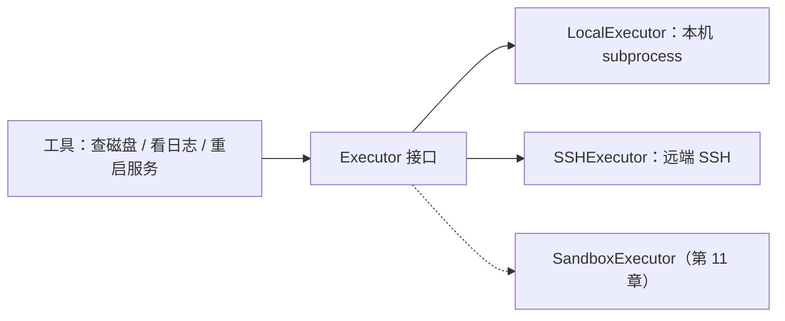

# 第 10 章 伸向远方：SSH 远程执行与多主机

**前置知识**：第 9 章（策略与审批）、第 3 章（工具层）

**本章代码**：`server_agent/executors/`、`server_agent/tools/remote.py`、`inventory.yaml`、`lab/`。

**学习目标**：读完本章，应能回答以下问题。

1. 执行器抽象解决什么问题？
2. 远端没有 psutil 怎么办？
3. 授权范围为什么跟着主机走？

---

## 10.1 把「在哪执行」抽出来

前九章的工具都在**本机**跑。要管多台机器，最糟的做法是给每个工具写一份「远程版」——立刻变成两份要同步维护的代码。

正确做法是抽出**执行器**（Executor）：工具只说「做什么」，执行器决定「在哪做」。



| 好处 | 说明 |
|---|---|
| 工具不关心位置 | 同一份解析、脱敏、审计逻辑，本地远端共用 |
| 策略层照旧生效 | 第 9 章的白名单/审批与换执行器无关 |
| 新目标易扩展 | 容器、跳板机、云主机，都只是再实现一次 `run(argv)` |

接口只有一个方法：

```python
class Executor(Protocol):
    host: str
    async def run(self, argv: list[str], *, timeout: float = 30.0) -> ExecOutcome: ...
```

注意它收的是 **argv 列表**而不是一整条命令字符串——这是从第 9 章学到的：**永远不要让字符串命令拼起来再交给 shell**。SSH 执行器内部会把 argv 逐项安全引用后再拼（`_quote`），这样参数里的空格、引号、`;` 都不会变成注入。

---

## 10.2 主机清单：授权范围跟着机器走

`inventory.yaml` 描述「有哪些机器、怎么连、允许对它做什么」：

```yaml
defaults:
  username: root
  port: 2222
  strict_host_key: false
  tags: {password_env: LAB_SSH_PASSWORD}
hosts:
  web-01:
    hostname: 127.0.0.1
    port: 2201
    groups: [web]
    allowed_paths: ["/var/log/nginx", "/tmp"]
    allowed_services: ["nginx"]
  db-01:
    groups: [db]
    allowed_paths: ["/var/log"]
    allowed_services: ["redis-server", "postgresql"]
```

| 设计 | 原因 |
|---|---|
| `allowed_paths` / `allowed_services` **跟着主机** | 「web-01 能重启 nginx、db-01 不能」属于环境知识，不该散落在代码的 if-else |
| 密码用 `password_env` 从环境变量取 | 清单要进 Git，密码不能进 Git |
| `groups` 支持按组批量操作 | 「重启所有 web 组的 nginx」是常见需求（第 16 章多 Agent 会用到） |
| `strict_host_key` 默认关、真机要开 | 演练图方便，生产必须校验 host key（否则中间人可为所欲为） |

---

## 10.3 远端没有 psutil：命令 + 本地解析

远端**不装任何依赖**（不装 psutil、不装 agent），只跑白名单命令，结构化交给本地的解析器：

| 工具 | 远端命令 | 本地解析成 |
|---|---|---|
| `remote_run(host, "df -h")` | `df -P` | `partitions[]`（设备/总量/已用/可用/使用率/挂载点） |
| `remote_run(host, "free -m")` | `free` | `{total_kb, used_kb, available_kb}` |
| `remote_run(host, "ss -lntp")` | `ss` | `listening[]` |
| `remote_run(host, "uptime")` | `uptime` | load 原文 |
| `remote_logs(host, path, grep)` | `tail -n` | 行数 + 内容（受主机白名单约束） |
| `remote_restart_service(host, name)` | `systemctl restart` | 走审批 + 审计 |

这个取舍的代价很直白：**解析逻辑要跟着命令输出格式走**。所以只解析「格式稳定」的几条命令（`df -P` 的 POSIX 格式、`free` 的固定列），其余的原样返回给模型自己读。**不要为了整齐去解析所有命令**——脆弱的解析器比原文更难维护。

### 一个高频误解：「远程执行就是把 SSH 包一层」

不止。远程执行要额外处理三件事，每一件都能让 Demo 崩：

| 问题 | 本章做法 |
|---|---|
| 每次命令都握手太慢 | `SSHExecutor` 缓存连接；出错时丢弃连接（下次重连），避免一直用坏连接 |
| 远端错误信息丢失 | `ExecOutcome` 同时保留 stdout / stderr / returncode；连不上时抛 `ExecutorError`，工具层转成「模型能看懂的错误」 |
| 授权粒度 | 路径/服务白名单在**主机级**校验，而不是全局一张表 |

---

## 10.4 靶场：故障是可重复的

`lab/docker-compose.yml` 起三台「服务器」（带 sshd + nginx，端口 2201/2202/2203），`lab/faults/` 提供四个注入脚本：

| 脚本 | 制造的问题 | 期望的排查路径 |
|---|---|---|
| `inject-disk-full.sh` | `/var/log/fill` 写入 200MB | `df -h` → `du -sh /var/log/*` |
| `inject-cpu-hog.sh` | 两个死循环进程 | `uptime` 看 load → `ps aux` 找 pid |
| `inject-nginx-down.sh` | nginx 停止 | `ss -lntp` 没有 80 → `systemctl status nginx` |
| `inject-port-conflict.sh` | 80 端口被临时进程占用 | `ss -lntp` 看到占用 pid |

**为什么要靶场而不是真机？** 三个理由：可以随便注入故障、可以随便删文件、`docker compose down -v && up -d` 就回到干净状态。这也是第 15 章评测集的基础设施——评测需要**可重复的故障**。

> 本章的靶场需要 Docker。如果你的机器上 Docker daemon 没跑（或者没装 compose 插件），先启动它：`colima start`（macOS）或 `sudo systemctl start docker`（Linux）。本章的自动化测试**不需要 Docker**——它们用假执行器验证全部逻辑。

---

## 10.5 代码走读

```text
server_agent/executors/
├── base.py       # ExecOutcome / Executor 协议 / ExecutorError
├── local.py      # subprocess 异步封装
├── ssh.py        # asyncssh + 连接缓存 + 参数安全引用
├── inventory.py  # 清单加载、分组、主机级授权、password_env
└── __init__.py   # get_executor(host)：local / ssh 分派
server_agent/tools/remote.py   # remote_run / remote_logs / remote_restart_service
inventory.yaml                 # 演示清单（web-01/web-02/db-01）
lab/                           # Dockerfile + compose + 4 个故障注入脚本 + README
```

两个值得注意的实现细节：

| 位置 | 做法 | 原因 |
|---|---|---|
| `SSHExecutor.run` 异常分支 | 把 `self._conn = None` | 连接坏了要丢弃，否则后续每条命令都失败 |
| `remote_logs` | 用主机 `allowed_paths` 校验路径 | 否则「读日志」的能力等价于「读任意文件」 |

---

## 10.6 动手练习

1. **不装 Docker 也能做**：用假执行器跑一遍测试，理解数据流：
   ```bash
   pytest -q tests/test_executors.py
   ```
2. **起靶场**（需要 Docker）：`cd lab && docker compose up -d --build`，然后 `ssh -p 2201 root@127.0.0.1`（密码 `labpass`）确认能登进去。
3. **注入故障并让 Agent 查**：
   ```bash
   docker exec sa-web-01 bash /opt/faults/inject-disk-full.sh
   export LAB_SSH_PASSWORD=labpass
   server-agent ask "web-01 怎么了？磁盘是不是有问题"
   ```
   观察它怎么用 `remote_run` 调 `df`、`du`，再给出结论。
4. **越权测试**：让 Agent 在 `web-01` 上重启 `postgresql`（不在它白名单里），确认被拒；再让它读 `/etc/shadow`，确认被路径白名单拦住。
5. **思考题**：现在每条命令要在远端起一个 shell 进程。如果要采集 20 台机器 × 8 项指标，怎么设计才能避免「40 次 SSH 握手」？（提示：连接复用已经有了，下一步是批量命令或并行 gather。）

---

## 10.7 验收清单

```bash
pytest -q tests/test_executors.py      # 14 个用例，不需要 Docker
server-agent ask "web-01 磁盘满了吗"    # 需要靶场 + LAB_SSH_PASSWORD
server-agent tools call remote_run '{"host": "web-01", "command": "df -h"}'
server-agent tools call remote_restart_service '{"host": "web-01", "name": "postgresql"}'   # 应被拒（未授权）
```

---

## 10.8 本章小结

**要点**
1. 执行器抽象让工具不必关心目标位置——本地、SSH、（第 11 章的）沙箱都是同一种接口。
2. 远端不装依赖，只跑白名单命令 + 本地解析；授权范围（路径/服务）跟着主机写在清单里。
3. 靶场让故障可重复注入，这既是练习环境，也是第 15 章评测的基础设施。

**自测题**（括号内为对应小节）
1. 执行器接口为什么收 argv 列表而不是命令字符串？（10.1 节）
2. `allowed_paths` / `allowed_services` 为什么放在主机清单而不是全局配置？（10.2 节）
3. 为什么密码用 `password_env` 而不写进清单？（10.2 节）
4. 远端不装 psutil 的代价是什么？（10.3 节）
5. 为什么 SSH 执行器在异常时要丢弃连接？（10.3 节）
6. `remote_logs` 为什么必须做路径白名单校验？（10.4 节）
7. 靶场相比真机有三个好处，分别是什么？（10.4 节）
