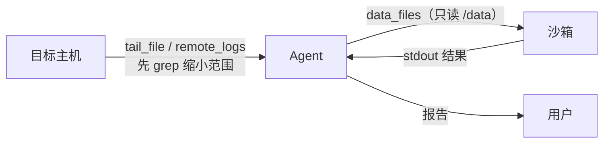

# 第 11 章 给 Agent 一间隔离的工作室：Agent 沙箱（AGS）

> **本章导读**
> - 建议用时：知识 45 分钟 + 动手 30 分钟（真实执行需要 Docker，或 AGS 的 Key）
> - 前置知识：第 03 章（工具）、第 09 章（安全边界）
> - 读完能回答：什么时候该让 Agent 写代码而不是调工具？隔离强度分几层？沙箱能替代目标服务器吗？
> - 本章代码：`server_agent/sandbox/`、`server_agent/tools/sandbox_tool.py`。对应 tag `ch11`。

---

## 【积木 11-1】CodeAct：让 Agent 写代码当动作

固定工具能回答的问题是**预先想好的**。「某个服务的 5xx 按分钟怎么分布」这种问题，你可以为它写一个工具——然后会有第二个、第三个，工具表越来越长。

另一种做法：**让模型写几行代码，在隔离环境里执行**。这就是 CodeAct（以代码为动作）。

| 维度 | 固定工具 | CodeAct（写代码） |
|---|---|---|
| 灵活性 | 只能做写工具的人想到的事 | 能做任何「数据变换」类分析 |
| 可校验性 | 参数可枚举、可白名单 | 代码不可枚举，只能靠**隔离**兜底 |
| 成本 | 每次调用固定 | 每次要生成代码 + 跑容器 |
| 适用 | 运维动作（重启、清理、查状态） | 数据分析（统计、聚合、格式转换） |

第 09 章的结论在这里延伸：**动作越自由，边界就必须越硬**。工具自由度的代价用「策略层」偿还，代码自由度的代价用「沙箱」偿还。

### 一个高频误解：「沙箱能替代目标服务器」

不能，这是本章最重要的一句话。这条边界已经写成架构决策 [ADR-0003](../adr/0003-sandbox-boundary.md)。

沙箱隔离的是 **Agent 自己执行的代码**，而 Server Agent 最终要检查、要修改的是**你的真实机器**——那一步沙箱做不了（沙箱默认连不到内网，也不该连）。

| 用途 | 沙箱合适吗 | 说明 |
|---|---|---|
| Agent 写代码分析已取回的日志 | ✅ 最合适 | 代码不可信 → 关进沙箱 |
| 云端靶场（自定义镜像起靶机） | ✅ 合适 | 用完即销毁 |
| 用沙箱去 SSH 生产机 | ❌ 不要 | 沙箱里就得放凭证；且默认网络不通内网 |
| 沙箱里跑高危操作的「预演」 | ⚠️ 有条件 | 仅当你有与目标一致的镜像（如容器化服务） |

---

## 【积木 11-2】隔离分几层：强度、速度、成本

| 层级 | 例子 | 逃逸难度 | 启动速度 | 适合 |
|---|---|---|---|---|
| 进程限制 | `ulimit`、独立用户 | 很低（同一内核） | 毫秒 | 只是防手滑 |
| **容器**（namespace + cgroup） | Docker | 中（共享内核，内核漏洞可逃） | 秒级 | **本项目默认**：跑分析代码足够 |
| 用户态内核 | gVisor、Kata | 高 | 秒级 | 多租户、不可信代码 |
| 微型虚拟机 | Firecracker | 最高 | 百毫秒 | 云厂商沙箱底座（AGS 这类服务） |

写在选型上的三句话：

1. **默认用容器**：分析日志这种任务，容器足够，且本地免费、可控；
2. **要更强隔离就用托管沙箱**（如腾讯云 AGS：毫秒启动、云端隔离、按生命周期自动销毁）；
3. **别自己发明隔离**：把 `chroot`、字符串过滤当沙箱，是历史上重复出现的事故模式。

容器沙箱的关键参数（缺一不可）：

```text
--network none              不联网（连不出去，也就带不走数据）
--read-only                 根文件系统只读
--tmpfs /work               只给一块可写临时空间
--memory/--cpus/--pids-limit 资源配额，防止把宿主机拖垮
--cap-drop ALL              去掉内核能力
--user 65534                非 root
-v 输入数据:/data:ro         输入只读挂载
```

---

## 【积木 11-3】数据进出沙箱：只带必要的，只带脱敏的

沙箱不是「把整个文件系统搬进去」，而是**只带这一次分析需要的数据**：



三条规则：

| 规则 | 原因 |
|---|---|
| 先缩小范围再传入（grep/head） | 传输与 token 都要花钱；工具里有 40 万字符上限 |
| 只传文件名（忽略路径） | 防止 `../` 逃出挂载点 |
| 沙箱里不放任何凭证 | 沙箱里能读到的东西，就等于模型能读到的东西 |

---

## 【代码走读】本章落地了什么

```text
server_agent/sandbox/
├── base.py          # Sandbox 协议 / SandboxResult / SandboxError
├── local_docker.py  # DockerSandbox：隔离参数 + 输入只读挂载 + 超时清理
├── ags.py           # AGSSandbox：AGS（E2B 兼容）后端，缺 Key 时不启用
└── __init__.py      # create_sandbox()：auto / local_docker / ags 分派与回退
server_agent/tools/sandbox_tool.py   # run_python（risk=low，走策略层与审计）
```

两个实现细节：

| 位置 | 做法 | 原因 |
|---|---|---|
| `create_sandbox(prefer_ags=None)` | 只有显式设了 `AGS_ENABLED=1` 且有 Key 才用 AGS | 收费且需要网络的服务，不该在本地测试时被偷偷启用 |
| `DockerSandbox.run` 超时分支 | `docker kill` 掉容器 | `--rm` 只在正常退出时清理；超时要自己收尸 |

**关于 AGS 的诚实说明**：`ags.py` 按 E2B 的 REST 约定实现（创建沙箱 → 执行代码 → 关闭），并且**只在真实配置了 Key 时才会被调用**；本机没有 AGS 环境，因此这条路径的自动化验证是「缺配置时错误可读 + 自动回退」，真实调用需要你用自己的 Key 试一次，并对照官方文档核对字段名。

---

## 【动手练习】

1. **看懂隔离参数**（不需要 Docker）：
   ```bash
   pytest -q tests/test_sandbox.py -k isolation -s
   python3 -c "
   from server_agent.sandbox import DockerSandbox
   print(' '.join(DockerSandbox()._argv('print(1)', 'demo')))"
   ```
2. **真实执行一次**（需要 Docker daemon）：`python -m server_agent.cli tools call run_python '{"code":"print(sum(range(100)))"}'`
3. **验证「连不出去」**：`run_python` 里试 `import urllib.request; urllib.request.urlopen("https://example.com")`，应该失败——这是 `--network none` 的效果。
4. **接 AGS**（可选）：在 AGS 控制台建 API Key 与沙箱工具，然后：
   ```bash
   export E2B_DOMAIN=ap-guangzhou.tencentags.com E2B_API_KEY=xxx AGS_ENABLED=1 AGS_TEMPLATE=你的沙箱工具名
   SA_SANDBOX_BACKEND=ags server-agent tools call run_python '{"code":"print(1+1)"}'
   ```
   观察返回里的 `backend` 是不是 `ags`，以及耗时（毫秒级 vs 本地容器秒级）。
5. **思考题**：如果分析需要第三方库（pandas），本地 Docker 与 AGS 两种方案各要怎么准备镜像？

---

## 【验收清单】

```bash
pytest -q tests/test_sandbox.py        # 11 passed, 1 skipped（docker 不可用时跳过）
server-agent tools list | grep run_python
SA_SANDBOX_ENABLED=false server-agent tools call run_python '{"code":"print(1)"}'   # 应被拒
```

---

## 【本章小结】

**三句话：**
1. 固定工具回答「预设问题」，CodeAct 回答「任意数据问题」；后者把风险从「参数」转移到「代码」，所以必须用沙箱兜底。
2. 隔离按强度分四层（进程/容器/用户态内核/微虚拟机），本项目默认容器，要更强隔离用 AGS 这类托管沙箱。
3. **沙箱隔离的是 Agent 的代码，不是目标服务器**；数据只带必要的、脱敏的，凭证永不进沙箱。

**自测题：**
1. CodeAct 相比固定工具的代价是什么？（积木 11-1）
2. 为什么沙箱不能替代目标服务器？（积木 11-1）
3. 容器沙箱的七个关键参数分别防什么？（积木 11-2）
4. 为什么 `--network none` 很重要？（积木 11-2）
5. 输入数据为什么只取文件名？（积木 11-3）
6. 为什么 AGS 后端要「显式开启」？（代码走读）
7. 沙箱超时后为什么要 `docker kill`？（代码走读）

---

## 【下一章预告】

第 12 章「先想后做：规划、反思与 Runbook」：ReAct 是「走一步看一步」，复杂故障容易绕圈。下一章加两种能力：**Plan-and-Execute**（先出计划再执行，失败可重规划）与 **Runbook**（把「磁盘满怎么查」这类程序性知识写成可加载的手册），并用第 10 章的靶场验证效果差异。

*学完本章，回到对话里说一句「继续」，我就开讲第 12 章。*
