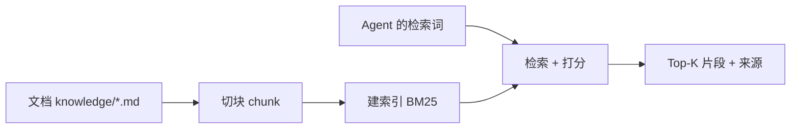

# 第 13 章 让 Agent 读过你的文档：RAG 知识库

**前置知识**：第 8 章（上下文预算）、第 12 章（Runbook 与提示词的分工）

**本章代码**：`server_agent/knowledge/`、`server_agent/tools/knowledge_tools.py`、`knowledge/`。

**学习目标**：读完本章，应能回答以下问题。

1. 为什么需要 RAG？
2. 切块怎么切？
3. 为什么先上 BM25 而不是向量？
4. 引用溯源为什么重要？

---

## 13.1 模型不知道的三类事实

模型知道「Linux 磁盘满怎么查」，但它不知道：

| 类型 | 例子 | 为什么模型不知道 |
|---|---|---|
| **内部约定** | 备份在 `/data/backup/<db>/`，每天 03:00 | 这是你公司的私有事实 |
| **历史故障** | 上次 502 是发布脚本没等端口释放 | 这是你们踩过的坑 |
| **当前状态** | 这台机器现在负载多少 | 这要靠工具实时查（不是 RAG 的活） |

第三类**必须用工具**，前两类才轮到 RAG。这个分工很重要——**RAG 提供的是「背景知识」，不是「实时事实」**，所以工具描述里明确写着：文档可能过期，与实时事实冲突时以实时事实为准。

RAG 的经典三段：



---

## 13.2 切块：碎与整的取舍

切块（chunking）是 RAG 里最容易被低估的一步：

| 切得太碎 | 切得太大 |
|---|---|
| 「重启它」——重启谁？上下文丢了 | 噪声多、占 token、命中不精准 |
| 检索精准但语义不完整 | 语义完整但检索模糊 |

本章的做法：

| 规则 | 原因 |
|---|---|
| 按 Markdown 标题切（`#`-`####`） | 运维文档天然按主题分节，标题就是天然的语义边界 |
| 把**标题路径**拼进 chunk 文本（`运维手册 > 备份约定`） | 让「备份约定」这层上下文跟着片段走，检索和阅读都更准 |
| 超长段落按 900 字符滑窗切，保留 120 字符重叠 | 避免把一句话劈两半；重叠让边界处的语义有冗余 |
| 丢掉 <20 字符的碎片 | 纯标题、空段之类的噪声 |
| 跳过 `README.md` | 目录说明类文件几乎不包含事实 |

---

## 13.3 为什么先上 BM25，而不是向量检索

这是个反直觉但有充分理由的决定：

| 理由 | 说明 |
|---|---|
| **依赖成本** | 向量检索需要 embedding 服务或本地模型 + 向量库；本项目坚持「依赖尽量少」 |
| **查询特点** | 运维查询往往很具体：`logrotate`、`502`、`/var/log/nginx`。**关键词检索在这类查询上很强** |
| **可解释** | BM25 能告诉你「命中了哪些词、分数多少」；向量只能给相似度，出了问题很难调 |
| **先有基线** | 没有评测（第 15 章）就去引入向量库，是在赌「它一定更好」 |

中文处理是 BM25 的坑：中文没空格，直接按空格切词会全军覆没。本章用**字符二元组（bigram）+ 单字**的混合切分，零依赖且跨平台一致：

```python
tokenize("磁盘满了")  # -> ["磁盘", "盘满", "满了", "磁", "盘", "满", "了"]
```

BM25 的公式（k1=1.5、b=0.75，业界默认值）：

```text
score(q, d) = Σ_t IDF(t) · (tf · (k1 + 1)) / (tf + k1 · (1 - b + b · |d| / avgdl))
```

它同时考虑**词频（tf）**、**稀有度（IDF）**与**文档长度归一（b）**——够用、可解释、可单测。

### 一个高频误解：「RAG 就是把文档塞进提示词」

那是「长上下文」，不是 RAG。区别在于：

| 做法 | 成本 | 精度 | 可解释性 |
|---|---|---|---|
| 全塞进提示词 | 每次几万 token | 无关内容干扰判断 | 无 |
| 检索 Top-K | 每次几百 token | 通常更准 | 有来源可查 |

关键是**按需**：检索只在模型判断需要背景知识时发生，而且只带回命中的那几百字。

---

## 13.4 引用溯源：结论必须能指回原文

RAG 最容易出的事故是**看起来很有道理，但来源是错的**。所以本章做了三件事：

| 措施 | 实现 |
|---|---|
| 每个片段都带来源 | `source = "incidents.md#历史故障复盘 > 2026-07-18 ..."` |
| 工具描述里要求引用 | 「回答时请引用来源」写进 `search_knowledge` 的说明 |
| 冲突时以实时为准 | 「文档可能过期，与工具查到的实时事实冲突时，以实时事实为准」 |

再加一条工程习惯：**索引内容可重建**（`rebuild()`）、**可保存**（`save/load` JSON），这样索引不怕丢，也不需要把向量库当唯一真相源。

---

## 13.5 代码走读

```text
server_agent/knowledge/chunker.py     # chunk_markdown / _split_long（标题切 + 滑窗重叠）
server_agent/knowledge/index.py       # tokenize（CJK bigram）/ BM25Index / build_from_dir
server_agent/knowledge/retriever.py   # KnowledgeBase（search / documents / rebuild / 目录解析）
server_agent/tools/knowledge_tools.py # search_knowledge / list_knowledge_docs
knowledge/                            # 示例文档：运维手册 + 历史故障复盘
```

### 常见陷阱：两个坑

**坑 1：切块阈值把「短但有用」的文档整段丢了。** 给 chunk 设「长度 >= 20 字符」的过滤后，测试里一个 17 字的文本文件被整个丢掉，于是断言「应该有两个文档」失败。阈值本身没错（过滤碎片是对的），但**测试用例要按阈值来写**——这类「边界值」的坑在本书里已经出现第三次（第 8 章的 `max(1, ...)`、第 10 章的 `_quote("")`）。

**坑 2：查询词和文档有中文子串重叠，导致「应该没命中」的用例命中了。** 用 `kubernetes 证书轮转` 去测「无命中」，结果文档里有「日志轮转」——`轮转` 这个 bigram 命中了。这是**中文检索的正常行为**（也是它的优势），但它提醒我：**写「不应该命中」的测试时，查询词要与语料在字符层面完全错开**。

---

## 13.6 动手练习

1. **看切块结果**：
   ```bash
   python3 -c "
   from server_agent.knowledge.chunker import chunk_markdown
   for c in chunk_markdown(open('knowledge/ops-handbook.md').read(), 'handbook.md')[:3]:
       print(c.label(), len(c.text))"
   ```
2. **测检索**：
   ```bash
   server-agent tools call search_knowledge '{"query": "备份目录在哪", "top_k": 2}'
   server-agent tools call search_knowledge '{"query": "502 起不来", "top_k": 2}'
   server-agent tools call list_knowledge_docs
   ```
   注意每条结果的 `source` 与 `score`。
3. **加自己的文档**：把一份内部运维说明（去掉敏感信息）放进 `knowledge/`，重建索引后再搜。
4. **对照实验（配好模型）**：问一个「只在文档里有答案」的问题（如「db-01 的备份目录在哪」），看它是否会调 `search_knowledge`、结论是否带来源。
5. **思考题**：如果文档量到 1000 个文件、几百万字，BM25 还能用吗？什么时候必须上向量检索？（提示：词不匹配的情况，例如用户说「存储爆了」而文档里写的是「磁盘写满」。）

---

## 13.7 验收清单

```bash
pytest -q tests/test_knowledge.py        # 13 passed
server-agent tools call list_knowledge_docs
server-agent tools call search_knowledge '{"query": "备份目录", "top_k": 2}'
```

---

## 13.8 本章小结

**要点**
1. RAG 补的是「内部约定」与「历史故障」这类模型不知道的事实；实时状态仍然要靠工具。
2. 切块是在「碎与整」之间取平衡：按标题切 + 标题路径进上下文 + 超长滑窗重叠。
3. **先用 BM25 建立可解释的基线**，把「要不要上向量」交给第 15 章的评测数据决定；每条结论都要能指回来源。

**自测题**（括号内为对应小节）
1. 模型不知道的三类事实是什么？哪一类不该用 RAG 解决？（13.1 节）
2. 标题路径为什么拼进 chunk 文本？（13.2 节）
3. 滑窗为什么要保留重叠？（13.2 节）
4. 中文 BM25 为什么需要 bigram？（13.3 节）
5. BM25 里的 b 参数管什么？（13.3 节）
6. 「全塞进提示词」和 RAG 的三个差别？（13.3 节）
7. 引用溯源做了哪三件事？（13.4 节）
8. 本章两个坑分别关于什么？「不应该命中」的测试要注意什么？（常见陷阱）
