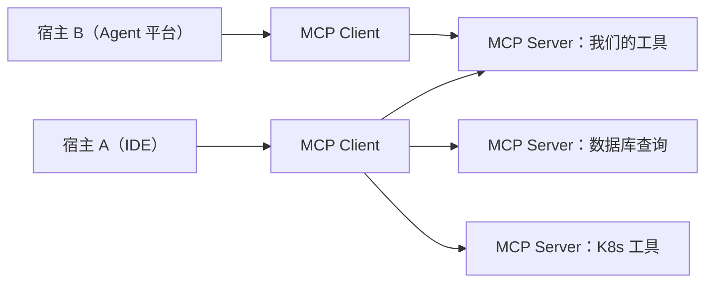

# 第 14 章 工具的 USB 接口：MCP 协议

> **本章导读**
> - 建议用时：知识 40 分钟 + 动手 30 分钟
> - 前置知识：第 03 章（工具注册表）、第 09 章（策略与默认拒绝）
> - 读完能回答：MCP 解决什么问题？暴露工具时最容易犯什么错？接入外部工具的风险在哪？
> - 本章代码：`server_agent/mcp/server.py`、`server_agent/mcp/client.py`、`server-agent mcp` 子命令。对应 tag `ch14`。

---

## 【积木 14-1】MCP 想解决什么：把 M × N 变成 M + N

在没有标准之前，每个 Agent 框架都要为自己的工具写适配层：M 个框架 × N 个工具 = M×N 份适配代码。

MCP（Model Context Protocol）做的事，是把接口标准化：



| 概念 | 角色 |
|---|---|
| **Host** | 最终用户用的程序（IDE、桌面应用、Agent 平台） |
| **Client** | Host 内部与某个 Server 保持 1:1 连接的部分 |
| **Server** | 提供能力的一方（工具 / 资源 / 提示词） |
| **传输** | stdio（本地子进程）或 HTTP（远程） |

本章实现的是 stdio 传输 + `tools` 能力子集——**够用**，也让协议细节看得清楚。

---

## 【积木 14-2】最小协议：JSON-RPC over stdio

stdio 传输的规则很朴素：**一行一个 JSON-RPC 消息**（换行分隔），不要往 stdout 打日志（日志走 stderr）。

| 方法 | 方向 | 说明 |
|---|---|---|
| `initialize` | C → S | 握手：交换协议版本与能力 |
| `notifications/initialized` | C → S | 通知（**没有响应**，别等） |
| `tools/list` | C → S | 返回 `{name, description, inputSchema}` |
| `tools/call` | C → S | 调用工具，返回 `content: [{type:"text", ...}]` |
| `ping` | C → S | 探活 |

三个容易踩的细节：

| 细节 | 说明 |
|---|---|
| 通知没有 `id`，也不该回响应 | 回了会让客户端等错东西 |
| 错误分两类：协议错（`error` 字段）与工具错（`result.isError=true`） | 工具执行失败属于业务结果，不是协议错误 |
| `inputSchema` 就是 JSON Schema | 与第 03 章给模型看的参数格式完全一致——**同一份 schema，换个传输方式而已** |

---

## 【积木 14-3】暴露工具时的三条规矩

把内部工具暴露出去，风险比在内部使用**只多不少**（受众变了）。本章守三条：

| 规矩 | 实现 | 原因 |
|---|---|---|
| **默认只暴露只读工具** | `read` / `low` 才出现在 `tools/list`；写操作要 `--expose-write` | fail-closed：误暴露的代价远大于少暴露 |
| **策略层照旧生效** | `tools/call` 走 `registry.call(policy=..., audit=...)` | 换传输方式 ≠ 换安全模型（第 09 章的教训） |
| **没有审批人 → 按拒绝处理** | `approver=None`，所以 high 风险调用直接失败 | 「没人能批准」就是「不能执行」 |

第三条是本项目「默认拒绝」原则的又一站：**终端有交互式审批、Web 端有按钮、MCP 端什么都没有——那就拒绝。**

---

## 【积木 14-4】接入外部工具：把别人当成高危

反向也做了：`MCPClient` 能连任意外部 MCP Server，把它的工具注册进我们的注册表。

| 风险 | 处理 |
|---|---|
| 不了解远端工具做什么 | 注册时**默认 `risk="high"`**，必须审批（除非明确知道它只读） |
| 名字冲突 | 加前缀（如 `mcp_prom_`）隔离命名空间 |
| 参数校验 | 参数模型允许任意字段（外部 schema 是 JSON，无法映射成 Python 类型），**校验交给远端**（它才是权威） |
| 远端挂了 | 调用返回错误文本，模型能看到并换路 |

「默认 high」这条值得强调：你接了一个「查询监控指标」的工具，看起来只读——但它可能在某些参数下触发重计算、甚至改配置。**不了解就别默认信任。**

---

## 【代码走读】本章落地了什么

```text
server_agent/mcp/
├── server.py   # make_server（纯 handler，便于测试）/ serve_stdio（进程循环）/ main（CLI 入口）
└── client.py   # MCPClient（握手 / 列表 / 调用 / 关闭）+ register_mcp_tools（默认 high + 前缀）
server_agent/cli.py  # server-agent mcp serve [--expose-write] / mcp list / mcp call
```

实现上有个细节值得学：`make_server()` 返回**纯函数 handler**，把 stdio 循环单独放在 `serve_stdio()`。
这样绝大部分测试可以直接 `await handler({...})`（毫秒级、稳定），只有传输层用真子进程验证——**分层测试，贵的只测一次**。

---

## 【动手练习】

1. **自己当一次 MCP 客户端**（不需要外部服务）：
   ```bash
   server-agent mcp list --server "python -m server_agent.mcp.server"
   server-agent mcp call host_info --server "python -m server_agent.mcp.server"
   server-agent mcp call restart_service '{"name":"nginx","dry_run":false}' --server "python -m server_agent.mcp.server --expose-write"
   ```
   注意最后一条：写操作被拒绝（没有审批人）。
2. **手工说一次协议**（最直观）：
   ```bash
   printf '%s\n' '{"jsonrpc":"2.0","id":1,"method":"initialize","params":{}}' | python -m server_agent.mcp.server --expose-write 2>/dev/null
   ```
3. **接到 MCP 客户端里**：在你常用的 MCP 客户端（如 IDE/WorkBuddy）配置里加上 `server-agent mcp serve`，然后在对话里让它调 `host_info`。
4. **接入一个外部工具**：随便找一个小型 MCP Server（或者自己写一个十行的），用 `register_mcp_tools` 挂进注册表，观察它是否按 high 风险走审批。
5. **思考题**：MCP 的 `resources`（资源）与 `prompts`（提示词模板）这两类能力，和我们的「RAG 文档」与「Runbook」是不是一回事？（提示：谁来决定「什么时候用」？）

---

## 【验收清单】

```bash
pytest -q tests/test_mcp.py                # 11 passed（含真实子进程往返）
server-agent mcp list --server "python -m server_agent.mcp.server"
server-agent mcp call host_info --server "python -m server_agent.mcp.server"
```

---

## 【本章小结】

**三句话：**
1. MCP 把「工具 × 宿主」的适配从 M×N 降到 M+N：一方实现，多方可用；stdio 传输就是换行分隔的 JSON-RPC。
2. 暴露工具时三条规矩：**默认只暴露只读**、**策略层照旧生效**、**没有审批人就拒绝**。
3. 接入外部工具一律先当高危：默认 `risk="high"`、加命名空间前缀、校验交给远端。

**自测题：**
1. MCP 的 Host / Client / Server 三者关系？（积木 14-1）
2. 为什么通知（notification）不该回响应？（积木 14-2）
3. 「工具错」和「协议错」怎么区分？（积木 14-2）
4. 为什么默认只暴露只读工具？（积木 14-3）
5. MCP 场景下 high 风险操作为什么必然失败？（积木 14-3）
6. 外部工具为什么默认按 high 处理？（积木 14-4）
7. 「分层测试，贵的只测一次」在本章是怎么体现的？（代码走读）

---

## 【下一章预告】

第 15 章「先有尺子：评估与可观测性」：前面 14 章加了很多能力，但**它们到底有没有用**？下一章做两件事——**Trace**（一次 run 的完整耗时树，能回答「时间花在哪」）与**评测集**（用靶场故障 + MockLLM 做可重复的离线评测，量化「根因命中率 / 步数 / 越权尝试」）。有了尺子，第 12 章的「要不要开计划」、第 13 章的「要不要上向量」才有答案。

*学完本章，回到对话里说一句「继续」，我就开讲第 15 章。*
