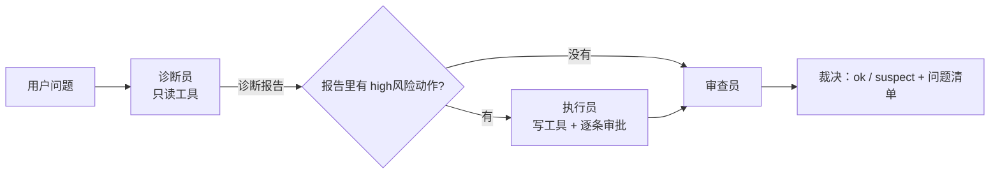

# 第 16 章 一个不够就组队：多 Agent 协作

**前置知识**：第 9 章（最小权限与审批）、第 15 章（评测）

**本章代码**：`server_agent/multi/`、`server-agent ask --multi`。

**学习目标**：读完本章，应能回答以下问题。

1. 什么时候该拆多 Agent？
2. 三种常见协作模式？
3. 拆角色的真正收益是什么？

---

## 16.1 先问「为什么要拆」

多 Agent 是这几年被过度使用最多的概念。拆之前先明确代价：

| 代价 | 具体表现 |
|---|---|
| 成本 | 每个角色至少一次模型调用（3 角色 ≈ 3 倍 token） |
| 延迟 | 串行执行，用户等更久 |
| 调试难度 | 出错时要判断「是哪个角色的锅」 |
| 状态同步 | 前一个角色的结论怎么传给下一个（文本？结构化？） |

那收益是什么？三个**真实**的收益：

| 收益 | 说明 |
|---|---|
| **权限隔离**（最重要） | 只读角色拿不到写工具，被骗也删不了东西。这是第 9 章「最小权限」的延伸 |
| **注意力聚焦** | 执行员只关心「怎么把动作做对」；审查员只挑毛病，不必重跑排查 |
| **可分工评测** | 指标可以按角色拆开：诊断命中率 / 执行成功率 / 审查发现问题数 |

**判断标准**：如果你的问题只需要一个「能写点东西」的角色，别拆；如果**需要不同的权限**或**需要独立复核**，才拆。

---

## 16.2 三种常见模式

| 模式 | 结构 | 适合 |
|---|---|---|
| **Supervisor（主管分派）** | 一个主管决定让谁做，汇总结果 | 任务可分解、角色差异明显（本章采用） |
| **Handoff（接力）** | A 做完把上下文交给 B，B 接着做 | 流程线性（如「先诊断再执行」） |
| **Reviewer（审查者）** | 主 Agent 干活，另一个挑毛病 | 高风险结论需要独立复核（本章也用了） |

本章实现的是「Supervisor 编排 + Reviewer 复核」的组合：



---

## 16.3 权限隔离要落到「工具集」上

光在提示词里写「你是只读角色」不算隔离——**必须让它在物理上拿不到写工具**：

```python
def registry_for(role: Role, base_registry):
    filtered = ToolRegistry()
    for tool in base_registry.list():
        if role.allows(tool.name):      # 角色白名单
            filtered.register(tool)
    return filtered
```

三个角色的工具集：

| 角色 | 工具 |
|---|---|
| 诊断员 | 只读：`disk_usage` / `tail_file` / `listening_ports` / `run_command` / `remote_*` / `search_knowledge` / `load_runbook` / `recall_host` |
| 执行员 | 写：`restart_service` / `kill_process` / `clean_directory` / `remote_restart_service`（+ 少量只读用于确认结果） |
| 审查员 | 极简：`disk_usage` / `listening_ports` / `tail_file`（抽查用） |

注意诊断员**没有** `clean_directory`：即使模型被日志里的注入指令说服，它也调不到那个工具——**这比提示词里的「不要删除」强得多**。

---

## 16.4 结论怎么传递：用结构化数据，不用自然语言

角色之间传递的应该是**结构化结果**（第 7 章的诊断报告），而不是一段散文：

| 传递方式 | 问题 |
|---|---|
| 把诊断员的自然语言原文丢给执行员 | 执行员要重新理解一遍，容易漏掉关键约束 |
| **传结构化报告**（本章做法） | 字段明确：`actions[].risk` 直接决定「要不要审批」 |

执行员的输入长这样：

```text
诊断结论：
{"summary": "...", "root_cause": "日志未轮转", "actions": [{"risk": "high", "description": "清理日志"}]}

需要执行的动作（逐条执行，先 dry-run）：
- [high] 清理 /var/log/nginx 下 7 天前的日志
```

审查员拿到的也是「报告 + 执行记录」，最后输出裁决 JSON：`{"verdict": "ok|suspect", "issues": [...]}`。

**裁决解析失败怎么办？** 记成 `verdict=unknown`，不阻塞——与第 12 章「计划失败降级为无计划」同一个原则：**增强能力不该成为单点故障**。

---

## 16.5 代码走读

```text
server_agent/multi/
├── roles.py        # Role 定义 + registry_for（按角色裁剪工具集）
└── supervisor.py   # Supervisor：诊断 → 执行 → 审查；MultiRunResult 汇总
server_agent/cli.py # server-agent ask --multi
```

### 常见陷阱：同一个坑的第三次

审查提示词里有示例 JSON `{"verdict": "ok", ...}`，若用 `.format(report=..., executed=...)` —— 又一次 `KeyError: '"verdict"'`。

三次踩坑记录：

| 章 | 场景 | 症状 |
|---|---|---|
| 07 | 修复提示词用 `Template.substitute` 少传占位符 | `KeyError: 'previous'` |
| 12 | 计划模板用 `str.format`，模板里有示例 JSON | `KeyError: '"steps"'` |
| 16 | 裁决模板用 `str.format`，模板里有示例 JSON | `KeyError: '"verdict"'` |

**因此定为项目规范：任何包含示例代码/JSON 的模板，一律 `string.Template` + `$var`；禁止 `str.format` / f-string 做模板替换。** 并且现在有一条回归测试专门守住这条（`test_verdict_prompt_survives_json_example`）。

---

## 16.6 动手练习

1. **看角色权限差异**（离线）：
   ```bash
   pytest -q tests/test_multi_agent.py -k role -s
   python3 -c "
   from server_agent.multi import DIAGNOSTICIAN, EXECUTOR, registry_for
   from server_agent.tools import registry
   print('诊断员：', registry_for(DIAGNOSTICIAN, registry).names())
   print('执行员：', registry_for(EXECUTOR, registry).names())"
   ```
2. **跑一次三角色协作**（配好模型）：
   ```bash
   server-agent ask --multi "web-01 磁盘满了，查清楚并处理"
   ```
   观察三段输出、执行员的审批请求、以及最后的裁决。
3. **对照实验**：同一个问题用 `--multi` 与不带 `--multi` 各跑一次，比较步数、token、结论质量。把结论写进你的笔记——这就是「拆不拆」的决策依据。
4. **加一个角色**：比如「巡检员」（定期检查 + 只读），想清楚：它需要哪些工具？它的输出交给谁？
5. **思考题**：本章是串行编排。如果让诊断员同时派发 3 台机器的并行诊断，会带来什么问题？（提示：并发上限、成本、以及「谁汇总」的责任边界。）

---

## 16.7 验收清单

```bash
pytest -q tests/test_multi_agent.py       # 9 passed
server-agent ask --multi --mock "查一下磁盘"   # 至少能看到三段角色输出
```

---

## 16.8 本章小结

**要点**
1. 拆多 Agent 的**主要收益是权限隔离**（只读角色拿不到写工具），其次是注意力聚焦与按角色评测；代价是成本、延迟与调试复杂度。
2. 三种模式：Supervisor（分派）、Handoff（接力）、Reviewer（复核）；本章用「Supervisor + Reviewer」。
3. 角色之间传**结构化结果**（报告 JSON），不传散文；裁决解析失败降级为 `unknown`，不阻塞主流程。

**自测题**（括号内为对应小节）
1. 拆多 Agent 的三项收益与四项代价？（16.1 节）
2. 什么情况下「不该拆」？（16.1 节）
3. 为什么权限隔离必须落到工具集上，而不能只写在提示词里？（16.3 节）
4. 诊断员为什么不需要 `clean_directory`？（16.3 节）
5. 角色之间为什么传结构化报告而不是自然语言？（16.4 节）
6. 裁决解析失败时为什么选择降级而不是报错？（16.4 节）
7. 本章第三次踩的是什么坑？现在由什么守住？（常见陷阱）
