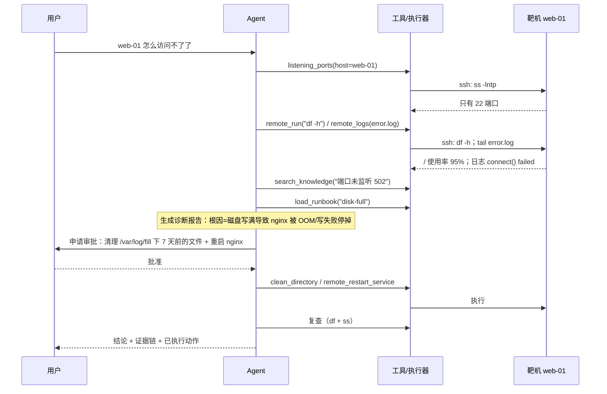

# 第 17 章 总演习：故障靶场实战与交付部署

> **本章导读**
> - 建议用时：知识 30 分钟 + 动手 60 分钟
> - 前置知识：全部。这一章不引入新概念，只做两件事：**端到端跑一遍**、**把它交付出去**
> - 读完能回答：一次真实排障里各模块怎么协作？上线前必须检查什么？下一步往哪走？
> - 本章代码：`Dockerfile`、`docker-compose.yml`、`Makefile`、`docs/deploy.md`、`docs/security-checklist.md`。对应 tag `ch17`。

---

## 【积木 17-1】端到端演练剧本

**场景**：`web-01` 上被注入了两个故障——磁盘写满 + nginx 停止；用户只说了一句「web-01 怎么访问不了了」。



**跑法（需要 Docker）**：

```bash
make lab-up                     # 起三台靶机
export LAB_SSH_PASSWORD=labpass
make fault-disk fault-nginx     # 注入两个故障（docker exec 到 web-01）
server-agent ask --plan "web-01 怎么访问不了了？帮我查清楚并处理"
#   交互式审批：清理与重启会各问一次 y/N
make fix-all                    # 恢复
make lab-down
```

---

## 【积木 17-2】这一步真正在验证什么

跑完这一遍，你验证的其实是**前面 16 章是否真的能拼起来**：

| 环节 | 来自哪一章 | 出问题的表现 |
|---|---|---|
| 循环、步数上限、错误回喂 | 04 | 卡在同一个工具上反复查 |
| 工具与结果上限 | 03 | 报告里出现被截断的 JSON 碎片 |
| 远程执行与主机授权 | 10 | 「未授权重启该服务」「清单里没有这台主机」 |
| 策略与审批 | 09 | 没经过审批就执行了写操作（严重） |
| 手册与文档 | 12/13 | 结论里没有引用来源 |
| 上下文压缩 | 08 | 报告明显丢失早期观察（如端口信息） |
| 报告结构 | 07 | 前端显示「未解析为结构化报告」 |
| 评测 | 15 | 同一场景在评测里过、在真机上不过（说明桩与真实差异大） |
| Trace | 15 | 查不到时间花在哪 |

**这也是为什么最后要做一章演习**：单元测试全绿不代表系统能用；**只有端到端跑过，你才知道哪两个模块的接口理解不一致。**

---

## 【积木 17-3】交付：三条命令起服务

```bash
# 1. 本地开发
make install && make test          # 离线，不需要 Key

# 2. 起服务（终端）
SA_API_TOKEN=devtoken LLM_BASE_URL=... LLM_MODEL=... make serve
#   浏览器打开 http://127.0.0.1:8000

# 3. 全套（Agent + 三台靶机）
export SA_API_TOKEN=devtoken LAB_SSH_PASSWORD=labpass
export LLM_BASE_URL=... LLM_API_KEY=... LLM_MODEL=...
make docker-up
```

容器化时的四个细节（都在 `Dockerfile` / `docker-compose.yml` 里）：

| 细节 | 原因 |
|---|---|
| 非 root 用户（uid 1000） | 容器逃逸的收益从「root」降为「普通用户」 |
| `data/` 挂卷 | SQLite / 审计 / trace 要持久化，不能随容器销毁 |
| `HEALTHCHECK` 打 `/health` | 编排系统据此判断存活（第 05 章的 liveness 思路） |
| 靶机与 Agent 同网络、清单用服务名 | 容器里用 `web-01` 而非宿主机的 `127.0.0.1:2201` |

---

## 【积木 17-4】上线前的安全清单

六条硬检查（详见 [docs/security-checklist.md](../security-checklist.md)）：

| 检查 | 命令 / 动作 |
|---|---|
| 1. 只监听本机或已设 Token | `SA_HOST=127.0.0.1` 或必设 `SA_API_TOKEN`；验证 `curl` 无 Token 返回 401 |
| 2. 写操作都要审批 | 跑 `pytest -q tests/test_policy.py`（含注入用例）与评测里的 `min_denials` 用例 |
| 3. 授权范围按主机写死 | 检查 `inventory.yaml` 的 `allowed_paths` / `allowed_services`，不含 `/`、`/etc` |
| 4. 审计开启且能查 | `SA_AUDIT_ENABLED=true`；`server-agent audit -v` 能看到审批与拒绝记录 |
| 5. 秘密不进沙箱、不进日志 | `redact` 生效；`grep -c '\*\*\*' data/audit.jsonl`；沙箱无凭证 |
| 6. 有回滚与 kill switch | 知道怎么停服务、怎么撤销一次误操作（靶场先演练一遍） |

**最容易被忽略的是第 6 条**：能执行变更的 Agent，必须配一个「怎么停下来」的答案。最低限度是：任务可取消（第 05 章）、审批可拒绝（第 09 章）、服务可停止、数据可回滚。

---

## 【积木 17-5】下一步可以往哪走

按「先补短板，再扩能力」的顺序：

| 方向 | 触发信号（什么时候该做） |
|---|---|
| 定时巡检 | 你已经在手工重复同一批检查 |
| 接入告警 | 你希望它比人先看到故障（这时要加去重与静默，否则会被告警刷屏） |
| 更细的权限 | 多人使用：需要按人/按角色区分「谁能批准什么」 |
| 向量检索 | 评测显示 BM25 漏掉了大量「词不匹配」的查询 |
| 并行多机 | 一次要检查 10+ 台机器（此时要加并发上限与汇总策略） |
| 真正的审批体系 | 需要留痕与合规（对接你们的工单/审批系统） |

**一条提醒**：本项目的每个能力都配了评测与边界说明，这是它能长期演进的前提。**没有评测的能力扩张，最后都会变成没人敢用的黑盒。**

---

## 【代码走读】本章落地了什么

```text
Dockerfile              # 非 root + healthcheck + data 挂卷
docker-compose.yml      # agent + web-01/web-02/db-01（一键起全套）
inventory.docker.yaml   # 容器内清单（用服务名与容器端口）
Makefile                # install/test/eval/serve/lab-up/fault-*/fix-all/mcp-list/docker-up
docs/deploy.md          # 部署与运维手册
docs/security-checklist.md  # 上线前六项硬检查
```

---

## 【动手练习】

1. **完整演习**（需要 Docker）：按积木 17-1 的剧本跑一遍，记录每一步的实际现象。
2. **制造一次「Agent 被拒绝」**：清理操作时在终端输 `n`，观察它是否停止、报告里怎么写这件事。
3. **制造一次「Agent 想越权」**：让它重启 `db-01` 上的 `nginx`（不在它白名单里），确认被拒。
4. **交付演练**：`make docker-up`，然后从浏览器完成一次排查（前端有审批卡片）。
5. **思考题**：如果要让这个 Agent 接入你们的告警系统自动处理「磁盘满」，你会怎么设计安全边界？（提示：白名单 + 审批 + 审计之外，还需要「同时处理几条」「失败几次就停」这类策略。）

---

## 【验收清单】

```bash
make test                        # 全部离线测试通过
make eval                        # 评测报告：通过率 100%
make lab-up && make fault-disk   # 需要 Docker
server-agent ask --plan "web-01 磁盘满了吗"
make fix-all && make lab-down
make docker-up                   # 全套容器化（需要 Docker + compose 插件）
```

---

## 【本章小结】

**三句话：**
1. 端到端演习的价值在于**暴露模块之间的接口误解**——单元测试全绿不等于系统能用。
2. 交付只要三条命令（install/test/serve 或 docker-up），但容器化要注意非 root、数据挂卷、健康检查、容器内清单。
3. 上线前有六项硬检查，其中最容易漏的是「**怎么停下来**」：能改系统的 Agent 必须配好取消、拒绝、停止与回滚。

**自测题：**
1. 端到端演习能验证哪些环节？（积木 17-2）
2. 容器化时要特别注意哪四点？（积木 17-3）
3. 上线前六项检查里，哪一项最容易被忽略？为什么它重要？（积木 17-4）
4. 什么信号说明「该做定时巡检」而不是继续手工查？（积木 17-5）
5. 为什么说「没有评测的能力扩张会变成没人敢用的黑盒」？（积木 17-5）

---

## 【全课终点】

到这里，17 章结束了。回头看你拥有的东西：

- 一个**能跑、能远程调用、有前端、能在靶场真的修好故障**的运维 Agent；
- 一套**讲得清为什么**的模块文档与架构决策记录；
- 一把**能证明它靠谱**的评测尺子（离线可跑、进 CI）；
- 以及最重要的一件事：**遇到任何 Agent 需求时，你知道从哪一层开始设计与担心。**

下一步的建议很简单：**把它接到你真实的一台测试机上，用你自己的故障去跑。** 那才是真正的考试。

*学完本章，课程结束。想复盘某一章，直接说「重讲第 N 章」；想扩展某个方向（巡检、告警、并行多机），说「扩展 XXX」即可。*
