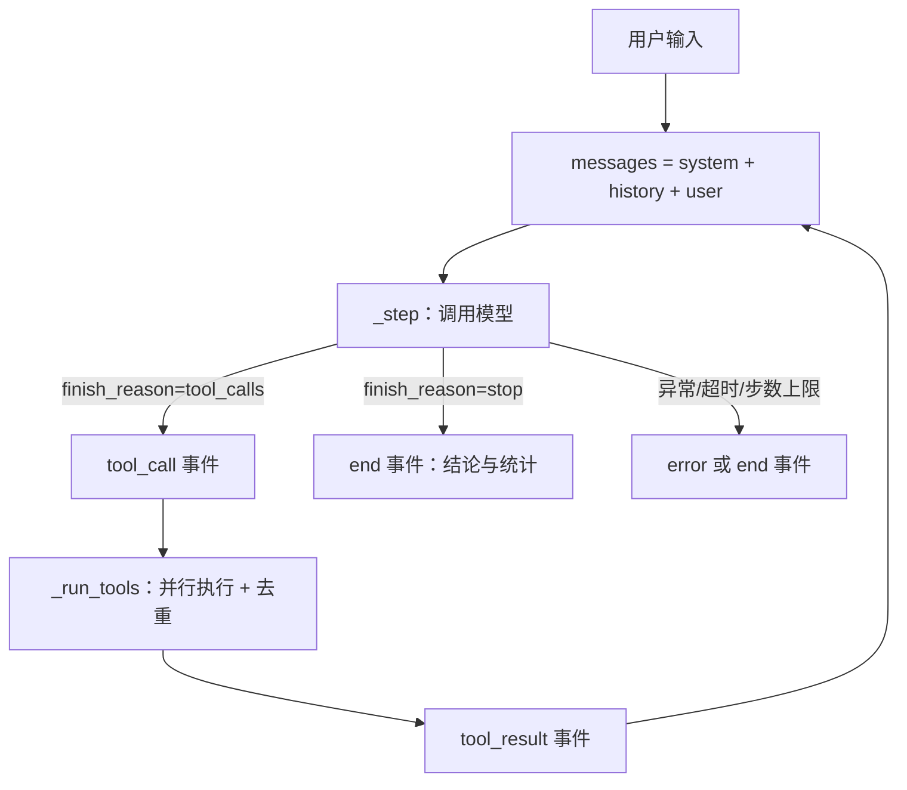

# 模块：agent（ReAct 循环与事件）

- 引入章节：第 04 章
- 源码：`server_agent/agent/events.py`、`server_agent/agent/loop.py`
- 测试：`tests/test_agent_loop.py`

## 职责

| 负责 | 不负责 |
|---|---|
| 组织「模型 ⇄ 工具」的多步循环 | 模型怎么调用（第 02 章）、工具怎么执行（第 03 章） |
| 停止条件：最终回答、最大步数、超时、重复调用 | 权限与审批（第 09 章在 `_run_tools` 之前插入策略层） |
| 把过程输出成事件流 | 事件怎么显示（CLI / 第 06 章前端） |
| 统计步数、工具调用次数、token 用量 | 历史持久化与压缩（第 08 章） |

## 接口

```python
from server_agent.agent import Agent

agent = Agent(llm, tools=None, system_prompt=DEFAULT_SYSTEM,
              max_steps=None, timeout=None, stream=True, clock=time.monotonic)

async for event in agent.run("磁盘为什么满了", history=None):   # 事件流
    event.type, event.run_id, event.seq, event.data

result = await agent.run_sync("磁盘为什么满了")                 # 只要结果
result.text, result.steps, result.tool_calls, result.usage, result.stopped, result.messages
agent.last_result                                              # 同 result，含完整消息历史
```

| 事件类型 | data 关键字段 |
|---|---|
| `start` | `input` `max_steps` `tools` `model` |
| `step` | `step` |
| `reasoning` | `text` |
| `text` | `text`（增量） |
| `tool_call` | `id` `name` `arguments` |
| `tool_result` | `id` `name` `ok` `content` `chars` `truncated` `elapsed_ms` `skipped`（`repeat` / `bad_json` / `null`） |
| `report` | `parsed` `report` `error` `raw`（第 07 章的结构化报告） |
| `error` | `message` `status` `retryable` |
| `end` | `text` `steps` `tool_calls` `usage` `stopped` `elapsed_ms` `report` `report_error` |

`stopped` 取值：`final`（正常给出结论）、`max_steps`、`timeout`、`length`（输出被截断）、`error`、`cancelled`。

## 配置

| 变量 | 默认 | 说明 |
|---|---|---|
| `SA_AGENT_MAX_STEPS` | 12 | 单次提问最多几步（一步 = 一次模型调用） |
| `SA_AGENT_TIMEOUT` | 300 | 单次提问总超时（秒） |
| `SA_AGENT_MAX_TOKENS` | 1024 | 模型单次回复上限 |

## 数据流



## 设计取舍

| 决策 | 备选 | 理由 |
|---|---|---|
| 事件缓冲 + 主循环 flush | 辅助方法直接 yield | 只有生成器本身能 yield；缓冲让 `_step` / `_run_tools` 保持普通函数 |
| `seq` 用独立计数器 | 用缓冲区长度 | 缓冲区会被清空，长度会回退，序号必须单调 |
| 最大步数最后一步追加提示 | 直接截断 | 至少拿到「基于已有信息的结论」，而不是空白 |
| 重复调用只警告不报错 | 直接终止 | 给模型一次自我纠正的机会 |
| 依赖注入 `llm` / `tools` / `clock` | 内部 `import` | 测试可完全离线、无真实时间等待 |
| 事件扁平化 | 嵌套结构 | 前端与协议层无需再解析 |

## 已知限制

- 历史不做压缩，长会话会迅速逼近上下文窗口（第 08 章）。
- 重复检测只识别「参数完全相同」的调用。
- 同一 Agent 实例不适合并发 `run()`：`self.usage` 与 `last_result` 是实例状态；第 05 章每个 run 新建实例。
- 不支持中断（`CancelledError` 会向上传播，但工具线程无法被强制终止）。
- `run_sync()` 用 `last_result` 取结果，因此同一实例上并发调用会互相覆盖。
