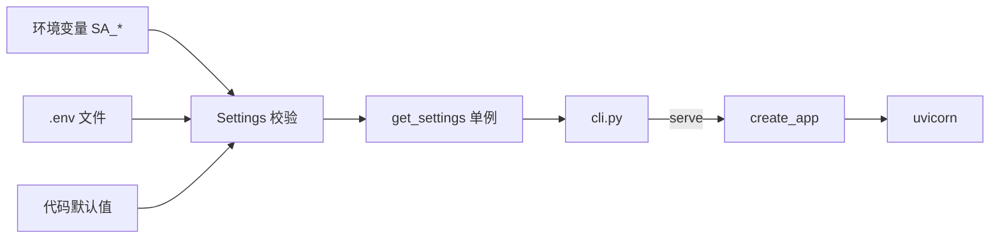

# 模块：config / cli / server 骨架

- 对应章节：第 1 章
- 源码：`server_agent/config.py`、`server_agent/cli.py`、`server_agent/server/app.py`
- 测试：`tests/test_config.py`、`tests/test_cli.py`、`tests/test_health.py`

## 职责

| 文件 | 职责 | 不负责 |
|---|---|---|
| `config.py` | 从环境变量 / `.env` / 默认值加载并校验配置，提供进程内单例 | 不读写任何业务数据 |
| `cli.py` | 命令行入口，解析子命令并分发 | 不包含业务逻辑，只做参数转发 |
| `server/app.py` | 应用工厂 `create_app()`，挂载路由与生命周期 | 不含业务逻辑 |

## 配置项

| 环境变量 | 默认值 | 校验 | 说明 |
|---|---|---|---|
| `SA_HOST` | `127.0.0.1` | — | 监听地址；安全默认只监听本机 |
| `SA_PORT` | `8000` | 1-65535 | 监听端口 |
| `SA_LOG_LEVEL` | `info` | debug/info/warning/error，大小写不敏感 | 日志级别（`serve` 生效；其它 CLI 子命令固定 warning） |
| `SA_LOG_FORMAT` | `text` | text / json | json 时每行一个 JSON（含 `run_id`、`tool`、`duration_ms` 等字段），便于日志平台采集 |
| `SA_API_TOKEN` | 空 | 空串视为未设置 | 远程调用鉴权；监听非本机地址时必须设置 |

优先级：进程环境变量 > 当前工作目录 `.env` > 默认值。

## 接口

```python
from server_agent.config import Settings, get_settings
s = get_settings()          # 进程内单例（lru_cache）
s.public_dict()             # 敏感字段打码后的 dict
get_settings.cache_clear()  # 测试中切换配置

from server_agent.server.app import create_app
app = create_app(settings)  # 每次返回新实例
```

| HTTP | 返回 |
|---|---|
| `GET /health` | `{"status":"ok","version":"0.1.0","uptime_seconds":1.23}` |

| CLI | 作用 |
|---|---|
| `server-agent version` | 打印版本 |
| `server-agent config` | 打印生效配置（Token 打码） |
| `server-agent serve [--host] [--port]` | 启动服务；非本机地址且无 Token 时告警 |

## 数据流



## 设计取舍

| 决策 | 备选 | 理由 |
|---|---|---|
| pydantic-settings | 手写 `os.getenv` | 类型转换 + 校验 + `.env` 一步到位；与后续工具 Schema 共用 pydantic |
| 统一 `SA_` 前缀 | 无前缀 | 避免与系统其他程序的 `HOST`、`PORT` 撞名 |
| 应用工厂 | 模块级 `app` | 测试可注入配置；避免导入即读取配置的副作用 |
| argparse | click / typer | 零依赖；子命令不多时足够 |

## 已知限制

- `.env` 按**当前工作目录**查找，从其他目录启动时不会读到仓库里的 `.env`。
- `/health` 只代表进程存活（附 `runs_active`），不检查 LLM 等依赖；没有单独的 readiness 探针。
- 配置非法（如 `SA_LOG_FORMAT=xml`、`SA_SANDBOX_BACKEND=k8s`）时 CLI 直接退出，返回码 2。
