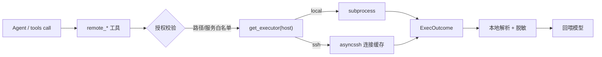

# 模块：executors（执行器）+ tools/remote（远程工具）

- 对应章节：第 10 章
- 源码：`server_agent/executors/`、`server_agent/tools/remote.py`、`inventory.yaml`、`lab/`
- 测试：`tests/test_executors.py`（14 个，全部离线）

## 职责

| 文件 | 负责 | 不负责 |
|---|---|---|
| `base.py` | `ExecOutcome`、`Executor` 协议、`ExecutorError` | 不实现任何执行方式 |
| `local.py` | 本地 subprocess（异步、带超时） | 不解析输出 |
| `ssh.py` | SSH 执行、连接缓存、参数安全引用 | 不做授权判断（策略层与清单负责） |
| `inventory.py` | 清单加载、分组、主机级 `allowed_paths/services`、`password_env` | 不建连接 |
| `tools/remote.py` | 三个远程工具 + 命令输出解析 | 不做审批（复用策略层） |

## 接口

```python
from server_agent.executors import get_executor, Inventory, reset_inventory

executor = get_executor("web-01")            # local / ssh 自动分派
outcome = await executor.run(["df", "-h"])   # ExecOutcome(ok, stdout, stderr, returncode, host, elapsed_ms)

inv = Inventory.from_yaml("inventory.yaml")
inv.get("web-01").allowed_services           # ["nginx"]
```

| 工具 | risk | 关键约束 |
|---|---|---|
| `remote_run(host, command)` | read | 命令白名单（含 `df/free/ps/ss/uptime/journalctl/tail/...`）；解析 df/free/ps/ss/uptime |
| `remote_logs(host, path, lines, grep)` | read | 路径受该主机 `allowed_paths` 约束 |
| `remote_restart_service(host, name)` | high | 该主机 `allowed_services` + 人工审批 + 审计 |

## 数据流



## 设计取舍

| 决策 | 备选 | 理由 |
|---|---|---|
| 执行器收 argv | 收命令字符串 | 避免 shell 拼接注入；引用逻辑集中在 `_quote` |
| 远端不装依赖 | 远端装 psutil/agent | 零侵入真机；代价是解析器要跟输出格式 |
| 只解析格式稳定的命令 | 全量解析 | 脆弱解析器比原文更难维护 |
| 授权写在清单 | 写在代码/全局配置 | 环境知识跟主机走；不同机器授权不同 |
| 密码用 `password_env` | 写进清单 | 清单进 Git，密码不能进 Git |
| 默认 `strict_host_key: false` | 强制校验 | 演练可用；真机应在清单显式改 true |

## 已知限制

- 串行执行：多主机批量采集会重复握手（连接有缓存但仍是逐条命令）。
- 解析器只覆盖 `df/free/ps/ss/uptime`；其余命令返回原文。
- 未做主机并发限流；同时打 20 台机器需要自行控制（第 16 章多 Agent 会讨论）。
- Windows 远端未支持（`systemctl`/`ss` 等命令是 Linux 假设）。
