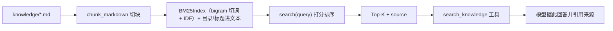

# 模块：knowledge（切块 / BM25 检索 / 知识工具）

- 对应章节：第 13 章
- 源码：`server_agent/knowledge/`、`server_agent/tools/knowledge_tools.py`、`knowledge/`
- 测试：`tests/test_knowledge.py`（13 个）

## 职责

| 文件 | 负责 | 不负责 |
|---|---|---|
| `chunker.py` | Markdown 按标题切块、超长滑窗重叠、标题路径进上下文 | 不建索引 |
| `index.py` | 中文混合切词、BM25 打分、索引保存/加载、目录构建 | 不做缓存与去重 |
| `retriever.py` | `KnowledgeBase`（search / documents / rebuild）、默认目录解析与缓存 | 不生成答案 |
| `knowledge_tools.py` | `search_knowledge` / `list_knowledge_docs` | 不做引用校验（靠提示词与评估） |

## 接口

```python
from server_agent.knowledge import get_knowledge_base, reset_knowledge_base

kb = get_knowledge_base()               # 目录：SA_KNOWLEDGE_DIR 或仓库根/knowledge
kb.search("备份目录", top_k=4)          # -> [ScoredChunk(chunk, score, matched)]
hit.label()                             # "incidents.md#历史故障复盘 > 2026-07-12 ..."
kb.documents(); kb.rebuild()
```

工具返回：`{query, hits:[{doc,heading,text,index,score,source,matched}], documents, hint}`

## 数据流



## 设计取舍

| 决策 | 备选 | 理由 |
|---|---|---|
| BM25（关键词） | 向量检索 + embedding | 零依赖、可解释、对具体关键词查询足够；升级留给评测决定 |
| CJK bigram + 单字 | jieba 等分词器 | 零依赖、跨平台一致；对运维术语效果够 |
| 按标题切块 | 固定长度切 | 运维文档按主题分节，标题是天然语义边界 |
| 标题路径进 chunk 文本 | 只存元数据 | 检索与阅读都能拿到上下文 |
| 跳过 README | 全部入库 | README 多为目录说明，噪声大 |
| 索引入内存 + 可 save/load | 每次重建 | 单机文档量小；保留持久化接口以便扩展 |

## 已知限制

- 无同义词/词形处理：用户说「存储爆了」而文档写「磁盘写满」时可能不命中（向量检索要解决的正是这类）。
- 索引在内存中，进程重启后重建（文档量小，可接受）。
- 无重排（re-rank）、无 MMR 去重，Top-K 可能来自同一段落的不同滑窗。
- 不做权限隔离：所有文档对 Agent 可见（生产需按知识库分级）。
