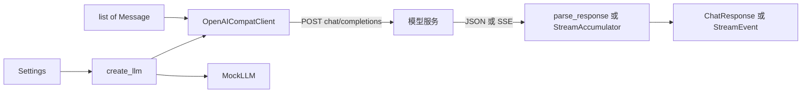

# 模块：llm（LLM 调用层）

- 对应章节：第 2 章
- 源码：`server_agent/llm/`
- 测试：`tests/test_llm_base.py`、`tests/test_openai_compat.py`、`tests/test_mock_llm.py`、`tests/test_llm_factory_cli.py`

## 职责

把「和大模型说话」这件事封装成一个与厂商无关的接口。上层（CLI、第 4 章的 Agent 循环、第 5 章的服务）只依赖 `LLMClient` 协议与 `base.py` 中的数据结构。

| 负责 | 不负责 |
|---|---|
| 消息格式转换、请求组装 | 决定下一步做什么（Agent 循环的事） |
| 超时、重试、退避、错误分类 | 执行工具（第 3 章） |
| 非流式解析、SSE 流式拼装（文本 / 工具调用 / 推理内容） | 管理与压缩历史（第 8 章） |
| token 用量统计 | 提示词内容（第 7 章） |

## 文件

| 文件 | 内容 |
|---|---|
| `base.py` | `Message`、`ToolCall`、`ChatResponse`、`Usage`、`StreamEvent`、`LLMError`、`LLMClient` 协议 |
| `openai_compat.py` | `OpenAICompatClient`（httpx 实现）、`parse_response()`、`_StreamAccumulator` |
| `mock.py` | `MockLLM`、剧本辅助函数 `text()` / `tool_call()` |
| `factory.py` | `create_llm(settings, mock=False)` |

## 接口

```python
from server_agent.llm import Message, create_llm

llm = create_llm()                                   # 按配置创建
resp = await llm.chat([Message.system("..."), Message.user("...")], tools=None, max_tokens=512)
resp.message.content, resp.message.tool_calls, resp.finish_reason, resp.usage, resp.reasoning

async for ev in llm.stream(messages):
    ev.type   # "text" | "reasoning" | "done"
    ev.text   # 增量文本
    ev.response  # 仅 done 事件：拼装好的 ChatResponse
```

| 数据结构 | 关键字段 | 说明 |
|---|---|---|
| `Message` | `role` `content` `tool_calls` `tool_call_id` | `to_dict()` 转接口格式；工厂方法 `system/user/assistant/tool` |
| `ToolCall` | `id` `name` `arguments`（原始 JSON 字符串） | `parsed_arguments()` 解析，非法时抛 `ValueError` |
| `ChatResponse` | `message` `finish_reason` `usage` `model` `reasoning` | `reasoning` 不进入 `message`，不会回传给模型 |
| `LLMError` | `status` `retryable` | 统一错误类型 |

## 配置

| 变量（也可加 `SA_` 前缀） | 默认 | 说明 |
|---|---|---|
| `LLM_PROVIDER` | `openai_compat` | `mock` 则使用 echo 模式 MockLLM |
| `LLM_BASE_URL` | 无 | 必填，如 `https://api.deepseek.com`；客户端自动拼接 `/chat/completions` |
| `LLM_API_KEY` | 无 | 本地 vLLM / Ollama 可留空；打印时打码 |
| `LLM_MODEL` | 无 | 必填 |
| `LLM_TEMPERATURE` | `0.2` | 0-2 |
| `LLM_TIMEOUT` | `60` | 秒 |
| `LLM_MAX_RETRIES` | `2` | 0-10，不含首次请求 |
| `LLM_STREAM_USAGE` | `true` | 流式时发送 `stream_options.include_usage`；个别服务不支持时关掉 |
| `LLM_EXTRA_BODY` | `{}` | JSON，合并进请求体的厂商私有参数 |

## 数据流



## 重试策略

| 情况 | 行为 |
|---|---|
| 408 / 409 / 429 / 500 / 502 / 503 / 504 | 可重试；有 `Retry-After` 则按它等待（上限 30 秒），否则指数退避 `0.5 * 2^n`（上限 8 秒）+ 0-0.25 秒抖动 |
| 网络错误、超时 | 可重试 |
| 其它状态码（400 / 401 / 403 / 404 等） | 立即抛 `LLMError`，不重试 |
| 流式 | 仅在收到响应状态之前或状态非 200 时重试；开始输出后出错直接抛出 |

## 设计取舍

| 决策 | 备选 | 理由 |
|---|---|---|
| httpx 直调 | 官方 / 厂商 SDK | 请求完全可见；少一个依赖；各家兼容接口已足够统一 |
| `Protocol` 而非抽象基类 | ABC 继承 | 鸭子类型，MockLLM 不必继承任何东西 |
| `arguments` 保留原始字符串 | 解析后存 dict | 解析失败要作为观察回喂模型，而不是在底层崩溃 |
| 推理内容单独字段 | 混进 content | 避免污染历史、浪费 token |
| `extra_body` 透传厂商参数 | 为每家写子类 | 差异通常只是一两个字段，配置即可解决 |
| MockLLM 用字符数模拟 usage | 引入分词器 | 测试只需要「有数、会增长」，不需要精确 |

## 已知限制

- 只支持 Chat Completions 接口，不支持 Responses API 或 Anthropic 原生协议。
- 本层不做 token 预估；上下文预算在 Agent 循环里由 memory 模块处理。
- 没有并发限流（令牌桶）；单用户本地使用足够，多人共用服务时需要在上层加并发上限。
- 流式中途断开不会续传，直接报错。
