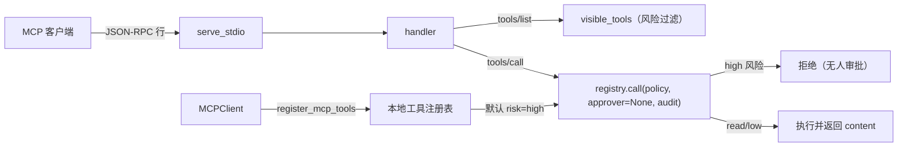

# 模块：mcp（MCP Server / Client）

- 引入章节：第 14 章
- 源码：`server_agent/mcp/server.py`、`server_agent/mcp/client.py`、`server-agent mcp` 子命令
- 测试：`tests/test_mcp.py`（11 个，含一次真实子进程往返）

## 职责

| 文件 | 负责 | 不负责 |
|---|---|---|
| `server.py` | JSON-RPC handler（initialize / tools/list / tools/call / ping）+ stdio 循环 | 不做鉴权（本地 stdio；远程传输需自行加） |
| `client.py` | 连接外部 Server、列出/调用工具、把工具注册进注册表 | 不缓存远端结果 |

## 协议子集

| 方法 | 响应 |
|---|---|
| `initialize` | `{protocolVersion, capabilities:{tools:{listChanged:false}}, serverInfo}` |
| `notifications/initialized` / `notifications/cancelled` | 无响应 |
| `tools/list` | `{tools:[{name, description, inputSchema}]}`（默认只含 read/low） |
| `tools/call` | `{content:[{type:"text", text}], isError}` |
| `ping` | `{}` |
| 未知方法 | `error.code = -32601` |

## 暴露策略

| 情况 | 行为 |
|---|---|
| 默认启动 | 只暴露 `read` / `low` 风险工具 |
| `--expose-write` | 也暴露 high 风险工具，但调用时**没有审批人 → 拒绝** |
| 调用未暴露/不存在工具 | `isError=true`，文案说明 |
| 所有调用 | 走策略层 + 审计（`run_id="mcp"`） |

## 数据流

## 设计取舍

| 决策 | 备选 | 理由 |
|---|---|---|
| 手写最小协议子集 | 引入官方 SDK | 协议细节看得清；依赖少；需要时再换 SDK |
| handler 与 stdio 循环分离 | 写成一个函数 | 绝大多数测试可进程内跑，只有传输层用子进程 |
| 默认不暴露写操作 | 全量暴露 | fail-closed |
| 无审批人即拒绝 | 自动批准 | 「没人批准」不能等于「批准了」 |
| 外部工具默认 high | 默认 read | 不了解远端行为，先当高危 |
| 前缀命名空间 | 直接原名 | 避免与本地工具冲突 |

## 已知限制

- 只实现 tools 能力（未实现 resources / prompts / logging；按需扩展）。
- 只支持 stdio 传输（远程 HTTP 传输未实现）。
- 无鉴权与配额：本地 stdio 假设「能启动进程的人已被信任」。
- 参数模型对任意额外字段放行，校验依赖远端（已在文档中标注）。
