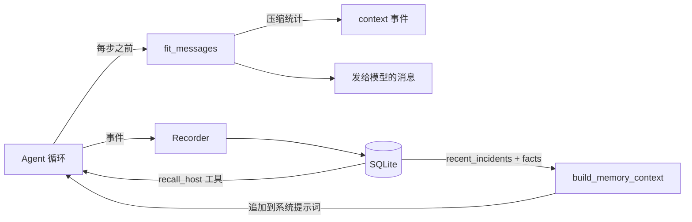

# 模块：memory（上下文预算、持久化存储、记忆工具）

- 引入章节：第 08 章
- 源码：`server_agent/memory/`（`context.py`、`store.py`、`recorder.py`）、`server_agent/tools/memory.py`
- 测试：`tests/test_memory_context.py`、`tests/test_memory_store.py`、`tests/test_cli.py`

## 职责

| 文件 | 负责 | 不负责 |
|---|---|---|
| `context.py` | token 估算、工具结果压缩（三级）、把消息列表压进预算 | 不做语义摘要（不调用模型） |
| `store.py` | SQLite：会话、run、事件、主机档案、事实 | 不做压缩、不判断记忆是否过期 |
| `recorder.py` | 把 run 过程写库；构造「历史记忆」注入文本 | 不决定何时注入（CLI / 服务层决定） |
| `tools/memory.py` | `recall_host`（read）、`remember_fact`（low） | 不修改被排查的系统 |

## 接口

```python
from server_agent.memory import (ContextBudget, Store, Recorder, build_memory_context,
                                 estimate_tokens, fit_messages, messages_tokens, shrink_text, get_store)

fit_messages(messages, ContextBudget(max_tokens=32000, reserve_output=2000, keep_recent_tool_msgs=4))
# -> (新消息列表, {"before_tokens":…, "after_tokens":…, "stage":"tail_head|summarize|drop(+protected)|none", "changed":n})

store = Store("data/server_agent.db")      # 或 ":memory:"
store.save_run_start / append_event / save_run_end
store.list_runs(limit) / get_run(id) / get_events(id, after_seq)
store.update_host_profile(host, data) / get_host_profile(host)
store.remember_fact(host, key, value) / recall_facts(host, limit) / recent_incidents(host, limit)

Recorder(store, run_id, user_input).bind(run_id) / .event(ev) / .finish(result, status)
build_memory_context(store, host)  # -> 注入用文本，无记忆时返回 None
```

| CLI | 作用 |
|---|---|
| `server-agent ask --host HOST [--no-memory]` | 注入该主机的历史记忆；跑完自动落库 |
| `server-agent history [--limit N] [--show ID] [--events]` | 历史列表 / 详情 / 完整事件流 |
| `GET /api/history`、`GET /api/history/{run_id}` | 服务端历史（重启后仍在） |

## 压缩策略

| 级别 | 动作 | 触发条件 |
|---|---|---|
| L1 `tail_head` | 头 1200 + 尾 800 字符，中间标注省略量 | 超预算 |
| L2 `summarize` | 整条替换为「N 字符，开头：…」一行 | L1 后仍超 |
| L3 `drop` | 替换为 `[更早的工具结果已省略]` | L2 后仍超 |
| 兜底 `+protected` | 连「最近 N 条」也按 L2/L3 压 | 单条结果本身就超预算 |

`system` 与 `user` 消息永不删除；只压缩 `tool` 消息。

## 数据流



## 表结构

| 表 | 关键列 |
|---|---|
| `sessions` | `id`、`title`、`created_at` |
| `runs` | `id`、`session_id`、`input`、`status`、`started_at`、`finished_at`、`steps`、`tool_calls`、`tokens`、`text`、`report_json`、`error` |
| `events` | `run_id`、`seq`、`type`、`data_json`（主键 run_id+seq） |
| `facts` | `host`、`key`、`value`、`run_id`、`created_at` |
| `host_profiles` | `host`、`data_json`、`updated_at` |

## 设计取舍

| 决策 | 备选 | 理由 |
|---|---|---|
| 字符启发式估算 token | tiktoken / 厂商 tokenizer | 零依赖、模型无关；预算只需量级正确（向上取整避免低估） |
| 头尾保留优先于摘要 | 直接摘要 | 日志的有效信息常在首尾；L1 代价最低 |
| 记忆注入系统提示词 | 伪造历史对话 | 语义正确（规则与背景的位置）；避免模型把伪造回复当作自己说过的话 |
| 写库失败静默降级 | 抛出异常 | 记忆是增强不是主流程，磁盘问题不该让排查失败 |
| SQLite 单文件 | PostgreSQL / 内存 | 单机工具，零运维；接口抽象后可替换 |
| 报告存 JSON 列 | 只存文本 | 第 15 章评估可直接查询字段，无需解析自然语言 |

## 已知限制

- 长期记忆没有失效与冲突解决机制：事实会一直累积，旧值可能过期（讲义思考题）。
- `fit_messages` 只压 `tool` 消息；如果 `assistant` 回复极长或用户粘贴超长文本，仍可能超预算（后续可用同策略扩展）。
- 未做去重：同一事实反复 `remember_fact` 会写多条（`recall_facts` 返回最新在前，天然覆盖）。
- 单机并发写靠 SQLite 串行；高频并发场景需要 WAL 或换库（第 17 章评估）。
