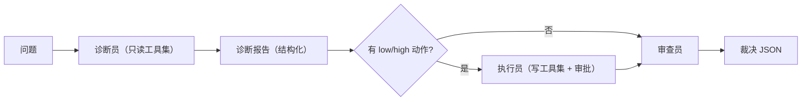

# 模块：multi（多 Agent 协作）

- 对应章节：第 16 章
- 源码：`server_agent/multi/roles.py`、`server_agent/multi/supervisor.py`、`server-agent ask --multi`
- 测试：`tests/test_multi_agent.py`（9 个）

## 职责

| 文件 | 负责 | 不负责 |
|---|---|---|
| `roles.py` | 角色定义（工具白名单、角色说明）、`registry_for` 按角色裁剪工具集 | 不执行任何工具 |
| `supervisor.py` | 编排：诊断 → 执行 → 审查；结果汇总与裁决解析 | 不做审批（复用第 9 章的 approver） |

## 角色与工具集

| 角色 | 工具 | 说明 |
|---|---|---|
| `diagnostician` 诊断员 | 只读工具（含 remote_*、search_knowledge、load_runbook、recall_host） | **没有写工具**，被骗也伤不到系统 |
| `executor` 执行员 | 写工具 + `disk_usage` / `listening_ports` | 每次写操作都要审批 |
| `reviewer` 审查员 | `disk_usage` / `listening_ports` / `tail_file` / `recall_host` | 抽查 1-2 次，输出裁决 JSON |

## 接口

```python
from server_agent.multi import Supervisor, registry_for, DIAGNOSTICIAN

sup = Supervisor({"diagnostician": llm, "executor": llm, "reviewer": llm},
                 base_registry, policy=policy, audit=audit, approver=approver, max_steps=8)
result = await sup.run("web-01 磁盘满了，查清楚并处理")
result.roles        # [RoleRun(role, text, steps, tool_calls, tokens, report, stopped)]
result.verdict      # {"verdict": "ok|suspect|unknown", "issues": [...], "suggestions": [...]}
result.executed     # 执行员真实拿到的工具结果（截断）
```

## 数据流



## 设计取舍

| 决策 | 备选 | 理由 |
|---|---|---|
| 工具集按角色物理裁剪 | 只靠提示词约束 | 提示词是建议，工具集是事实（第 9 章原则） |
| 角色间传结构化报告 | 传自然语言 | 字段明确，`actions[].risk` 直接驱动审批 |
| 串行编排 | 并行 fan-out | 先保证可解释与可调试；并行是第 17 章的演进方向 |
| 裁决解析失败降级 `unknown` | 抛错中断 | 增强能力不该成为单点故障 |
| 作为可选模式（`--multi`） | 默认开启 | 简单问题拆角色纯属浪费成本 |

## 已知限制

- 无自动重规划：审查员发现问题只给建议，不会自动回到诊断员重来。
- 执行员按「动作列表」执行，不判断动作之间的依赖顺序。
- 角色共享同一个 `llm`（可注入不同模型，但未做模型分级路由，如「诊断用强模型、执行用快模型」）。
- 无并行 fan-out：多机批量场景尚未优化（待改进）。
