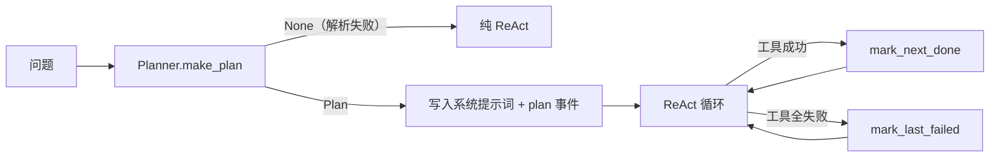

# 模块：planner + knowledge/runbooks（规划与手册）

- 引入章节：第 12 章
- 源码：`server_agent/agent/planner.py`、`server_agent/knowledge/runbooks.py`、`server_agent/tools/runbook_tools.py`、`runbooks/`
- 测试：`tests/test_planning_runbooks.py`（15 个）

## 职责

| 文件 | 负责 | 不负责 |
|---|---|---|
| `planner.py` | 生成计划（一次 LLM 调用）、解析、状态推进（done/failed） | 不执行步骤（ReAct 循环负责） |
| `runbooks.py` | frontmatter 解析、症状匹配、目录加载与缓存 | 不生成手册内容 |
| `runbook_tools.py` | `list_runbooks`（只要标题）/ `load_runbook`（要正文） | 不做检索排序（第 13 章） |

## 接口

```python
planner = Planner(llm, max_steps=6)
plan = await planner.make_plan(question)      # -> Plan | None（失败时为 None，不抛异常）
plan.render()                                  # 注入提示词的文本（带 [x]/[ ]/[!] 状态标记）
plan.mark_next_done() / plan.mark_last_failed()

lib = get_library()                            # 默认目录：cwd/runbooks 或仓库根/runbooks
lib.search("磁盘满了")                          # 按 symptoms 命中数排序
lib.get("disk-full").body
```

Agent 集成：`Agent(..., planning=True)` → 先发 `plan` 事件，再把计划写进系统提示词，每轮按结果推进状态。

## 数据流



## 设计取舍

| 决策 | 备选 | 理由 |
|---|---|---|
| 计划一次生成 | 每步重新规划 | 成本可控；复杂重规划留给模型自行调整 |
| 计划失败降级为无计划 | 直接报错 | 计划是增强不是前置条件 |
| Runbook 按需加载 | 全部塞进提示词 | 省 token；避免无关手册干扰判断 |
| `list_runbooks` 先给标题 | 直接返回正文 | 让模型自己决定要看哪本，并留下选择痕迹 |
| 模板用 `string.Template` | `str.format` / f-string | 示例 JSON 的花括号会与 `format` 冲突（第 07 与 12 章各踩一次） |
| 计划默认关闭 | 默认开启 | 简单问题不值得多一次调用；是否默认开启交给第 15 章评测数据决定 |

## 已知限制

- 不做自动重规划（只有状态标记 + 提示词里的「如受阻请调整」）。
- 计划步骤与工具调用没有强绑定：模型可能跳过某步或合并两步。
- Runbook 匹配是关键词命中计数，没有同义词/词形处理（那是第 13 章向量检索要解决的）。
- 手册目录解析依赖配置或仓库位置，打包部署时需把 `runbooks/` 一起带上。
