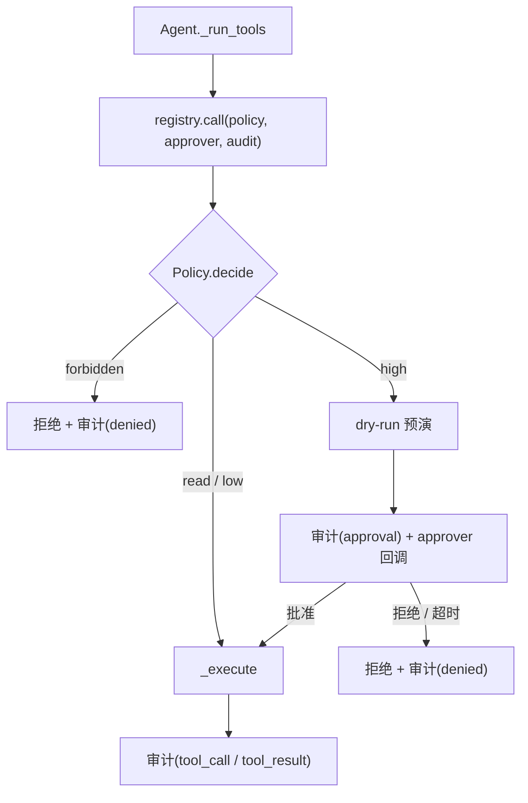

# 模块：policy（策略、审批、审计、脱敏）+ tools/ops（写操作工具）

- 对应章节：第 9 章
- 源码：`server_agent/policy/`（`risk.py`、`approval.py`、`audit.py`、`redact.py`）、`server_agent/tools/ops.py`
- 测试：`tests/test_policy.py`（54 个）、`tests/test_cli.py`、`tests/test_api.py`
- 相关决策：[ADR-0002 不给 Agent 任意 shell](../adr/0002-no-arbitrary-shell.md)

## 职责

| 文件 | 负责 | 不负责 |
|---|---|---|
| `risk.py` | 风险分级与参数校验（路径/服务/pid/命令白名单） | 不执行工具、不决定审批人是谁 |
| `approval.py` | 审批状态机、超时即拒绝、多通道裁决 | 不推送事件（由 RunManager 提供 `on_request`） |
| `audit.py` | JSONL 审计日志 + 内存缓冲 | 不脱敏（调用方 `redact_args` 或 `AuditLog.write` 内做） |
| `redact.py` | 敏感信息打码 | 不做访问控制 |
| `tools/ops.py` | 三个写操作工具 + 白名单只读命令，均带 `dry_run` | **不做参数校验**（在策略层） |

## 接口

```python
from server_agent.policy import Policy, ApprovalManager, AuditLog, get_audit, redact, redact_args

decision = Policy(allowed_paths=("/tmp",), allowed_services=("nginx",)).decide(
    "clean_directory", {"path": "/tmp/x", "older_than_days": 7}, risk="high")
decision.allowed, decision.needs_approval, decision.reason, decision.label   # allow | approval | forbidden

mgr = ApprovalManager(timeout=120)
approver = mgr.make_approver("run_x", on_request=push_event)   # async (tool, args, dry_run, reason) -> bool
mgr.resolve("ap_xxx", approved=True, decider="user")          # 超时/无人裁决 -> 自动拒绝
mgr.cancel_run("run_x")                                       # run 结束清场

audit = AuditLog("data/audit.jsonl")
audit.log("tool_call", run_id="r", tool="disk_usage", args={...}, decision="allow")
audit.records() / audit.read_file(limit=200)
```

工具层调用签名（唯一执行入口，策略/审批/审计都在这里串起来）：

```python
await registry.call(name, args, policy=policy, approver=approver, audit=audit, run_id=run_id)
```

| 工具 | risk | 校验规则 | dry_run 默认 |
|---|---|---|---|
| `restart_service` | high | 服务名在 `SA_POLICY_ALLOW_SERVICES` | True |
| `kill_process` | high | `pid >= 2`、非自身、信号仅 TERM/INT/HUP | True |
| `clean_directory` | high | 路径在 `SA_POLICY_ALLOW_PATHS` 内且不在受保护列表；`older_than_days >= 1` | True |
| `run_command` | read | 首词在白名单、禁 shell 元字符、输出脱敏 | — |
| 其余（读/记忆） | read / low | 无额外规则，直接放行并记审计 | — |

| CLI | 作用 |
|---|---|
| `server-agent ask [--yes\|--no-approval]` | 高危操作的审批人：交互式 `y/N`、全自动批准、或一律拒绝 |
| `server-agent tools call NAME JSON [--no-approval]` | 手动调用（**同样经过策略层**） |
| `server-agent audit [--limit] [-v] [--memory]` | 查审计（默认从 JSONL 读） |

| HTTP / WS | 作用 |
|---|---|
| `GET /api/runs/{id}/approvals` | 该 run 的待决审批（前端断线后补拉） |
| `POST /api/runs/{id}/approvals/{ap_id}` | 裁决（409 = 已裁决过） |
| `GET /api/audit` | 审计记录（参数已脱敏） |
| WS `{"type":"approval","approval_id":…,"approved":true}` | 通过 WebSocket 裁决 |

## 数据流



## 设计取舍

| 决策 | 备选 | 理由 |
|---|---|---|
| 无任意 shell，工具白名单 | `run_shell` + 黑名单过滤 | 黑名单穷举不完；白名单 fail-closed（ADR-0002） |
| 校验集中在策略层 | 每个工具内部校验 | 一处好测、好审计；新工具漏登记会被测试发现 |
| 超时/无人应答 = 拒绝 | 超时 = 批准 | 「没人批准」不能等于「批准了」 |
| 审批前先跑 dry-run | 只展示参数 | 让审批人看懂影响（「删 37 个文件、释放 1.2G」） |
| 审计用 JSONL | 写 SQLite | 追加写不怕并发；`tail -f`/`jq` 可查；与业务库分离 |
| 脱敏对参数与命令输出都做 | 只脱敏参数 | 命令输出会进模型历史与数据库，泄漏面更大 |
| 工具内部用可替换的 `_xxx` 函数做副作用 | 直接写死逻辑 | 测试能安全地「执行」而不真的重启服务/删文件 |

## 已知限制

- 白名单是静态配置，改白名单需要重启或改环境变量；没有在线评审流程。
- 审批粒度是「单个动作」，一个 run 里多次高危操作要多次点击（待改进）。
- `run_command` 的元字符检查是字符级，不做语法分析；更复杂的绕过（如 base64 拼接）依赖白名单本身足够窄。
- 审计日志没有轮转与加密；生产环境需要 logrotate 与访问控制。
- 审批裁决无身份区分（任何持 Token 者都能批准），第 17 章讨论部署时再引入角色。
