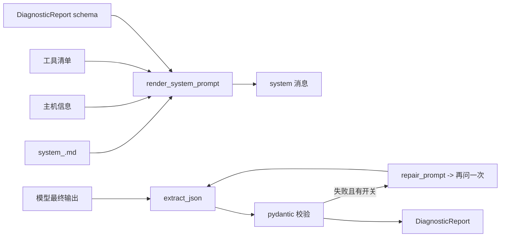

# 模块：prompts（提示词模板与结构化报告）

- 引入章节：第 07 章
- 源码：`server_agent/prompts/`（`__init__.py`、`system_sre.md`、`system_plain.md`、`report.py`）
- 测试：`tests/test_prompts.py`

## 职责

| 负责 | 不负责 |
|---|---|
| 系统提示词模板、变体管理与渲染（注入主机信息、工具清单、报告 schema） | 消息历史与上下文预算（第 08 章） |
| 诊断报告的数据结构（`DiagnosticReport`）与 JSON Schema 导出 | 报告怎么展示（CLI / 第 06 章前端） |
| 从模型输出里提取并校验报告；解析失败时的修复指令 | 决定要不要修复（由 `SA_REPORT_REPAIR` 控制） |

## 接口

```python
from server_agent.prompts import (render_system_prompt, load_template, VARIANTS,
                                 DiagnosticReport, parse_report, repair_prompt, json_schema_text)

render_system_prompt("sre", tools=["disk_usage"], hostname="web-01", os_name="Linux")  # -> str
parse_report(text)  # -> (DiagnosticReport | None, error: str | None)
repair_prompt(previous_text)  # -> str：把散文改写成 JSON 的指令
```

### DiagnosticReport

| 字段 | 类型 | 说明 |
|---|---|---|
| `summary` | str | 现象（不是结论） |
| `severity` | `info` / `warning` / `critical` | 严重程度 |
| `findings` | `list[{claim, evidence}]` | 观察与依据；`evidence` 必须引用具体数据 |
| `root_cause` | str \| null | 根因；证据不足时为 null |
| `confidence` | `high` / `medium` / `low` | 对根因的置信度 |
| `actions` | `list[{description, risk, command}]` | 建议动作；`risk` 供第 09 章审批 |
| `data_gaps` | `list[str]` | 还缺什么信息 |

### 变体

| 变体 | 文件 | 用途 |
|---|---|---|
| `sre`（默认） | `system_sre.md` | 角色 + 方法论（USE / 先宏观后微观 / 证据链）+ 约束 + 输出格式 |
| `plain` | `system_plain.md` | 对照组：只有角色与格式，没有方法论；用于 A/B 与第 15 章评估 |

模板占位符：`$hostname`、`$os`、`$tools`、`$report_schema`。用 `string.Template` 而非 Jinja2 / `str.format`——schema 里全是花括号，`$` 语法不会冲突且零依赖。

## 数据流



## 设计取舍

| 决策 | 备选 | 理由 |
|---|---|---|
| `string.Template` | Jinja2 / `str.format` | 零依赖；schema 花括号不冲突 |
| schema 内联进提示词 | 只靠程序端校验 | 让模型知道形状，命中率更高；程序端仍要做最终把关 |
| 修复只做一次 | 循环修复直到成功 | 控制成本与延迟；失败时保留原文与错误原因 |
| 报告解析失败不抛异常 | 直接报错 | 结论原文对用户仍有价值；`report_error` 供调试提示词 |
| `plain` 变体保留在仓库 | 只留一份提示词 | A/B 与评估需要对照组（第 15 章） |

## 已知限制

- 报告解析假设「整段回答就是一个 JSON 对象」；若模型输出多个 JSON 片段，取第一个。
- 修复请求的上下文只带最后 4000 字符的原始回答，超长回答可能丢失细节。
- 未做 schema 的「软约束」（如 findings 至少一条）——那是评估与提示词迭代要解决的问题。
- 提示词变体目前只有两档，没有灰度与在线切换（第 17 章讨论部署时再考虑）。
