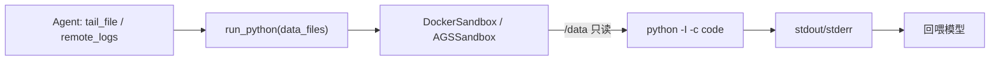

# 模块：sandbox（沙箱）+ run_python

- 对应章节：第 11 章
- 源码：`server_agent/sandbox/`、`server_agent/tools/sandbox_tool.py`
- 测试：`tests/test_sandbox.py`（13 个 + 1 个 Docker 真实执行，daemon 不可用时跳过）
- 边界决策：[ADR-0003](../adr/0003-sandbox-boundary.md)（任意代码只在沙箱里跑；沙箱不是操作生产机的通道）

## 职责

| 文件 | 负责 | 不负责 |
|---|---|---|
| `base.py` | `Sandbox` 协议、`SandboxResult`、`SandboxError` | 不实现后端 |
| `local_docker.py` | 本地容器：隔离参数、只读输入挂载、超时清理 | 不做授权（由策略层/配置决定） |
| `ags.py` | 腾讯云 AGS（E2B 兼容 REST）：创建/执行/销毁 | 不做回退（工厂负责） |
| `sandbox_tool.py` | `run_python` 工具：输入上限、超时、错误翻译 | 不生成代码（模型生成） |

## 接口

```python
from server_agent.sandbox import create_sandbox, DockerSandbox

sb = create_sandbox()                          # auto：有 AGS 配置且启用则 AGS，否则本地 Docker
result = await sb.run(code, files={"log": content}, timeout=30)
result.ok / stdout / stderr / exit_code / backend / elapsed_ms
```

`run_python(code, purpose, data_files, timeout)`：沙箱里只读挂载 `data_files` 到 `/data`，返回 stdout。

## 隔离参数（本地 Docker）

| 参数 | 防什么 |
|---|---|
| `--network none` | 外发数据、拉取载荷、连内网 |
| `--read-only` + `--tmpfs /work` | 篡改宿主文件系统 |
| `--memory/--cpus/--pids-limit` | 资源耗尽（fork 炸弹、内存爆炸） |
| `--cap-drop ALL` | 提权、挂载、改网络 |
| `--user 65534` | 以 root 运行导致的越权 |
| `-v dir:/data:ro` | 输入被篡改 |

## 数据流



## 设计取舍

| 决策 | 备选 | 理由 |
|---|---|---|
| 默认本地 Docker | 只用 AGS | 免费、离线可测、可控；AGS 需要 Key 与网络 |
| AGS 需显式开启 | 有 Key 就自动用 | 收费服务不该被隐式启用 |
| 只支持 Python | 多语言 | 分析场景 Python 生态最全；换语言只是换镜像 |
| 输入走 `data_files` | 让代码直接连服务器 | 沙箱里绝不能有凭证；数据必须由 Agent 送进去 |
| 输入上限 40 万字符 | 无上限 | 传输/token 成本；也逼着先 grep 缩小范围 |
| `run_python` 定级 low | 定级 high（要审批） | 它不改系统；隔离由沙箱保证，靠审计留痕 |

## 已知限制

- AGS 路径未在真实环境验证（无 Key）；字段名以官方文档为准。
- Docker 后端首次执行需拉镜像（秒级到分钟级），无法做到 AGS 的毫秒启动。
- 沙箱内不预装第三方库（如 pandas），需要自定义镜像。
- 生成文件的回传只保留了接口位（`artifacts`），当前仅支持 stdout。
- SYLLABUS 里的「沙箱预演」与 `lab/ags/` 暂未落地，推迟原因见 ADR-0003。
