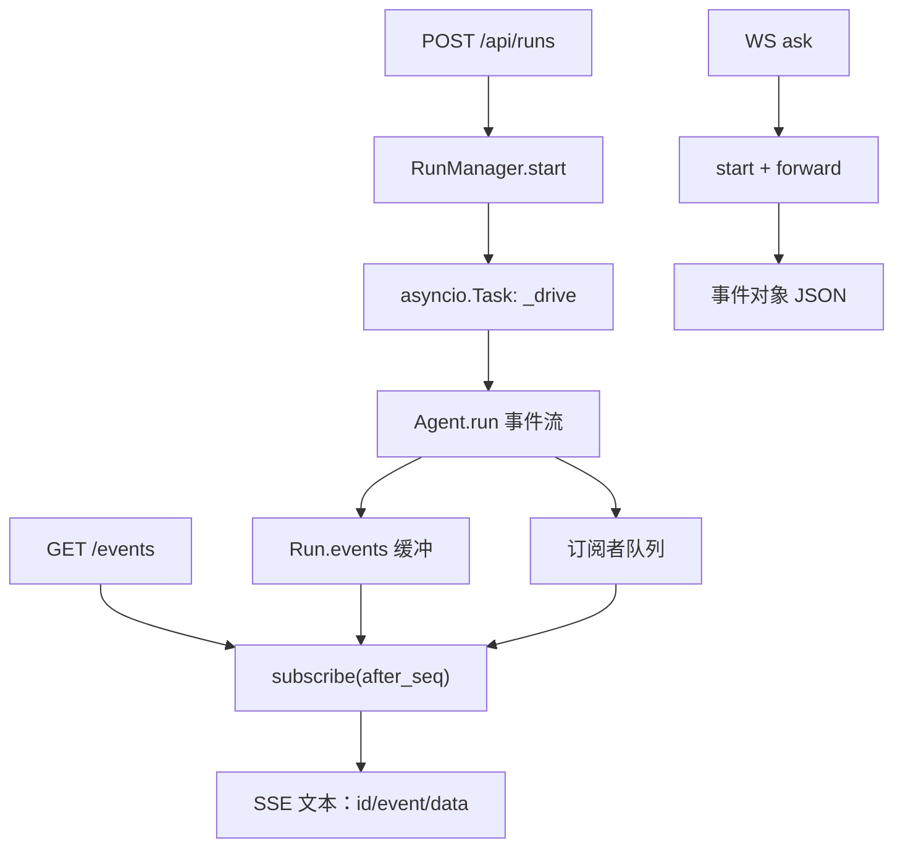

# 模块：runs / server（Run 管理器、HTTP API、WebSocket、鉴权）

- 对应章节：第 5 章
- 源码：`server_agent/agent/runs.py`、`server_agent/server/{app,api,ws,auth}.py`
- 测试：`tests/test_runs.py`、`tests/test_api.py`、`tests/test_ws.py`
- 接口文档：[docs/api.md](../api.md)

## 职责

| 文件 | 负责 | 不负责 |
|---|---|---|
| `agent/runs.py` | Run 生命周期、事件缓冲、订阅（含断线续传）、取消、淘汰 | 不关心 HTTP/WS 怎么传（那是对外协议） |
| `server/app.py` | 应用工厂：挂路由、CORS、把 settings/registry/runs/agent_factory 放到 `app.state` | 不含业务逻辑 |
| `server/api.py` | HTTP 路由与请求校验 | 不直接调 Agent |
| `server/ws.py` | 双向通道与消息协议（含审批请求/应答） | 不做审批决策（由 ApprovalManager 负责） |
| `server/auth.py` | Bearer Token 校验 | 不做权限分级（由策略层负责） |

## 接口

### RunManager

```python
mgr = RunManager(agent_factory)          # agent_factory: () -> Agent
run = await mgr.start("磁盘为什么满了")   # 必须是 async：create_task 需要事件循环
mgr.get(run_id) -> Run | None
mgr.list() -> list[Run]                   # 新的在前
await mgr.cancel(run_id) -> bool          # 只能取消 running
async for ev in mgr.subscribe(run, after_seq=0)   # 先补发，再实时；自动去重
```

| Run 字段 | 说明 |
|---|---|
| `status` | `running` / `done` / `cancelled` / `error` |
| `events` | 事件缓冲（最多 `MAX_EVENTS=2000` 条） |
| `summary()` | 给接口用的轻量视图（不含事件正文） |

### HTTP

见 [docs/api.md](../api.md)。要点：

| 接口 | 语义 |
|---|---|
| `POST /api/runs` | 202 + `{id, status, events_url}`，立即返回 |
| `GET /api/runs/{id}/events` | SSE；支持 `Last-Event-ID` 或 `?last_event_id=` 续传 |
| `POST /api/runs/{id}/cancel` | `DELETE` 同效；返回 `{cancelled: bool, status}` |
| `GET /api/tools` | 读 `app.state.registry`（本实例的工具集） |

### WebSocket

`{"type": "ask"|"cancel"|"ping"}` → `accepted` / `cancelled` / `pong`，事件对象与 SSE 的 `data` 同构。

## 数据流



## 设计取舍

| 决策 | 备选 | 理由 |
|---|---|---|
| 提交与订阅分离 | 一个 POST 流式返回 | 短请求不易超时；断线可重连；事件流可多客户端复用 |
| 事件全部缓存在内存 | 只转发不缓存 | 支持晚连与断线续传；代价是内存，用 `MAX_EVENTS`/`MAX_RUNS` 兜底 |
| `start()` 是 async | 同步 + `run_coroutine_threadsafe` | 简单直白；同步路由里根本没有事件循环 |
| 鉴权读 `app.state.settings` | 全局 `get_settings()` | 多实例/测试场景下全局单例会串味 |
| 工具清单挂 `app.state.registry` | 全局 registry | 允许按实例裁剪工具集（多 Agent 按角色裁剪要用） |
| WS 用 `?token=` | `Authorization` 头 | 浏览器 WebSocket API 无法自定义请求头 |
| 未对并发设上限 | 信号量 | 本地单用户够用；多人共用时需要加上限（见已知限制） |

## 已知限制

- 内存里只保留最近 `MAX_RUNS` 个 run 用于订阅与补发；历史 run 与事件在 SQLite 里（`/api/history`），但重启后无法再订阅旧 run 的实时事件。
- 无全局并发上限：同时提交大量任务会一起打向模型服务，可能触发限流。
- 取消只能中断「正在等待」的步骤，已在执行的同步工具（跑在线程池）无法强杀。
- 无速率限制；审计由策略层写 JSONL（`SA_AUDIT_PATH`），不在服务层。
- 服务退出时 `lifespan` 调用 `RunManager.shutdown()`：在跑的 run 被取消并落库为 cancelled，挂起的审批被撤销。
