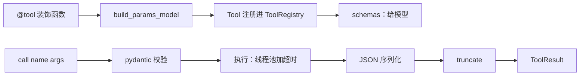

# 模块：tools（工具注册表与排障工具）

- 引入章节：第 03 章
- 源码：`server_agent/tools/registry.py`、`server_agent/tools/system.py`
- 测试：`tests/test_tool_registry.py`、`tests/test_system_tools.py`、`tests/test_cli.py`

## 职责

| 负责 | 不负责 |
|---|---|
| 把 Python 函数注册为工具，自动生成 JSON Schema | 决定调用哪个工具（模型与 Agent 循环的事，第 04 章） |
| 调用前校验参数，调用中处理异常与超时 | 权限与审批（第 09 章在调用前加策略层） |
| 结果序列化与长度截断 | 智能压缩与摘要（第 08 章） |
| 提供 6 个只读排障工具 | 远程执行（第 10 章引入执行器） |

## 接口

```python
from server_agent.tools import registry, tool, ToolError, ToolRegistry

@tool                                   # 或 @tool(name=..., risk="read", max_chars=4000, timeout=30)
def my_tool(path: Annotated[str, Field(description="...")], n: int = 10) -> dict:
    """给模型看的描述（必填）。"""
    if bad:
        raise ToolError("给模型看的错误信息")
    return {...}

registry.schemas()                      # -> list[dict]，直接作为 Chat Completions 的 tools 参数
result = await registry.call("my_tool", {"path": "/x"})   # 参数可为 dict 或 JSON 字符串
result.ok, result.content, result.data, result.error, result.truncated, result.elapsed_ms
```

| 类型 | 说明 |
|---|---|
| `Tool` | `name` `description` `func` `params`（pydantic 模型）`risk` `max_chars` `timeout`；`schema()` 输出接口格式 |
| `ToolResult` | `content` 回喂模型（有上限）；`data` 原始返回值给程序 |
| `ToolError` | 工具主动抛出、原样告诉模型的错误 |
| `Risk` | `read` / `low` / `high` / `forbidden`，第 09 章使用 |

| CLI | 作用 |
|---|---|
| `server-agent tools list [--schema]` | 列出工具；`--schema` 输出发给模型的 JSON |
| `server-agent tools call NAME ['{"k": "v"}']` | 手动调用；失败时退出码 1 |

## 工具清单

| 工具 | 参数（默认值） | 返回要点 | 限制 |
|---|---|---|---|
| `host_info` | 无 | 主机名、OS、核数、内存、开机时间、运行时长 | — |
| `cpu_memory_usage` | `interval`（0.5，范围 0.1-5） | CPU 总/每核、负载、每核负载、内存、swap | 负载在 Windows 上为 0 |
| `disk_usage` | `path`（全部分区） | 分区用量；>= 90% 带 `warning` | 最多 20 个分区；过滤伪文件系统 |
| `top_processes` | `sort_by`（cpu / memory）、`limit`（10，1-50） | pid、名称、用户、CPU%、内存%、RSS、状态、命令行 | 固定采样 0.5 秒；命令行截断到 200 字符 |
| `listening_ports` | `port`（全部）、`limit`（30，1-100） | 协议、地址、端口、pid、进程名；超出时带 `hint` | 非 root 可能不完整，带 `partial` |
| `tail_file` | `path`（必填，绝对路径）、`lines`（50，1-1000）、`grep` | 文件大小、修改时间、内容 | 只扫末尾 2MB；拒绝二进制；`max_chars=8000` |

## 数据流



## 设计取舍

| 决策 | 备选 | 理由 |
|---|---|---|
| 类型注解 + `Annotated[..., Field]` 生成 Schema | 手写 JSON；解析 docstring 中的 Args 段 | 一处定义，Schema 与校验永远一致；IDE 有类型提示 |
| `extra="forbid"` | 忽略多余参数 | 模型填错参数时明确告知，避免误以为生效 |
| `call()` 永不抛异常 | 让异常上抛 | Agent 循环把错误当观察回喂模型，便于自我纠正 |
| 截断保留开头并附说明 | 头尾各保留一半 | 本章工具输出多为 JSON，开头信息更完整；第 08 章针对日志做头尾保留 |
| 全局默认注册表 + 可新建实例 | 只用实例 | CLI 与工具定义简单；测试用独立实例隔离 |
| psutil | 解析 `df`、`ps` 输出 | 跨平台、结构化；第 10 章远程执行时再处理「远端没有 psutil」 |

## 已知限制

- `tail_file` 可读取进程有权限的任意文件，包括敏感文件；第 09 章加入路径白名单与脱敏。
- 截断按字符数而不是 token 数计算；第 08 章引入 token 预算。
- 同步工具超时后线程无法被强制终止，只是不再等待其结果。
- 所有工具只作用于本机；第 10 章增加 `host` 参数与 SSH 执行器。
