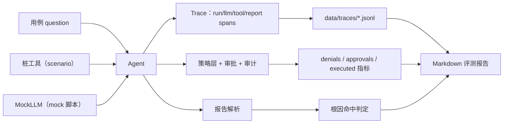

# 模块：tracing + evals（可观测性与评测）

- 引入章节：第 15 章
- 源码：`server_agent/tracing/`、`evals/`
- 测试：`tests/test_eval.py`（12 个）

## 职责

| 文件 | 负责 | 不负责 |
|---|---|---|
| `tracing/trace.py` | span 采集、JSONL 落盘、summary 汇总 | 不做审计（那是 `policy/audit.py`） |
| `evals/stubs.py` | 桩工具与场景数据（disk_full / cpu_busy / service_down） | 不联网、不碰真机 |
| `evals/runner.py` | 用例加载、脚本回放、指标计算、报告渲染 | 不评测模型能力（那是接真模型的事） |
| `cli eval` | 跑用例集、输出 Markdown、可选 `--strict` | 不做 CI 集成（交给 Makefile） |

## 接口

```python
trace = Trace(run_id, path="data/traces")
async with trace.span("llm", step=1) as span:
    ...
span.attrs["finish_reason"] = "stop"
trace.summary()      # {spans, total_ms, by_name, llm_ms, tool_ms}

from evals.runner import load_cases, run_all, render_report
results = asyncio.run(run_all(load_cases("evals/cases")))
print(render_report(results))
```

用例字段：`id / question / scenario / planning / mock[{tool_call|text|report}] / expect{stopped,max_steps,tools_called,tools_not_called,root_cause_contains,min_denials,must_execute} / approve_write`

## 数据流



## 设计取舍

| 决策 | 备选 | 理由 |
|---|---|---|
| 桩工具 + MockLLM | 真模型 + 真机 | 可重复、可回归、零成本，能进 CI |
| 规则判定（关键词/工具/步数） | LLM-as-judge | 先建立客观基线；主观质量评测作为第二层 |
| Trace 用 JSONL | 写数据库 | `jq` 可查、追加写不怕并发；与审计同构 |
| Trace 允许注入且可关闭 | 强制开启 | 测试/评测需要控制落盘；生产可用环境变量关掉 |
| 指标含「写操作数」 | 只看效果指标 | 安全是被测项：默认拒绝必须可回归 |

## 已知限制

- 根因判定是关键词匹配，无法评估「解释是否清楚」（需要 judge 层）。
- 用例里的模型行为是写死的脚本，只验证 Agent 逻辑，不衡量模型的真实能力。
- Trace 只记录了时序与少量属性，没有跨进程追踪（服务 + 工具子进程）。
- 用例集规模小（5 条基线）：生产要按真实故障库扩充。
