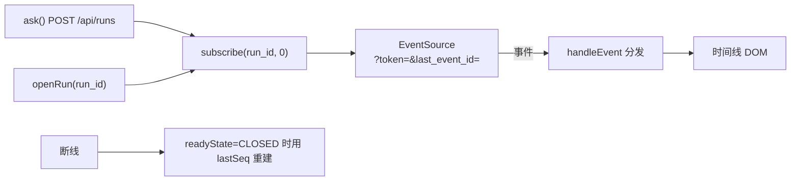

# 模块：web（前端控制台）

- 引入章节：第 06 章
- 源码：`web/index.html`、`web/app.js`、`web/style.css`
- 托管：`server_agent/server/app.py` 末尾挂载 `StaticFiles`；目录来自 `SA_WEB_DIR`（默认仓库根的 `web/`）
- 测试：`tests/test_web.py`

## 职责

| 负责 | 不负责 |
|---|---|
| 把 SSE 事件流渲染成时间线（步骤、流式文本、工具卡片、结论） | 不做任何业务判断（全部依据服务端事件） |
| 提交任务、取消任务、查看历史任务、查看工具清单 | 不直接调用 Agent 或工具 |
| Token 保存（`localStorage`）与断线重连 | 不存在服务端状态 |

## 界面结构

```text
┌─ 顶栏 ──────────────────────────────────────────┐
│ ●健康状态  server-agent  v0.1.0   [Token] [工具] │
├──────────┬──────────────────────────────────────┤
│ 历史任务  │ 时间线                                │
│  · 任务A  │   用户气泡                            │
│  · 任务B  │   第 1 步 ────────────────            │
│          │   ▸ disk_usage  [完成 13ms]           │
│          │   结论气泡（绿）+ 统计行                │
│          ├──────────────────────────────────────┤
│          │ [输入框]                    [发送][停止] │
└──────────┴──────────────────────────────────────┘
```

## 事件 → UI 映射

| 事件 | UI |
|---|---|
| `start` | 重置流式气泡指针 |
| `step` | 分隔线「第 N 步」 |
| `reasoning` | 默认不显示（可在 `handleEvent` 中打开） |
| `text` | 追加到当前流式气泡（同一段回答共用一个 DOM 节点） |
| `tool_call` | 新建折叠卡片：`details.card`，状态「调用中」 |
| `tool_result` | 按 `id` 找到卡片，更新状态标签、耗时、截断/跳过标记，附结果原文 |
| `error` | 红边气泡 + 消息 |
| `end` | 结论气泡标记为 `final`，追加统计行（步数 / 工具调用 / 耗时 / token） |

## 客户端状态

| 字段 | 作用 |
|---|---|
| `token` | 从 `localStorage` 读取；变更后写回 |
| `currentRun` | 当前订阅的 run_id |
| `lastSeq` | 已收到的事件序号（取自 `e.lastId`），重连时作为 `last_event_id` |
| `textNode` | 当前流式气泡节点；遇 `step`/`start` 置空以另起新气泡 |
| `cards` | `call_id -> {card, summary, payload}`，用于配对 `tool_call` / `tool_result` |
| `busy` | 是否有任务在跑，控制按钮可用状态 |

## 数据流



## 浏览器侧的两个约束

| 约束 | 处理 |
|---|---|
| `EventSource` 无法自定义请求头 | SSE 接口支持 `?token=`（服务端 `run_events` 同时接受 Header 与查询参数） |
| 断线自动重连 | 浏览器自动携带 `Last-Event-ID`（服务端发的 `id:` 被浏览器记住）；彻底关闭时前端用 `lastSeq` 手动重建 |

## 设计取舍

| 决策 | 备选 | 理由 |
|---|---|---|
| 原生 HTML/JS，无构建 | React / Vue | 本课程聚焦 Agent 机制；界面状态只有 6 个变量，不需要框架 |
| 时间线 + 折叠卡片 | 聊天气泡 | Agent 的一轮执行有多个步骤与结构化数据，气泡装不下 |
| 思考内容默认隐藏 | 默认显示 | 思考很长，摊开会挤走有效信息；默认应该「安静」 |
| 工具结果默认折叠 | 默认展开 | 结果动辄数千字符，结论会被淹没 |
| Token 存 `localStorage` | Cookie / 会话 | 本地工具够用；公网部署需换成 HTTP-only Cookie 或同源代理（见讲义思考题） |
| 静态目录不存在时跳过挂载 | 强制要求目录存在 | 后端单独使用时不应因为缺前端目录而整体 404 |

## 已知限制

- 无多标签页同步、无任务队列视图、无报告与导出。
- 不做 Markdown 渲染（结论按纯文本显示，避免引入 XSS 风险）。
- 界面文案为中文硬编码，无 i18n。
- 未做移动端深度适配（只做了单列布局的窄屏降级）。
